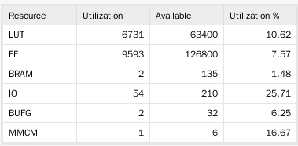
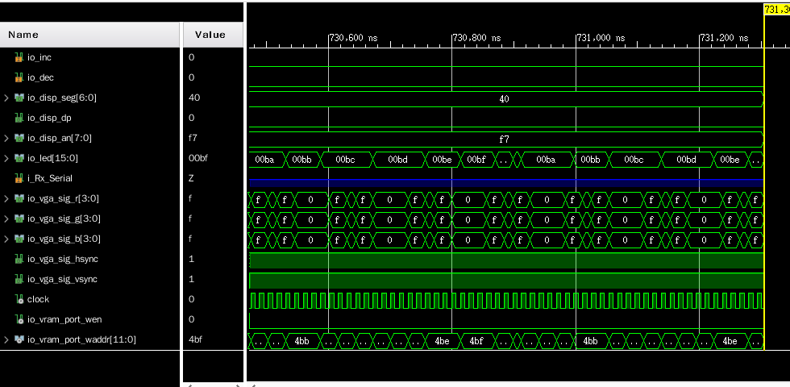

# 计算机组成原理 Lab6 实验报告

刘紫檀 PB17000232 - VGA Uart Terminal Written in Chisel and MIPS C

-----

## 工具链 - Chisel + GTKWave

>  虽然上次（指 Lab 5）已经提到我的工具链设置了，但是这次还是再提一下。

本次综合实验中我采用了 UC Berkeley 的 Chisel3 作为硬件描述的工具。

Chisel 相比 Verilog，有如下优势：

1. Verilog 在设计之初只是*硬件模拟语言*，其中很多语法不适合硬件综合；Chisel 对此有仔细区分
2. Verilog 的一些语法概念在如何映射到硬件实现方面是非常不直观的，或一不小心就会导致非常低效的电路结构（比如锁存器）
3. Verilog 缺少现代编程语言的机制，诸如 OOP/FP，类型推导和反射
4. Verilog 缺乏规模化构建的机制，比如「成批链接」I/O 端口的语法和好用的 function 机制
5. Verilog 的可扩展性大大弱于 Scala

Chisel 是基于 Scala 语言设计构建的。 Scala 是一个以 Java 为基础的「Scalable Language」，在执行前会被翻译为 Class 文件，最终在 JVM 中运行。

Chisel 经过 Firrtl 中间层后，会被翻译为 Verilog 代码，然后再用 Vivado 导入综合/实现/烧写。

### 配置工具链

主要参考 https://github.com/ucb-bar/chisel-tutorial.git。

在 ArchLinux 下只需要 `pacman -Sy sbt scala` 安装 `sbt` 构建工具和 `scala`； Chisel 的相关代码会在第一次使用引用 Chisel 的 `sbt` 项目时由 `sbt` 经由 `Maven` 构建系统下载。下载可能需要网络加速服务，或切换镜像（比较困难，因为硬写在了 `sbt` 的 `jar` 包中了），因为 `Maven` 主镜像非常缓慢。

### 从模板开始

为了方便大家熟悉 Chisel，Chisel 项目准备了 [chisel-template](https://github.com/freechipsproject/chisel-template) 项目。用 `git clone https://github.com/freechipsproject/chisel-template` 即可 clone 到本地。

目录结构大致如下所示：

```
.
├── build.sbt                              # sbt 构建文件
├── project                                # sbt 生成的文件，无需关心
│   ├── build.properties 
│   └── plugins.sbt 
├── README.md                              # template 的介绍
├── scalastyle-config.xml
├── scalastyle-test-config.xml
└── src                                    # 源码目录
    ├── main                               # 一般用来放 Design Sources
    │   └── scala
    │       └── gcd
    │           └── GCD.scala
    └── test                               # 一般用来放 Testbench
        └── scala
            └── gcd
                ├── GCDMain.scala
                └── GCDUnitTest.scala

8 directories, 9 files

```

这个目录结构和 `sbt` 的构建有关系，更详细的介绍请参见 `sbt` 的手册，大概是 `src` 下面每一个目录都是一个子的 `sbt` 构建单位（项目），可以写独立的  `build.sbt` 的那种。

### 从哪里获得帮助

我主要用到了四个方面的帮助

1. 关于 Scala 的：参考 Spec，谷歌和 Scala 自己的 doc
2. 关于 Chisel 的：
   1. 一般的用法直接参见 https://github.com/freechipsproject/chisel3.wiki 和 https://github.com/ucb-bar/chisel-tutorial
   2. 特别的用法要去看源码（在 https://github.com/freechipsproject/chisel3/）和 API 文档（在 https://chisel.eecs.berkeley.edu/api/3.0.0/chisel3/ ）
      1. 比如说 ListLookup/BitPad 和某些 deprecated 的用法（比如支持 BitPad 的类似 MuxCase 的调用 MuxLookup）
3. 关于 sbt 的：参考 sbt 的文档即可
4. 代码风格和复用的设计思路：RISCV Mini 项目（ `freechipsproject` @ Github)

### 调试

一般采用 Chisel 的 PeekPokeTester 的 `poke`（置数）和 `step`（前进 n 个时钟周期），在运行的时候加上`--generate-vcd-output on` 选项，然后用 GTKWave 打开生成的 vcd 文件。此法调试和 Vivado 体验近似。

### [NEW!] 我的源码结构

```
.
├── ALU.anno.json
├── ALU.fir
├── ALU.v
├── BlackBoxCGROM.v
├── black_box_verilog_files.f
├── build.sbt
├── CPU.anno.json
├── CPU.fir
├── CPU.v
├── DDU.anno.json
├── DDU.fir
├── DDU.v
├── project
├── scalastyle-config.xml
├── scalastyle-test-config.xml
├── src
│   ├── main
│   │   └── scala                      # 除新加入的 .scala，剩余基本为原 CPU 的代码
│   │       ├── ALU.scala
│   │       ├── Control.scala
│   │       ├── CPU.scala              # 加入了几条新指令
│   │       ├── Datapath.scala         # 加入了几条新指令
│   │       ├── DDU.scala
│   │       ├── Instr.scala
│   │       ├── Mem.scala
│   │       ├── MMap.scala             # 进行程序存储器，UART Cell 和 Textmode 显存的内存地址转换
│   │       ├── RegFile.scala
│   │       ├── TestField.scala
│   │       └── VGA                    # VGA 相关代码
│   │           ├── Counter.scala      # VGACounter 类，用来便捷构建 reset + carry 的计数器
│   │           ├── VGACore.scala      # VGA 核心模块
│   │           └── VGA.scala          # 字模 ROM <==> VGACore <==> 显存
│   └── test
│       ├── resources                   # 资源文件
│       │   ├── BlackBoxCGROM.1.v      # 使用 Block RAM IP 核的 CGROM Blackbox 模型
│       │   ├── BlackBoxCGROM.v        # 使用 Dist RAM IP 核的 CGROM Blackbox 模型
│       │   ├── build.sh               # 根据 util.c 构建内存 COE（仅有效载荷部分）的构建脚本
│       │   ├── inst_rom.coe           # Deprecated
│       │   ├── inst_rom.S             # Deprecated
│       │   ├── linker.ld              # *链接器脚本
│       │   ├── main.asm               # Deprecated，下同
│       │   ├── main_prog.asm          
│       │   ├── main_prog.txt
│       │   ├── main.S
│       │   ├── mips1.asm
│       │   ├── NOTE.md
│       │   ├── start.o
│       │   ├── start.S     # 用来设置栈地址的汇编代码，必须保证紧跟 main_loop
                                 # （如果把 main_loop 写在 util.c 的最前面，一般是可以的）
                                 # 尽管这样，还是应该想办法把这里的行为改进。
                                 # （主要的困难：在这里添加 j main_loop 会生成额外的 .pic 段，为什么？）
│       │   ├── test_jal_jr.asm           # 用来测试 jal 和 jr 指令是否工作正常的汇编代码
│       │   ├── test_jal_jr.txt
│       │   ├── util.1.c
│       │   ├── util.c                    # util.c，CPU 运行的主程序
│       │   ├── util.c.S
│       │   ├── util.elf
│       │   ├── util_final.bin            # 进行 objcopy，剔除所有符号后的 util_final.elf
│       │   ├── util_final.elf            # 和 start.S 一同编译链接后的 util.c，详情参见 build.sh
│       │   ├── util_final.elf.objdump.d  # 反汇编后的 util_final.elf
│       │   ├── util.o
│       │   └── xxd_c4_util_final_bin.txt # 利用 xxd 输出二进制后的 util_final.bin
│       └── scala
│           ├── ALU.scala
│           ├── CPU.scala
│           ├── DDU.scala
│           ├── RegFile.scala
│           ├── TestField.scala
│           └── VGA.scala                  # VGA Testbench
├── target
└── test_run_dir
```

### 构建命令

例：在与 `build.sbt` 同层的目录下运行 `sbt`后：

- `test:runMain ddu.DDUGen` 用于生成 DDU 的 Verilog 代码
- `test:runMain ddu.DDUTest --generate-vcd-output on`  用于运行 DDU + CPU Testbench 并生成 VCD 波形文件，可以用 GTKWave 打开
- `test:runMain multicpu.CPUTest --generate-vcd-output on` 运行 CPU Testbench
- `test:run` 可以查看所有可以运行的 main classes

下面为 `test:run` 的示例：
```
sbt:MultiCycleCpu> test:run
[warn] Multiple main classes detected.  Run 'show discoveredMainClasses' to see the list

Multiple main classes detected, select one to run:

 [1] ddu.DDUGen
 [2] ddu.DDUTest
 [3] gcd.GCDMain
 [4] gcd.GCDRepl
 [5] multicpu.ALUGen
 [6] multicpu.ALUTest
 [7] multicpu.CPUGen
 [8] multicpu.CPUTest
 [9] multicpu.RegFileGen
 [10] multicpu.RegFileTest
 [11] testfield.TestFieldGen
 [12] testfield.TestFieldTest

Enter number: 
```

构建生成的内容一般在 `test_run_dir`，`ALUGen/DDUGen` 等生成的一般在项目主目录下。

### Chisel 的问题

1. 不支持内存初值
   - 因为 Chisel 的硬件描述完全面向综合，而可以赋初值的内存本质上是个高级功能
2. 对 IP 核只能用 Verilog Blackbox 封装起来，到 Vivado Simulator 仿真
   - 不是个大问题，但是还是诸多不便（如果必须用 IP 核的话）
3. Chisel 的 `poke`（置数）操作总是慢半个时钟周期，以及 `iotester` 执行效率和 Vivado Simulator 一样感人
   - 没找到解决方法，并且 RISCV-Mini 项目为了解决内存模拟的问题用的 Verilator C++ 写的模拟插件

### Vivado 项目和 `top.v`

DDU 缺乏时钟分频，所以在 Vivado 中写一个 top.v 用来实例化 Clocking Wizard IP 核，同时把 xdc 处理好。

## MIPS C + 汇编混合编程

利用 C 语言可以极大的简化计算地址和想指令的苦恼。

本次设计采用`mipsel-linux-gnu-gcc`进行编译。在 Baremetal 环境编译需要注意以下事项：

- 开启 `-nostdlib` `-ffreestanding` `-static` 选项
- 因为我没有实现流水线，所以 MIPS 的分支延迟指令会有问题
  - 利用`-fno-delayed-branch` `-Wa,-O0` 来禁用之（参见 [这篇 StackOverflow](https://stackoverflow.com/questions/4042517/how-to-turn-off-mips-gcc-automatic-instruction-reordering)）
- 在链接的时候要用自定义的链接脚本（linker.ld），并且在链接后用 `objcopy` 把符号裁掉
  - 这部分详见代码和 `build.sh`。

## 逻辑设计

扩展的指令：

- `JAL`和`JR` - 用来实现 C 的过程调用和返回
- `LUI` - C 编译器经常使用 LUI 和 LW/SW 指令用来实现装入/写出
- `ADDIU` `SLTIU` 等带 U 的指令 - C 编译器经常使用此版本，避免异常（虽然我也没实现）
- `SLL` - C 编译器利用移位和加法来进行乘以常数的运算

----

拓扑关系：

UART RX 通过内存映射 IO 的形式，连接到 CPU；CPU 轮询 UART Cell 地址（`0xFF00`），检测到数据有效后，取出数据并且写入显存（`0x3000`~`0x4F40`）；显存和 CGROM（Character Generation ROM）一起来显示对应字母。

----

1. UART Rx 通过检测下降沿开始移位，在 `CLK_PER_BITS/2` 时间后检测是否仍为低电平（此时应该是 Start Bit 的一半）

2. 如果仍为低电平，则开始接收，否则认为是错误数据（毛刺等），放弃，否则进入 （3）
3. 每隔 `CLK_PER_BITS` 采样，共八次，最后再等待 `CLK_PER_BITS/2` 后进入等待 CPU 取走的状态
   - 在此状态，`Valid`为高；不停检测，如果 `Ready` 为高，则进入可以接收下一个字节的模式（1）

Memory Cell 如下：

```verilog
// +----------------------------------------------+
// |  31   |  30   | 29 ...  8   |    7  ... 0    |
// | READY | VALID | don't care  |  Serial data   |
// +----------------------------------------------+
```

## 核心代码（相对于 Lab5 的增加）

### C 主程序 - `util.c`

```c
int cursor_h = 0;
int cursor_v = 0;

void putchar(int ch);
int getchar();
void clear_scr();
void backspace();

void main_loop() {
    cursor_h = 0;
    cursor_v = 0;
    int ch;
    //clear_scr();
    putchar('>' | 0xF00);
    for (;;) {
        // putchar('_' | 0x700);
        ch = getchar();

        if (ch == '\n' || ch == '\r') {
            cursor_h = 0;
            cursor_v += 1;
        } else if (ch == 8) {
            // Backspace
            if (cursor_h == 0) {
                cursor_h = 24;
                cursor_v -= 1;
                putchar(' ' | 0xF00);
                cursor_h = 24;
                cursor_v -= 1;
            } else {
                cursor_h -= 1;
                putchar(' ' | 0xF00);
                cursor_h -= 1;
            }
        } else if (ch == 27) {
            for (int i = 0; i < 4000; i++) {
                putchar(' ' | 0xF00);
            }
            cursor_h = 0;
            cursor_v = 0;
        } else {
            putchar(ch | 0xF00);
        }
    }
}

void putchar(int ch) {
    volatile int *vram_offset = 0x3000;
    vram_offset[cursor_v * 80 + cursor_h] = ch;
    cursor_h++;
    if (cursor_h == 80) {
        cursor_h = 0;
        cursor_v++;
        if (cursor_v == 25) {
            cursor_v = 0;
        }
    }
}

int getchar() {
    // uart offset
    volatile int *uart_offset = 0xFF00;
    int valid_mask = 0x40000000;
    int byte_mask = 0x000000ff;
    while ((*uart_offset & valid_mask) == 0) {
        // Ready; do nothing
        //__asm__("nop");
    }
    int ret = byte_mask & *uart_offset;
    *uart_offset = (1 << 31);
    return ret;
}
```

### `VGACore.scala`

可以看到，此处利用 object `VGAConfig` 有效减少硬编码，实现优雅的参数化。

```scala
// Thanks to iBug for its VGA Sources.

package vga

import chisel3._
import chisel3.util._

/* hd: Horizontal Visible Area
 * hf: Horizontal Front Porch
 * hs: Horizontal Sync Pulse
 * hb: Horizontal Back Porch
 * vd: Vertical Visible Area
 * vf: Vertical Front Porch
 * vs: Vertical Sync Pulse
 * vb: Vertical Back Porch
 */

object VGAConfig {
  val config = Map(
    //                    |  hd  |  hf  |  hs  |  hb  |  vd   |  vf  |  vs  |  vb  |
    "640x480@60"   -> List(  640 ,  16  ,   96 ,   48 ,  480  ,  10  ,   2  ,  31  ),
    // Not widely supported, at 85Hz
    "720x400@85"   -> List(  720 ,  36  ,   72 ,  108 ,  400  ,  1   ,   3  ,  42  ),
    "720x400@70"   -> List(  720 ,  15  ,  108 ,   51 ,  400  ,  11  ,   2  ,  32  ),
    "800x600@60"   -> List(  800 ,  40  ,  128 ,   88 ,  600  ,  1   ,   4  ,  23  ),
    "800x600@72"   -> List(  800 ,  56  ,  120 ,   64 ,  600  ,  37  ,   6  ,  23  ),
    "1024x768@60"  -> List( 1024 ,  24  ,  136 ,  160 ,  768  ,  3   ,   6  ,  29  )
  )
  val refresh_freq = Map(
    "640x480@60"   -> 25175000,   // 25.175 MHz Pixel Freq
    "720x400@85"   -> 35500000,   // 35.500 MHz Pixel Freq
    "720x400@70"   -> 28322000,
    "800x600@60"   -> 40000000,   // 40.000 MHz Pixel Freq
    "800x600@72"   -> 50000000,   // 50.000 MHz Pixel Freq
    "1024x768@60"  -> 65000000    // 65.000 MHz Pixel Freq
  )

  val mode_selected = "720x400@70"
}

class VGASig extends Bundle {
  val r = Output(UInt(4.W))
  val g = Output(UInt(4.W))
  val b = Output(UInt(4.W))
  val hsync = Output(Bool())
  val vsync = Output(Bool())
}

class VGACore extends Module {
  val io = IO(new Bundle {
    val row = Output(UInt(32.W))
    val col = Output(UInt(32.W))
    val ready = Output(Bool())
    // Indicate that in next cycle
    // ready will assert
    val pre_ready = Output(Bool())
    val color = Input(UInt(12.W))
    val sig = new VGASig()
  })

  val cfg_list = VGAConfig.config(VGAConfig.mode_selected)
  val hd = cfg_list(0).U(32.W) // Must have this, or compr will be buggy
  val hf = cfg_list(1).U(32.W) // for h_tick >= hs + hb it'll do 
  val hs = cfg_list(2).U(32.W)
  val hb = cfg_list(3).U(32.W)
  val vd = cfg_list(4).U(32.W)
  val vf = cfg_list(5).U(32.W)
  val vs = cfg_list(6).U(32.W)
  val vb = cfg_list(7).U(32.W)

  val h_tick = RegInit(0.U(32.W))
  val v_tick = RegInit(0.U(32.W))

  val h_max = hs + hb + hd + hf
  val v_max = vs + vb + vd + vf

  // Layered counter
  when (h_tick >= h_max - 1.U) {
    h_tick := 0.U
    when (v_tick >= v_max - 1.U) {
      v_tick := 0.U
    } .otherwise {
      v_tick := v_tick + 1.U
    }
  } .otherwise {
    h_tick := h_tick + 1.U
  }
  // 0 ~ hs+hb-1 = total hs+hb cycles
  io.ready := (h_tick >= hs + hb) && (h_tick < hs + hb + hd) && (v_tick >= vs + vb) && (v_tick < vs + vb + vd)
  io.pre_ready := (h_tick >= hs + hb - 1.U) && (h_tick < hs + hb + hd - 1.U) && (v_tick >= vs + vb - 1.U) && (v_tick < vs + vb + vd - 1.U)
  io.sig.r := Mux(io.ready, io.color(3,0), 0.U)
  io.sig.g := Mux(io.ready, io.color(7,4), 0.U)
  io.sig.b := Mux(io.ready, io.color(11,8), 0.U)

  io.col := h_tick - hs - hb // BUG!!
  io.row := v_tick - vs - vb

  io.sig.hsync := h_tick >= hs
  io.sig.vsync := v_tick >= vs
}
```

### 内存映射模块 `MMap.scala`

```scala
package multicpu

import chisel3._
import chisel3.util._

import vga._

// // Datapath perspective
// class MemPort extends Bundle {
//     val mem_rdata = Input(UInt(32.W))
//     val mem_addr = Output(UInt(32.W))
//     val mem_wdata = Output(UInt(32.W))
//     val mem_wen   = Output(Bool())

//     // Extra reading port for debugging
//     val mem_addr2 = Output(UInt(32.W))
//     val mem_rdata2 = Input(UInt(32.W))
// }

class MemCellPort extends Bundle {
    val mem_rdata = Input(UInt(32.W))
    val mem_wdata = Output(UInt(32.W))
    val mem_wen   = Output(Bool())
}

class VRamPort extends Bundle {
    val mem_addr  = Output(UInt(32.W))
    val mem_wdata = Output(UInt(16.W))
    val mem_wen   = Output(Bool())
}
// 0 ~ 3FF(1023) : Prog Mem, 1024 bytes (as 128 Words)
// 3000(12288) ~ 4F40(20288) : Disp Mem, 80*25 words (but upper 2 byte is always zero)
// FF00(65280) : UART Mem
class MMap extends Module {
    val io = IO(new Bundle {
        // MMap -> Datapath
        val mmap_port = Flipped(new MemPort)
        // Mem -> MMap
        val mem_port  = new MemPort
        // Uart -> MMap
        val uart_port = new MemCellPort
        // VRam -> MMap
        val vram_port = new VRamPort
    })

    val addr_in_mem = ((io.mmap_port.mem_addr >= 0.U) && (io.mmap_port.mem_addr < 1024.U))
    val addr_in_uart = (io.mmap_port.mem_addr === 65280.U)
    val addr_in_vram = (io.mmap_port.mem_addr >= 12288.U) && (io.mmap_port.mem_addr < 20289.U)

    io.mmap_port.mem_rdata := MuxCase(0.U, Seq(
        addr_in_mem  -> io.mem_port.mem_rdata,
        addr_in_uart -> io.uart_port.mem_rdata,
        addr_in_vram -> 0.U
    ))

    //io.mem_port.mem_rdata
    io.mem_port.mem_addr  := io.mmap_port.mem_addr
    io.mem_port.mem_wdata := io.mmap_port.mem_wdata
    io.mem_port.mem_wen   := (io.mmap_port.mem_wen && addr_in_mem)
    io.mem_port.mem_addr2 := io.mmap_port.mem_addr2

    io.mmap_port.mem_rdata2 := io.mem_port.mem_rdata2

    //io.uart_port.mem_rdata
    io.uart_port.mem_wdata := io.mmap_port.mem_wdata
    io.uart_port.mem_wen   := (io.mmap_port.mem_wen && addr_in_uart)

    io.vram_port.mem_addr := (io.mmap_port.mem_addr - 12288.U) >> 2
    io.vram_port.mem_wdata := io.mmap_port.mem_wdata(15,0)
    io.vram_port.mem_wen   := (io.mmap_port.mem_wen && addr_in_vram)
}


```

其余未尽事宜请参见压缩包内源码。


## 资源占用




## 仿真结果



上面是全部导到 Vivado 后的仿真结果。限于篇幅，下面 VideoSys 和 CPU Sig 没有截出。

## 下载结果

请参见同压缩包下的视频，非常清晰的展现了功能。

## 实验总结

### 注意事项

1. Vivado 生成某些查找表结构的时候非常慢（至少`O(n^3)`）；诊断这种问题的时候，就应该尝试注释代码+记录时间，会得到很直观的认识。
   - 然后就要用 IP 核（如 Dist/Block ROM）替换，或者单独拎出来进行 Per Module Synthesis（可以保存综合结果）；详情可以参见《Vivado 从此开始》一书。