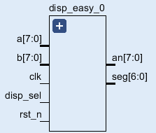
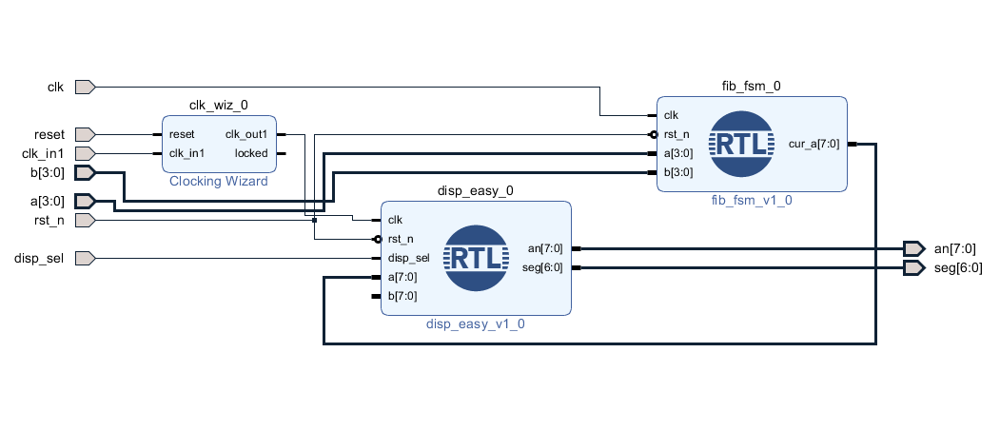
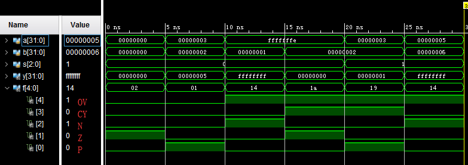
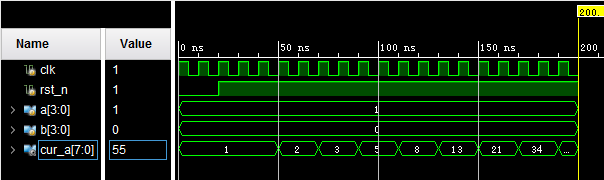
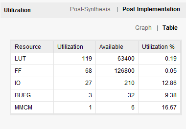
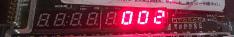
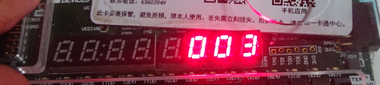
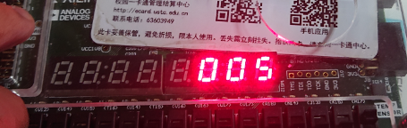

# 计算机组成原理 Lab1 实验报告

刘紫檀 PB17000232

------

## 逻辑设计与核心代码

### ALU

ALU采用三位操作码设计，默认位宽八位。加法器采用简单的串行进位加法器。减法使用取补码再+1的方法求得。标志位共有五位，从高到低分别为 `OV`（Overflow），`CY`（Carry），`N`（Negative），`Z`（Zero），`P`（Positive）。

本ALU共实现了加、减、与、或、非、异或功能。对于`NOT`操作，用`b`端口输入操作数，其余通过`a`和`b`输入。输出是`y`，标志为`f[4:0]`。

整体采用参数化设计，加法器部分采用Verilog Generate功能，类似C++的模板，在综合前自动实例化与ALU位宽相称的一位全加器。
**节选相关代码如下，末尾有全部代码**：

```verilog
module alu #( // ALU Module Def'n
        parameter ALU_WIDTH = 8,
        parameter ALU_OP_WIDTH = 3,
        parameter [ALU_OP_WIDTH - 1:0] ALU_ADD_OP = 3'b000,
        parameter [ALU_OP_WIDTH - 1:0] ALU_SUB_OP = 3'b001,
        parameter [ALU_OP_WIDTH - 1:0] ALU_AND_OP = 3'b010,
        parameter [ALU_OP_WIDTH - 1:0] ALU_OR_OP = 3'b011,
        parameter [ALU_OP_WIDTH - 1:0] ALU_NOT_OP = 3'b100,
        parameter [ALU_OP_WIDTH - 1:0] ALU_XOR_OP = 3'b101
    ) (
    input [ALU_WIDTH - 1: 0] a,
    input [ALU_WIDTH - 1: 0] b,
    input [ALU_OP_WIDTH - 1: 0] s,
    output reg [ALU_WIDTH - 1: 0] y,
    output reg [4:0] f
    );
```

```verilog

module alu_adder // 参数化的 ALU Adder
#( parameter ALU_ADDER_WIDTH = 32 ) (
        input [ALU_ADDER_WIDTH - 1 : 0] a,
        input [ALU_ADDER_WIDTH - 1 : 0] b,
        input ci,
        output [ALU_ADDER_WIDTH - 1 : 0] out,
        output cy,
        output ov
);
    wire [ALU_ADDER_WIDTH - 1 : 0] carry;
    genvar gv_i;
    generate
        for (gv_i = 0; gv_i < ALU_ADDER_WIDTH; gv_i = gv_i + 1) begin : alu_adder_arr
            if (gv_i == 0)
                one_bit_fulladder one_bit_fulladder_inst(a[gv_i], b[gv_i], ci, out[gv_i], carry[gv_i]);
            else
                one_bit_fulladder one_bit_fulladder_inst(a[gv_i], b[gv_i], carry[gv_i - 1], out[gv_i], carry[gv_i]);
        end
    endgenerate
    assign cy = carry[ALU_ADDER_WIDTH - 1];
    assign ov = carry[ALU_ADDER_WIDTH - 1] ^ out[ALU_ADDER_WIDTH - 1];

endmodule
```
#### 数据通路


### 斐波那契数列模块

斐波那契采用`cur_a`和`cur_b`两个寄存器存储当前的值。整个模块的动作在两个上升沿完成。

在第一个上升沿，`in_save_stage`的值为1，`cur_a`和`cur_b`的值被送入ALU进行加法运算。

在第二个上升沿，`in_save_stage`的值为0，`alu_out`被送入`cur_a`，同时`cur_a`被送入`cur_b`。

**核心代码如下，末尾有全部代码：**

```verilog
always @ (posedge clk) begin
    if (!rst_n) begin
        cur_a <= {1'b0,1'b0,1'b0,1'b0,a[3],a[2],a[1],a[0]};
        cur_b <= {1'b0,1'b0,1'b0,1'b0,b[3],b[2],b[1],b[0]};
        in_save_stage <= 1;
    end else begin
        if (in_save_stage) begin
            alu_in_a <= cur_a;
            alu_in_b <= cur_b;
            in_save_stage <= 0;
        end else begin 
            cur_a <= alu_out;
            cur_b <= cur_a;
            in_save_stage <= 1;
        end
    end
end
```
#### 数据通路


### disp_easy 辅助模块

为了方便调试，设置数码管显示模块`disp_easy`，可以接受两路八位输入，并且有开关控制将哪路的十进制值显示在数码管上。功能大致如下图所示：



其内部由控制逻辑，`bin2bcd`模块和`pulse_gen`扫描脉冲生成模块构成。`disp_sel`用来选择显示`a`还是`b`。`bin2bcd`模块现在还采用查表法，表格采用Python脚本打印而成（在程序注释里面有，Python3），但是预留了扩展为除法器进行二-十进制转换的可能。代码见后。

### Block Design

利用`IP Block Design`可以把所有内容方便的连接在一起，如下图：



## 仿真结果

### ALU

ALU的测试文件见下：

```verilog
module alu_tb();
reg [31:0] a;
reg [31:0] b;
reg [2:0] s;
wire [31:0] y;
wire [4:0] f;

alu #(.ALU_WIDTH(32)) my_alu (a, b, s, y, f);

    initial begin
        //Test Add
        a = 0; b = 0; s = 0;
        #5;
        a = 3; b = 2;
        #5;
        a = 4294967294; b = 1;
        #5;
        a = 4294967294; b = 2;
        #5;

        //Test Sub
        a = 3; b = 2; s = 1;
        #5;
        a = 5; b = 6;
        #5;
    end
endmodule
```

因为ALU的`XOR`等功能过于简单，所以没有为其编写`Testbench`。`Testbench`中仅仅测试了加法和减法。截图如下：



### 斐波那契数列

`fib_fsm`的测试文件见下：

```verilog
module fib_tb();

reg clk;
reg rst_n;
reg [3:0] a;
reg [3:0] b;
wire [7:0] cur_a;
fib_fsm my_fib (clk, rst_n, a, b, cur_a);

initial begin
    clk = 1;
    forever #5 clk=~clk;
end

initial begin
    rst_n = 0;
    a = 1; b = 0;
    #20;
    rst_n = 1;
end

endmodule
```



其中`cur_a`是斐波那契数列的输出，`a`和`b`是数列的第二项和第一项。

### disp_easy

```verilog
module disp_easy_tb();
    reg clk;
    reg rst_n;
    reg [7:0] a;
    reg [7:0] b;
    reg disp_sel;
    wire [7:0] an;
    wire [6:0] seg;
    disp_easy my_disp (clk, rst_n, disp_sel, a, b, an, seg);
    
    initial begin
        clk = 1;
        forever #5 clk=~clk;
    end
    
    initial begin
        rst_n = 0;
        a = 1; b = 2; disp_sel = 0;
        #20;
        rst_n = 1;
    end

endmodule
```

仿真如下：


这里测试时数码管显示`001`。

## 资源占用



（为加入`disp_easy`模块的结果）

## 下载结果

### Block Design（ALU & Fib & disp_easy）








（下略）

## 实验总结

本次实验我写了一个参数化的`ALU`，为之后的设计铺路了。感觉本次实验还是十分顺利的。

## 全部代码


### alu.v

```verilog
`timescale 1ns / 1ps
//////////////////////////////////////////////////////////////////////////////////
// Company: 
// Engineer: 
// 
// Create Date: 2019/03/14 22:23:34
// Design Name: 
// Module Name: alu
// Project Name: 
// Target Devices: 
// Tool Versions: 
// Description: 
// 
// Dependencies: 
// 
// Revision:
// Revision 0.01 - File Created
// Additional Comments:
// 
//////////////////////////////////////////////////////////////////////////////////

module one_bit_fulladder (
    input a,
    input b,
    input ci,
    output s,
    output co
    );
    //s=a xor b xor ci
    wire a_xor_b;
    xor  (a_xor_b, a, b);
    xor  (s, a_xor_b, ci);
    //co=ab+(a xor b)ci
    wire a_b;
    wire a_xor_b_ci;
    and  (a_b, a, b);
    and  (a_xor_b_ci, a_xor_b, ci);
    or   (co, a_b, a_xor_b_ci);
    
endmodule

//TODO: Find a modular version of writing, like template in C++
//module alu_adder(
//    input [7:0] a,
//    input [7:0] b,
//    output [7:0] s,
//    output co,
//    input ci
//    );
//    wire [7:0] carry;
//    one_bit_fulladder(a[0], b[0], ci, s[0], carry[0]);
//    one_bit_fulladder(a[1], b[1], carry[0], s[1], carry[1]);
//    one_bit_fulladder(a[2], b[2], carry[1], s[2], carry[2]);
//    one_bit_fulladder(a[3], b[3], carry[2], s[3], carry[3]);
//    one_bit_fulladder(a[4], b[4], carry[3], s[4], carry[4]);
//    one_bit_fulladder(a[5], b[5], carry[4], s[5], carry[5]);
//    one_bit_fulladder(a[6], b[6], carry[5], s[6], carry[6]);
//    one_bit_fulladder(a[7], b[7], carry[6], s[7], carry[7]);
//    assign co = carry[7];
    
//endmodule

module alu_adder 
#( parameter ALU_ADDER_WIDTH = 32 ) (
        input [ALU_ADDER_WIDTH - 1 : 0] a,
        input [ALU_ADDER_WIDTH - 1 : 0] b,
        input ci,
        output [ALU_ADDER_WIDTH - 1 : 0] out,
        output cy,
        output ov
);
    wire [ALU_ADDER_WIDTH - 1 : 0] carry;
    genvar gv_i;
    generate
        for (gv_i = 0; gv_i < ALU_ADDER_WIDTH; gv_i = gv_i + 1) begin : alu_adder_arr
            if (gv_i == 0)
                one_bit_fulladder one_bit_fulladder_inst(a[gv_i], b[gv_i], ci, out[gv_i], carry[gv_i]);
            else
                one_bit_fulladder one_bit_fulladder_inst(a[gv_i], b[gv_i], carry[gv_i - 1], out[gv_i], carry[gv_i]);
        end
    endgenerate
    assign cy = carry[ALU_ADDER_WIDTH - 1];
    assign ov = carry[ALU_ADDER_WIDTH - 1] ^ out[ALU_ADDER_WIDTH - 1];

endmodule

module alu_not
#( parameter ALU_NOT_WIDTH = 32 ) (
    input [ALU_NOT_WIDTH - 1 : 0] a,
    output [ALU_NOT_WIDTH - 1 : 0] s
);
    assign s = ~a;
endmodule

module alu_or
#( parameter ALU_OR_WIDTH = 32 ) (
    input [ALU_OR_WIDTH - 1 : 0] a,
    input [ALU_OR_WIDTH - 1 : 0] b,
    output [ALU_OR_WIDTH - 1 : 0] s
);
    assign s = a | b;
endmodule

module alu_xor
#( parameter ALU_XOR_WIDTH = 32 ) (
    input [ALU_XOR_WIDTH - 1 : 0] a,
    input [ALU_XOR_WIDTH - 1 : 0] b,
    output [ALU_XOR_WIDTH - 1 : 0] s
);
    assign s = a ^ b;
endmodule

module alu_and
#( parameter ALU_AND_WIDTH = 32 ) (
    input [ALU_AND_WIDTH - 1 : 0] a,
    input [ALU_AND_WIDTH - 1 : 0] b,
    output [ALU_AND_WIDTH - 1 : 0] s
);
    assign s = a & b;
endmodule

/* Simple ALU
 * f[3:0] = {CARRY, BORROW, ZERO, NEGATIVE}
 * a[n-1:0], b[n-1:0] as op
 * s: 000 for add
 *    001 for sub; a-b as result
 *    010 for and
 *    011 for or
 *    100 for not ** b as input **
 *    101 for xor
 * Flag vars: (4) (ARITHMETIC) | N | Z | P  (0)
 * Arithmetic: Add: OV(Overflow) | CY (Carry)
 *                That is to say, f[4] is OV, f[3] is CY, f[2] is Neg, f[1] is Zero and f[0] is Pos.
 *             Sub: OV(Overflow) | 0
 *             Mul:
 *             Div:
 */
  module alu #(
  parameter ALU_WIDTH = 8,
  parameter ALU_OP_WIDTH = 3,
  parameter [ALU_OP_WIDTH - 1:0] ALU_ADD_OP = 3'b000,
  parameter [ALU_OP_WIDTH - 1:0] ALU_SUB_OP = 3'b001,
  parameter [ALU_OP_WIDTH - 1:0] ALU_AND_OP = 3'b010,
  parameter [ALU_OP_WIDTH - 1:0] ALU_OR_OP = 3'b011,
  parameter [ALU_OP_WIDTH - 1:0] ALU_NOT_OP = 3'b100,
  parameter [ALU_OP_WIDTH - 1:0] ALU_XOR_OP = 3'b101
  ) (
  input [ALU_WIDTH - 1: 0] a,
  input [ALU_WIDTH - 1: 0] b,
  input [ALU_OP_WIDTH - 1: 0] s,
  output reg [ALU_WIDTH - 1: 0] y,
  output reg [4:0] f
  );

  //ALU Adder & Subtractor & Not; For multiplex, when needed to do sub, not ->  
  wire [ALU_WIDTH - 1: 0] alu_add_out;
  wire [ALU_WIDTH - 1: 0] alu_not_out;
  reg alu_add_cy_in;
  wire alu_add_cy;
  wire alu_add_ov;
  reg [ALU_WIDTH - 1: 0] alu_add_inb;
  alu_not #(.ALU_NOT_WIDTH( ALU_WIDTH )) alu_not_inst (b, alu_not_out);
  alu_adder #(.ALU_ADDER_WIDTH( ALU_WIDTH )) alu_adder_inst (a, alu_add_inb, alu_add_cy_in, alu_add_out, alu_add_cy, alu_add_ov);

  //ALU And
  wire [ALU_WIDTH - 1: 0] alu_and_out;
  alu_and #(.ALU_AND_WIDTH( ALU_WIDTH )) alu_and_inst (a, b, alu_and_out);

  //ALU Or
  wire [ALU_WIDTH - 1: 0] alu_or_out;
  alu_or #(.ALU_OR_WIDTH( ALU_WIDTH )) alu_or_inst (a, b, alu_or_out);

  //ALU Xor
  wire [ALU_WIDTH - 1: 0] alu_xor_out;
  alu_xor #(.ALU_XOR_WIDTH( ALU_WIDTH )) alu_xor_inst (a, b, alu_xor_out);

always @ (*) begin
    // Avoid generating latches
    f = 5'd0;
    y = 0;
    alu_add_cy_in = 0;
    alu_add_inb = b;
    

case (s)
    ALU_ADD_OP: begin y = alu_add_out; f[3] = alu_add_cy; f[4] = alu_add_ov; end
    ALU_SUB_OP: begin alu_add_cy_in = 1; alu_add_inb = alu_not_out; y = alu_add_out; f[3] = alu_add_cy; f[4] = alu_add_ov; end
    ALU_NOT_OP: y = alu_not_out;
    ALU_OR_OP: y = alu_or_out;
    ALU_AND_OP: y = alu_and_out;
    ALU_XOR_OP: y = alu_xor_out;            
endcase

// N,Z,P Flags
if (y == 0) f[1] = 1;
else if ( y[ALU_WIDTH - 1] == 1) f[2] = 1;
else f[0] = 1;

end

endmodule
```

### fib_fsm.v

```verilog
`timescale 1ns / 1ps
//////////////////////////////////////////////////////////////////////////////////
// Company: 
// Engineer: 
// 
// Create Date: 2019/03/20 15:15:20
// Design Name: 
// Module Name: fib_fsm
// Project Name: 
// Target Devices: 
// Tool Versions: 
// Description: 
// 
// Dependencies: 
// 
// Revision:
// Revision 0.01 - File Created
// Additional Comments:
// 
//////////////////////////////////////////////////////////////////////////////////
module fib_fsm(
    input clk,
    input rst_n,
    input [3:0] a,
    input [3:0] b,
    output reg [7:0] cur_a
    );
    
    reg [7:0] alu_in_a;
    reg [7:0] alu_in_b;
    wire [7:0] alu_out;
    wire [4:0] flags;
    alu #(.ALU_WIDTH(8)) my_alu (alu_in_a, alu_in_b, 0, alu_out, flags);
    
    //reg [7:0] cur_a;
    reg [7:0] cur_b;
    reg in_save_stage;
    always @ (posedge clk) begin
        if (!rst_n) begin
            cur_a <= {1'b0,1'b0,1'b0,1'b0,a[3],a[2],a[1],a[0]};
            cur_b <= {1'b0,1'b0,1'b0,1'b0,b[3],b[2],b[1],b[0]};
            in_save_stage <= 1;
        end else begin
            if (in_save_stage) begin
                alu_in_a <= cur_a;
                alu_in_b <= cur_b;
                in_save_stage <= 0;
            end else begin 
                cur_a <= alu_out;
                cur_b <= cur_a;
                in_save_stage <= 1;
            end
        end
    end
    
endmodule
```

### disp_easy.v

```verilog
`timescale 1ns / 1ps
//////////////////////////////////////////////////////////////////////////////////
// Company: 
// Engineer: 
// 
// Create Date: 2019/03/20 21:43:48
// Design Name: 
// Module Name: disp_easy
// Project Name: 
// Target Devices: 
// Tool Versions: 
// Description: 
// 
// Dependencies: 
// 
// Revision:
// Revision 0.01 - File Created
// Additional Comments:
// 
//////////////////////////////////////////////////////////////////////////////////

module bcd_decoder(
    input [3:0] x,
    output reg [6:0] seg
    );
    
    always @ (*)
    begin
        case (x)
            4'd0: begin seg = 7'b1000000; end
            4'd1: begin seg = 7'b1111001; end 
            4'd2: begin seg = 7'b0100100; end
            4'd3: begin seg = 7'b0110000; end 
            4'd4: begin seg = 7'b0011001; end
            4'd5: begin seg = 7'b0010010; end
            4'd6: begin seg = 7'b0000010; end
            4'd7: begin seg = 7'b1111000; end
            4'd8: begin seg = 7'b0000000; end
            4'd9: begin seg = 7'b0010000; end
          //Actually error here.
            4'd10: begin seg = 7'b1000000; end
            4'd11: begin seg = 7'b1111001; end
            4'd12: begin seg = 7'b0100100; end
            4'd13: begin seg = 7'b0110000; end
            4'd14: begin seg = 7'b0011001; end
            4'd15: begin seg = 7'b0010010; end
        endcase
    end
endmodule

/* Temporary solution of generating table, in Python
def get_bcd(x, digit):
    a = int(x / 100)
    b = int((x - 100 * a) / 10)
    c = (x - 100 * a - 10 * b)
    if digit == 2:
        return a
    elif digit == 1:
        return b
    else:
        return c


for i in range(0,255):
    for j in range(0,3):
        print( "10'b" + bin((i << 2) + j)[2:], ": bcd = 4'b" + bin(get_bcd(i, j))[2:] + ";")
*/

module bin2bcd(
    input clk,
    input rst_n,
    input [7:0] data,
    input [1:0] sel,
    output ready,
    output reg [3:0] bcd
);
    assign ready = 1;
    always @ (*) begin
    bcd = 0;
    // Run by searching table for now, but fix it later
    case ({data, sel})
    10'b0 : bcd = 4'b0;
    10'b1 : bcd = 4'b0;
    10'b10 : bcd = 4'b0;
    10'b100 : bcd = 4'b1;
    10'b101 : bcd = 4'b0;
    10'b110 : bcd = 4'b0;
    10'b1000 : bcd = 4'b10;
    10'b1001 : bcd = 4'b0;
    10'b1010 : bcd = 4'b0;
    10'b1100 : bcd = 4'b11;
    10'b1101 : bcd = 4'b0;
    10'b1110 : bcd = 4'b0;
    10'b10000 : bcd = 4'b100;
    10'b10001 : bcd = 4'b0;
    10'b10010 : bcd = 4'b0;
    10'b10100 : bcd = 4'b101;
    10'b10101 : bcd = 4'b0;
    10'b10110 : bcd = 4'b0;
    10'b11000 : bcd = 4'b110;
    10'b11001 : bcd = 4'b0;
    10'b11010 : bcd = 4'b0;
    10'b11100 : bcd = 4'b111;
    10'b11101 : bcd = 4'b0;
    10'b11110 : bcd = 4'b0;
    10'b100000 : bcd = 4'b1000;
    10'b100001 : bcd = 4'b0;
    10'b100010 : bcd = 4'b0;
    10'b100100 : bcd = 4'b1001;
    10'b100101 : bcd = 4'b0;
    10'b100110 : bcd = 4'b0;
    10'b101000 : bcd = 4'b0;
    10'b101001 : bcd = 4'b1;
    10'b101010 : bcd = 4'b0;
    10'b101100 : bcd = 4'b1;
    10'b101101 : bcd = 4'b1;
    10'b101110 : bcd = 4'b0;
    10'b110000 : bcd = 4'b10;
    10'b110001 : bcd = 4'b1;
    10'b110010 : bcd = 4'b0;
    10'b110100 : bcd = 4'b11;
    10'b110101 : bcd = 4'b1;
    10'b110110 : bcd = 4'b0;
    10'b111000 : bcd = 4'b100;
    10'b111001 : bcd = 4'b1;
    10'b111010 : bcd = 4'b0;
    10'b111100 : bcd = 4'b101;
    10'b111101 : bcd = 4'b1;
    10'b111110 : bcd = 4'b0;
    10'b1000000 : bcd = 4'b110;
    10'b1000001 : bcd = 4'b1;
    10'b1000010 : bcd = 4'b0;
    10'b1000100 : bcd = 4'b111;
    10'b1000101 : bcd = 4'b1;
    10'b1000110 : bcd = 4'b0;
    10'b1001000 : bcd = 4'b1000;
    10'b1001001 : bcd = 4'b1;
    10'b1001010 : bcd = 4'b0;
    10'b1001100 : bcd = 4'b1001;
    10'b1001101 : bcd = 4'b1;
    10'b1001110 : bcd = 4'b0;
    10'b1010000 : bcd = 4'b0;
    10'b1010001 : bcd = 4'b10;
    10'b1010010 : bcd = 4'b0;
    10'b1010100 : bcd = 4'b1;
    10'b1010101 : bcd = 4'b10;
    10'b1010110 : bcd = 4'b0;
    10'b1011000 : bcd = 4'b10;
    10'b1011001 : bcd = 4'b10;
    10'b1011010 : bcd = 4'b0;
    10'b1011100 : bcd = 4'b11;
    10'b1011101 : bcd = 4'b10;
    10'b1011110 : bcd = 4'b0;
    10'b1100000 : bcd = 4'b100;
    10'b1100001 : bcd = 4'b10;
    10'b1100010 : bcd = 4'b0;
    10'b1100100 : bcd = 4'b101;
    10'b1100101 : bcd = 4'b10;
    10'b1100110 : bcd = 4'b0;
    10'b1101000 : bcd = 4'b110;
    10'b1101001 : bcd = 4'b10;
    10'b1101010 : bcd = 4'b0;
    10'b1101100 : bcd = 4'b111;
    10'b1101101 : bcd = 4'b10;
    10'b1101110 : bcd = 4'b0;
    10'b1110000 : bcd = 4'b1000;
    10'b1110001 : bcd = 4'b10;
    10'b1110010 : bcd = 4'b0;
    10'b1110100 : bcd = 4'b1001;
    10'b1110101 : bcd = 4'b10;
    10'b1110110 : bcd = 4'b0;
    10'b1111000 : bcd = 4'b0;
    10'b1111001 : bcd = 4'b11;
    10'b1111010 : bcd = 4'b0;
    10'b1111100 : bcd = 4'b1;
    10'b1111101 : bcd = 4'b11;
    10'b1111110 : bcd = 4'b0;
    10'b10000000 : bcd = 4'b10;
    10'b10000001 : bcd = 4'b11;
    10'b10000010 : bcd = 4'b0;
    10'b10000100 : bcd = 4'b11;
    10'b10000101 : bcd = 4'b11;
    10'b10000110 : bcd = 4'b0;
    10'b10001000 : bcd = 4'b100;
    10'b10001001 : bcd = 4'b11;
    10'b10001010 : bcd = 4'b0;
    10'b10001100 : bcd = 4'b101;
    10'b10001101 : bcd = 4'b11;
    10'b10001110 : bcd = 4'b0;
    10'b10010000 : bcd = 4'b110;
    10'b10010001 : bcd = 4'b11;
    10'b10010010 : bcd = 4'b0;
    10'b10010100 : bcd = 4'b111;
    10'b10010101 : bcd = 4'b11;
    10'b10010110 : bcd = 4'b0;
    10'b10011000 : bcd = 4'b1000;
    10'b10011001 : bcd = 4'b11;
    10'b10011010 : bcd = 4'b0;
    10'b10011100 : bcd = 4'b1001;
    10'b10011101 : bcd = 4'b11;
    10'b10011110 : bcd = 4'b0;
    10'b10100000 : bcd = 4'b0;
    10'b10100001 : bcd = 4'b100;
    10'b10100010 : bcd = 4'b0;
    10'b10100100 : bcd = 4'b1;
    10'b10100101 : bcd = 4'b100;
    10'b10100110 : bcd = 4'b0;
    10'b10101000 : bcd = 4'b10;
    10'b10101001 : bcd = 4'b100;
    10'b10101010 : bcd = 4'b0;
    10'b10101100 : bcd = 4'b11;
    10'b10101101 : bcd = 4'b100;
    10'b10101110 : bcd = 4'b0;
    10'b10110000 : bcd = 4'b100;
    10'b10110001 : bcd = 4'b100;
    10'b10110010 : bcd = 4'b0;
    10'b10110100 : bcd = 4'b101;
    10'b10110101 : bcd = 4'b100;
    10'b10110110 : bcd = 4'b0;
    10'b10111000 : bcd = 4'b110;
    10'b10111001 : bcd = 4'b100;
    10'b10111010 : bcd = 4'b0;
    10'b10111100 : bcd = 4'b111;
    10'b10111101 : bcd = 4'b100;
    10'b10111110 : bcd = 4'b0;
    10'b11000000 : bcd = 4'b1000;
    10'b11000001 : bcd = 4'b100;
    10'b11000010 : bcd = 4'b0;
    10'b11000100 : bcd = 4'b1001;
    10'b11000101 : bcd = 4'b100;
    10'b11000110 : bcd = 4'b0;
    10'b11001000 : bcd = 4'b0;
    10'b11001001 : bcd = 4'b101;
    10'b11001010 : bcd = 4'b0;
    10'b11001100 : bcd = 4'b1;
    10'b11001101 : bcd = 4'b101;
    10'b11001110 : bcd = 4'b0;
    10'b11010000 : bcd = 4'b10;
    10'b11010001 : bcd = 4'b101;
    10'b11010010 : bcd = 4'b0;
    10'b11010100 : bcd = 4'b11;
    10'b11010101 : bcd = 4'b101;
    10'b11010110 : bcd = 4'b0;
    10'b11011000 : bcd = 4'b100;
    10'b11011001 : bcd = 4'b101;
    10'b11011010 : bcd = 4'b0;
    10'b11011100 : bcd = 4'b101;
    10'b11011101 : bcd = 4'b101;
    10'b11011110 : bcd = 4'b0;
    10'b11100000 : bcd = 4'b110;
    10'b11100001 : bcd = 4'b101;
    10'b11100010 : bcd = 4'b0;
    10'b11100100 : bcd = 4'b111;
    10'b11100101 : bcd = 4'b101;
    10'b11100110 : bcd = 4'b0;
    10'b11101000 : bcd = 4'b1000;
    10'b11101001 : bcd = 4'b101;
    10'b11101010 : bcd = 4'b0;
    10'b11101100 : bcd = 4'b1001;
    10'b11101101 : bcd = 4'b101;
    10'b11101110 : bcd = 4'b0;
    10'b11110000 : bcd = 4'b0;
    10'b11110001 : bcd = 4'b110;
    10'b11110010 : bcd = 4'b0;
    10'b11110100 : bcd = 4'b1;
    10'b11110101 : bcd = 4'b110;
    10'b11110110 : bcd = 4'b0;
    10'b11111000 : bcd = 4'b10;
    10'b11111001 : bcd = 4'b110;
    10'b11111010 : bcd = 4'b0;
    10'b11111100 : bcd = 4'b11;
    10'b11111101 : bcd = 4'b110;
    10'b11111110 : bcd = 4'b0;
    10'b100000000 : bcd = 4'b100;
    10'b100000001 : bcd = 4'b110;
    10'b100000010 : bcd = 4'b0;
    10'b100000100 : bcd = 4'b101;
    10'b100000101 : bcd = 4'b110;
    10'b100000110 : bcd = 4'b0;
    10'b100001000 : bcd = 4'b110;
    10'b100001001 : bcd = 4'b110;
    10'b100001010 : bcd = 4'b0;
    10'b100001100 : bcd = 4'b111;
    10'b100001101 : bcd = 4'b110;
    10'b100001110 : bcd = 4'b0;
    10'b100010000 : bcd = 4'b1000;
    10'b100010001 : bcd = 4'b110;
    10'b100010010 : bcd = 4'b0;
    10'b100010100 : bcd = 4'b1001;
    10'b100010101 : bcd = 4'b110;
    10'b100010110 : bcd = 4'b0;
    10'b100011000 : bcd = 4'b0;
    10'b100011001 : bcd = 4'b111;
    10'b100011010 : bcd = 4'b0;
    10'b100011100 : bcd = 4'b1;
    10'b100011101 : bcd = 4'b111;
    10'b100011110 : bcd = 4'b0;
    10'b100100000 : bcd = 4'b10;
    10'b100100001 : bcd = 4'b111;
    10'b100100010 : bcd = 4'b0;
    10'b100100100 : bcd = 4'b11;
    10'b100100101 : bcd = 4'b111;
    10'b100100110 : bcd = 4'b0;
    10'b100101000 : bcd = 4'b100;
    10'b100101001 : bcd = 4'b111;
    10'b100101010 : bcd = 4'b0;
    10'b100101100 : bcd = 4'b101;
    10'b100101101 : bcd = 4'b111;
    10'b100101110 : bcd = 4'b0;
    10'b100110000 : bcd = 4'b110;
    10'b100110001 : bcd = 4'b111;
    10'b100110010 : bcd = 4'b0;
    10'b100110100 : bcd = 4'b111;
    10'b100110101 : bcd = 4'b111;
    10'b100110110 : bcd = 4'b0;
    10'b100111000 : bcd = 4'b1000;
    10'b100111001 : bcd = 4'b111;
    10'b100111010 : bcd = 4'b0;
    10'b100111100 : bcd = 4'b1001;
    10'b100111101 : bcd = 4'b111;
    10'b100111110 : bcd = 4'b0;
    10'b101000000 : bcd = 4'b0;
    10'b101000001 : bcd = 4'b1000;
    10'b101000010 : bcd = 4'b0;
    10'b101000100 : bcd = 4'b1;
    10'b101000101 : bcd = 4'b1000;
    10'b101000110 : bcd = 4'b0;
    10'b101001000 : bcd = 4'b10;
    10'b101001001 : bcd = 4'b1000;
    10'b101001010 : bcd = 4'b0;
    10'b101001100 : bcd = 4'b11;
    10'b101001101 : bcd = 4'b1000;
    10'b101001110 : bcd = 4'b0;
    10'b101010000 : bcd = 4'b100;
    10'b101010001 : bcd = 4'b1000;
    10'b101010010 : bcd = 4'b0;
    10'b101010100 : bcd = 4'b101;
    10'b101010101 : bcd = 4'b1000;
    10'b101010110 : bcd = 4'b0;
    10'b101011000 : bcd = 4'b110;
    10'b101011001 : bcd = 4'b1000;
    10'b101011010 : bcd = 4'b0;
    10'b101011100 : bcd = 4'b111;
    10'b101011101 : bcd = 4'b1000;
    10'b101011110 : bcd = 4'b0;
    10'b101100000 : bcd = 4'b1000;
    10'b101100001 : bcd = 4'b1000;
    10'b101100010 : bcd = 4'b0;
    10'b101100100 : bcd = 4'b1001;
    10'b101100101 : bcd = 4'b1000;
    10'b101100110 : bcd = 4'b0;
    10'b101101000 : bcd = 4'b0;
    10'b101101001 : bcd = 4'b1001;
    10'b101101010 : bcd = 4'b0;
    10'b101101100 : bcd = 4'b1;
    10'b101101101 : bcd = 4'b1001;
    10'b101101110 : bcd = 4'b0;
    10'b101110000 : bcd = 4'b10;
    10'b101110001 : bcd = 4'b1001;
    10'b101110010 : bcd = 4'b0;
    10'b101110100 : bcd = 4'b11;
    10'b101110101 : bcd = 4'b1001;
    10'b101110110 : bcd = 4'b0;
    10'b101111000 : bcd = 4'b100;
    10'b101111001 : bcd = 4'b1001;
    10'b101111010 : bcd = 4'b0;
    10'b101111100 : bcd = 4'b101;
    10'b101111101 : bcd = 4'b1001;
    10'b101111110 : bcd = 4'b0;
    10'b110000000 : bcd = 4'b110;
    10'b110000001 : bcd = 4'b1001;
    10'b110000010 : bcd = 4'b0;
    10'b110000100 : bcd = 4'b111;
    10'b110000101 : bcd = 4'b1001;
    10'b110000110 : bcd = 4'b0;
    10'b110001000 : bcd = 4'b1000;
    10'b110001001 : bcd = 4'b1001;
    10'b110001010 : bcd = 4'b0;
    10'b110001100 : bcd = 4'b1001;
    10'b110001101 : bcd = 4'b1001;
    10'b110001110 : bcd = 4'b0;
    10'b110010000 : bcd = 4'b0;
    10'b110010001 : bcd = 4'b0;
    10'b110010010 : bcd = 4'b1;
    10'b110010100 : bcd = 4'b1;
    10'b110010101 : bcd = 4'b0;
    10'b110010110 : bcd = 4'b1;
    10'b110011000 : bcd = 4'b10;
    10'b110011001 : bcd = 4'b0;
    10'b110011010 : bcd = 4'b1;
    10'b110011100 : bcd = 4'b11;
    10'b110011101 : bcd = 4'b0;
    10'b110011110 : bcd = 4'b1;
    10'b110100000 : bcd = 4'b100;
    10'b110100001 : bcd = 4'b0;
    10'b110100010 : bcd = 4'b1;
    10'b110100100 : bcd = 4'b101;
    10'b110100101 : bcd = 4'b0;
    10'b110100110 : bcd = 4'b1;
    10'b110101000 : bcd = 4'b110;
    10'b110101001 : bcd = 4'b0;
    10'b110101010 : bcd = 4'b1;
    10'b110101100 : bcd = 4'b111;
    10'b110101101 : bcd = 4'b0;
    10'b110101110 : bcd = 4'b1;
    10'b110110000 : bcd = 4'b1000;
    10'b110110001 : bcd = 4'b0;
    10'b110110010 : bcd = 4'b1;
    10'b110110100 : bcd = 4'b1001;
    10'b110110101 : bcd = 4'b0;
    10'b110110110 : bcd = 4'b1;
    10'b110111000 : bcd = 4'b0;
    10'b110111001 : bcd = 4'b1;
    10'b110111010 : bcd = 4'b1;
    10'b110111100 : bcd = 4'b1;
    10'b110111101 : bcd = 4'b1;
    10'b110111110 : bcd = 4'b1;
    10'b111000000 : bcd = 4'b10;
    10'b111000001 : bcd = 4'b1;
    10'b111000010 : bcd = 4'b1;
    10'b111000100 : bcd = 4'b11;
    10'b111000101 : bcd = 4'b1;
    10'b111000110 : bcd = 4'b1;
    10'b111001000 : bcd = 4'b100;
    10'b111001001 : bcd = 4'b1;
    10'b111001010 : bcd = 4'b1;
    10'b111001100 : bcd = 4'b101;
    10'b111001101 : bcd = 4'b1;
    10'b111001110 : bcd = 4'b1;
    10'b111010000 : bcd = 4'b110;
    10'b111010001 : bcd = 4'b1;
    10'b111010010 : bcd = 4'b1;
    10'b111010100 : bcd = 4'b111;
    10'b111010101 : bcd = 4'b1;
    10'b111010110 : bcd = 4'b1;
    10'b111011000 : bcd = 4'b1000;
    10'b111011001 : bcd = 4'b1;
    10'b111011010 : bcd = 4'b1;
    10'b111011100 : bcd = 4'b1001;
    10'b111011101 : bcd = 4'b1;
    10'b111011110 : bcd = 4'b1;
    10'b111100000 : bcd = 4'b0;
    10'b111100001 : bcd = 4'b10;
    10'b111100010 : bcd = 4'b1;
    10'b111100100 : bcd = 4'b1;
    10'b111100101 : bcd = 4'b10;
    10'b111100110 : bcd = 4'b1;
    10'b111101000 : bcd = 4'b10;
    10'b111101001 : bcd = 4'b10;
    10'b111101010 : bcd = 4'b1;
    10'b111101100 : bcd = 4'b11;
    10'b111101101 : bcd = 4'b10;
    10'b111101110 : bcd = 4'b1;
    10'b111110000 : bcd = 4'b100;
    10'b111110001 : bcd = 4'b10;
    10'b111110010 : bcd = 4'b1;
    10'b111110100 : bcd = 4'b101;
    10'b111110101 : bcd = 4'b10;
    10'b111110110 : bcd = 4'b1;
    10'b111111000 : bcd = 4'b110;
    10'b111111001 : bcd = 4'b10;
    10'b111111010 : bcd = 4'b1;
    10'b111111100 : bcd = 4'b111;
    10'b111111101 : bcd = 4'b10;
    10'b111111110 : bcd = 4'b1;
    10'b1000000000 : bcd = 4'b1000;
    10'b1000000001 : bcd = 4'b10;
    10'b1000000010 : bcd = 4'b1;
    10'b1000000100 : bcd = 4'b1001;
    10'b1000000101 : bcd = 4'b10;
    10'b1000000110 : bcd = 4'b1;
    10'b1000001000 : bcd = 4'b0;
    10'b1000001001 : bcd = 4'b11;
    10'b1000001010 : bcd = 4'b1;
    10'b1000001100 : bcd = 4'b1;
    10'b1000001101 : bcd = 4'b11;
    10'b1000001110 : bcd = 4'b1;
    10'b1000010000 : bcd = 4'b10;
    10'b1000010001 : bcd = 4'b11;
    10'b1000010010 : bcd = 4'b1;
    10'b1000010100 : bcd = 4'b11;
    10'b1000010101 : bcd = 4'b11;
    10'b1000010110 : bcd = 4'b1;
    10'b1000011000 : bcd = 4'b100;
    10'b1000011001 : bcd = 4'b11;
    10'b1000011010 : bcd = 4'b1;
    10'b1000011100 : bcd = 4'b101;
    10'b1000011101 : bcd = 4'b11;
    10'b1000011110 : bcd = 4'b1;
    10'b1000100000 : bcd = 4'b110;
    10'b1000100001 : bcd = 4'b11;
    10'b1000100010 : bcd = 4'b1;
    10'b1000100100 : bcd = 4'b111;
    10'b1000100101 : bcd = 4'b11;
    10'b1000100110 : bcd = 4'b1;
    10'b1000101000 : bcd = 4'b1000;
    10'b1000101001 : bcd = 4'b11;
    10'b1000101010 : bcd = 4'b1;
    10'b1000101100 : bcd = 4'b1001;
    10'b1000101101 : bcd = 4'b11;
    10'b1000101110 : bcd = 4'b1;
    10'b1000110000 : bcd = 4'b0;
    10'b1000110001 : bcd = 4'b100;
    10'b1000110010 : bcd = 4'b1;
    10'b1000110100 : bcd = 4'b1;
    10'b1000110101 : bcd = 4'b100;
    10'b1000110110 : bcd = 4'b1;
    10'b1000111000 : bcd = 4'b10;
    10'b1000111001 : bcd = 4'b100;
    10'b1000111010 : bcd = 4'b1;
    10'b1000111100 : bcd = 4'b11;
    10'b1000111101 : bcd = 4'b100;
    10'b1000111110 : bcd = 4'b1;
    10'b1001000000 : bcd = 4'b100;
    10'b1001000001 : bcd = 4'b100;
    10'b1001000010 : bcd = 4'b1;
    10'b1001000100 : bcd = 4'b101;
    10'b1001000101 : bcd = 4'b100;
    10'b1001000110 : bcd = 4'b1;
    10'b1001001000 : bcd = 4'b110;
    10'b1001001001 : bcd = 4'b100;
    10'b1001001010 : bcd = 4'b1;
    10'b1001001100 : bcd = 4'b111;
    10'b1001001101 : bcd = 4'b100;
    10'b1001001110 : bcd = 4'b1;
    10'b1001010000 : bcd = 4'b1000;
    10'b1001010001 : bcd = 4'b100;
    10'b1001010010 : bcd = 4'b1;
    10'b1001010100 : bcd = 4'b1001;
    10'b1001010101 : bcd = 4'b100;
    10'b1001010110 : bcd = 4'b1;
    10'b1001011000 : bcd = 4'b0;
    10'b1001011001 : bcd = 4'b101;
    10'b1001011010 : bcd = 4'b1;
    10'b1001011100 : bcd = 4'b1;
    10'b1001011101 : bcd = 4'b101;
    10'b1001011110 : bcd = 4'b1;
    10'b1001100000 : bcd = 4'b10;
    10'b1001100001 : bcd = 4'b101;
    10'b1001100010 : bcd = 4'b1;
    10'b1001100100 : bcd = 4'b11;
    10'b1001100101 : bcd = 4'b101;
    10'b1001100110 : bcd = 4'b1;
    10'b1001101000 : bcd = 4'b100;
    10'b1001101001 : bcd = 4'b101;
    10'b1001101010 : bcd = 4'b1;
    10'b1001101100 : bcd = 4'b101;
    10'b1001101101 : bcd = 4'b101;
    10'b1001101110 : bcd = 4'b1;
    10'b1001110000 : bcd = 4'b110;
    10'b1001110001 : bcd = 4'b101;
    10'b1001110010 : bcd = 4'b1;
    10'b1001110100 : bcd = 4'b111;
    10'b1001110101 : bcd = 4'b101;
    10'b1001110110 : bcd = 4'b1;
    10'b1001111000 : bcd = 4'b1000;
    10'b1001111001 : bcd = 4'b101;
    10'b1001111010 : bcd = 4'b1;
    10'b1001111100 : bcd = 4'b1001;
    10'b1001111101 : bcd = 4'b101;
    10'b1001111110 : bcd = 4'b1;
    10'b1010000000 : bcd = 4'b0;
    10'b1010000001 : bcd = 4'b110;
    10'b1010000010 : bcd = 4'b1;
    10'b1010000100 : bcd = 4'b1;
    10'b1010000101 : bcd = 4'b110;
    10'b1010000110 : bcd = 4'b1;
    10'b1010001000 : bcd = 4'b10;
    10'b1010001001 : bcd = 4'b110;
    10'b1010001010 : bcd = 4'b1;
    10'b1010001100 : bcd = 4'b11;
    10'b1010001101 : bcd = 4'b110;
    10'b1010001110 : bcd = 4'b1;
    10'b1010010000 : bcd = 4'b100;
    10'b1010010001 : bcd = 4'b110;
    10'b1010010010 : bcd = 4'b1;
    10'b1010010100 : bcd = 4'b101;
    10'b1010010101 : bcd = 4'b110;
    10'b1010010110 : bcd = 4'b1;
    10'b1010011000 : bcd = 4'b110;
    10'b1010011001 : bcd = 4'b110;
    10'b1010011010 : bcd = 4'b1;
    10'b1010011100 : bcd = 4'b111;
    10'b1010011101 : bcd = 4'b110;
    10'b1010011110 : bcd = 4'b1;
    10'b1010100000 : bcd = 4'b1000;
    10'b1010100001 : bcd = 4'b110;
    10'b1010100010 : bcd = 4'b1;
    10'b1010100100 : bcd = 4'b1001;
    10'b1010100101 : bcd = 4'b110;
    10'b1010100110 : bcd = 4'b1;
    10'b1010101000 : bcd = 4'b0;
    10'b1010101001 : bcd = 4'b111;
    10'b1010101010 : bcd = 4'b1;
    10'b1010101100 : bcd = 4'b1;
    10'b1010101101 : bcd = 4'b111;
    10'b1010101110 : bcd = 4'b1;
    10'b1010110000 : bcd = 4'b10;
    10'b1010110001 : bcd = 4'b111;
    10'b1010110010 : bcd = 4'b1;
    10'b1010110100 : bcd = 4'b11;
    10'b1010110101 : bcd = 4'b111;
    10'b1010110110 : bcd = 4'b1;
    10'b1010111000 : bcd = 4'b100;
    10'b1010111001 : bcd = 4'b111;
    10'b1010111010 : bcd = 4'b1;
    10'b1010111100 : bcd = 4'b101;
    10'b1010111101 : bcd = 4'b111;
    10'b1010111110 : bcd = 4'b1;
    10'b1011000000 : bcd = 4'b110;
    10'b1011000001 : bcd = 4'b111;
    10'b1011000010 : bcd = 4'b1;
    10'b1011000100 : bcd = 4'b111;
    10'b1011000101 : bcd = 4'b111;
    10'b1011000110 : bcd = 4'b1;
    10'b1011001000 : bcd = 4'b1000;
    10'b1011001001 : bcd = 4'b111;
    10'b1011001010 : bcd = 4'b1;
    10'b1011001100 : bcd = 4'b1001;
    10'b1011001101 : bcd = 4'b111;
    10'b1011001110 : bcd = 4'b1;
    10'b1011010000 : bcd = 4'b0;
    10'b1011010001 : bcd = 4'b1000;
    10'b1011010010 : bcd = 4'b1;
    10'b1011010100 : bcd = 4'b1;
    10'b1011010101 : bcd = 4'b1000;
    10'b1011010110 : bcd = 4'b1;
    10'b1011011000 : bcd = 4'b10;
    10'b1011011001 : bcd = 4'b1000;
    10'b1011011010 : bcd = 4'b1;
    10'b1011011100 : bcd = 4'b11;
    10'b1011011101 : bcd = 4'b1000;
    10'b1011011110 : bcd = 4'b1;
    10'b1011100000 : bcd = 4'b100;
    10'b1011100001 : bcd = 4'b1000;
    10'b1011100010 : bcd = 4'b1;
    10'b1011100100 : bcd = 4'b101;
    10'b1011100101 : bcd = 4'b1000;
    10'b1011100110 : bcd = 4'b1;
    10'b1011101000 : bcd = 4'b110;
    10'b1011101001 : bcd = 4'b1000;
    10'b1011101010 : bcd = 4'b1;
    10'b1011101100 : bcd = 4'b111;
    10'b1011101101 : bcd = 4'b1000;
    10'b1011101110 : bcd = 4'b1;
    10'b1011110000 : bcd = 4'b1000;
    10'b1011110001 : bcd = 4'b1000;
    10'b1011110010 : bcd = 4'b1;
    10'b1011110100 : bcd = 4'b1001;
    10'b1011110101 : bcd = 4'b1000;
    10'b1011110110 : bcd = 4'b1;
    10'b1011111000 : bcd = 4'b0;
    10'b1011111001 : bcd = 4'b1001;
    10'b1011111010 : bcd = 4'b1;
    10'b1011111100 : bcd = 4'b1;
    10'b1011111101 : bcd = 4'b1001;
    10'b1011111110 : bcd = 4'b1;
    10'b1100000000 : bcd = 4'b10;
    10'b1100000001 : bcd = 4'b1001;
    10'b1100000010 : bcd = 4'b1;
    10'b1100000100 : bcd = 4'b11;
    10'b1100000101 : bcd = 4'b1001;
    10'b1100000110 : bcd = 4'b1;
    10'b1100001000 : bcd = 4'b100;
    10'b1100001001 : bcd = 4'b1001;
    10'b1100001010 : bcd = 4'b1;
    10'b1100001100 : bcd = 4'b101;
    10'b1100001101 : bcd = 4'b1001;
    10'b1100001110 : bcd = 4'b1;
    10'b1100010000 : bcd = 4'b110;
    10'b1100010001 : bcd = 4'b1001;
    10'b1100010010 : bcd = 4'b1;
    10'b1100010100 : bcd = 4'b111;
    10'b1100010101 : bcd = 4'b1001;
    10'b1100010110 : bcd = 4'b1;
    10'b1100011000 : bcd = 4'b1000;
    10'b1100011001 : bcd = 4'b1001;
    10'b1100011010 : bcd = 4'b1;
    10'b1100011100 : bcd = 4'b1001;
    10'b1100011101 : bcd = 4'b1001;
    10'b1100011110 : bcd = 4'b1;
    10'b1100100000 : bcd = 4'b0;
    10'b1100100001 : bcd = 4'b0;
    10'b1100100010 : bcd = 4'b10;
    10'b1100100100 : bcd = 4'b1;
    10'b1100100101 : bcd = 4'b0;
    10'b1100100110 : bcd = 4'b10;
    10'b1100101000 : bcd = 4'b10;
    10'b1100101001 : bcd = 4'b0;
    10'b1100101010 : bcd = 4'b10;
    10'b1100101100 : bcd = 4'b11;
    10'b1100101101 : bcd = 4'b0;
    10'b1100101110 : bcd = 4'b10;
    10'b1100110000 : bcd = 4'b100;
    10'b1100110001 : bcd = 4'b0;
    10'b1100110010 : bcd = 4'b10;
    10'b1100110100 : bcd = 4'b101;
    10'b1100110101 : bcd = 4'b0;
    10'b1100110110 : bcd = 4'b10;
    10'b1100111000 : bcd = 4'b110;
    10'b1100111001 : bcd = 4'b0;
    10'b1100111010 : bcd = 4'b10;
    10'b1100111100 : bcd = 4'b111;
    10'b1100111101 : bcd = 4'b0;
    10'b1100111110 : bcd = 4'b10;
    10'b1101000000 : bcd = 4'b1000;
    10'b1101000001 : bcd = 4'b0;
    10'b1101000010 : bcd = 4'b10;
    10'b1101000100 : bcd = 4'b1001;
    10'b1101000101 : bcd = 4'b0;
    10'b1101000110 : bcd = 4'b10;
    10'b1101001000 : bcd = 4'b0;
    10'b1101001001 : bcd = 4'b1;
    10'b1101001010 : bcd = 4'b10;
    10'b1101001100 : bcd = 4'b1;
    10'b1101001101 : bcd = 4'b1;
    10'b1101001110 : bcd = 4'b10;
    10'b1101010000 : bcd = 4'b10;
    10'b1101010001 : bcd = 4'b1;
    10'b1101010010 : bcd = 4'b10;
    10'b1101010100 : bcd = 4'b11;
    10'b1101010101 : bcd = 4'b1;
    10'b1101010110 : bcd = 4'b10;
    10'b1101011000 : bcd = 4'b100;
    10'b1101011001 : bcd = 4'b1;
    10'b1101011010 : bcd = 4'b10;
    10'b1101011100 : bcd = 4'b101;
    10'b1101011101 : bcd = 4'b1;
    10'b1101011110 : bcd = 4'b10;
    10'b1101100000 : bcd = 4'b110;
    10'b1101100001 : bcd = 4'b1;
    10'b1101100010 : bcd = 4'b10;
    10'b1101100100 : bcd = 4'b111;
    10'b1101100101 : bcd = 4'b1;
    10'b1101100110 : bcd = 4'b10;
    10'b1101101000 : bcd = 4'b1000;
    10'b1101101001 : bcd = 4'b1;
    10'b1101101010 : bcd = 4'b10;
    10'b1101101100 : bcd = 4'b1001;
    10'b1101101101 : bcd = 4'b1;
    10'b1101101110 : bcd = 4'b10;
    10'b1101110000 : bcd = 4'b0;
    10'b1101110001 : bcd = 4'b10;
    10'b1101110010 : bcd = 4'b10;
    10'b1101110100 : bcd = 4'b1;
    10'b1101110101 : bcd = 4'b10;
    10'b1101110110 : bcd = 4'b10;
    10'b1101111000 : bcd = 4'b10;
    10'b1101111001 : bcd = 4'b10;
    10'b1101111010 : bcd = 4'b10;
    10'b1101111100 : bcd = 4'b11;
    10'b1101111101 : bcd = 4'b10;
    10'b1101111110 : bcd = 4'b10;
    10'b1110000000 : bcd = 4'b100;
    10'b1110000001 : bcd = 4'b10;
    10'b1110000010 : bcd = 4'b10;
    10'b1110000100 : bcd = 4'b101;
    10'b1110000101 : bcd = 4'b10;
    10'b1110000110 : bcd = 4'b10;
    10'b1110001000 : bcd = 4'b110;
    10'b1110001001 : bcd = 4'b10;
    10'b1110001010 : bcd = 4'b10;
    10'b1110001100 : bcd = 4'b111;
    10'b1110001101 : bcd = 4'b10;
    10'b1110001110 : bcd = 4'b10;
    10'b1110010000 : bcd = 4'b1000;
    10'b1110010001 : bcd = 4'b10;
    10'b1110010010 : bcd = 4'b10;
    10'b1110010100 : bcd = 4'b1001;
    10'b1110010101 : bcd = 4'b10;
    10'b1110010110 : bcd = 4'b10;
    10'b1110011000 : bcd = 4'b0;
    10'b1110011001 : bcd = 4'b11;
    10'b1110011010 : bcd = 4'b10;
    10'b1110011100 : bcd = 4'b1;
    10'b1110011101 : bcd = 4'b11;
    10'b1110011110 : bcd = 4'b10;
    10'b1110100000 : bcd = 4'b10;
    10'b1110100001 : bcd = 4'b11;
    10'b1110100010 : bcd = 4'b10;
    10'b1110100100 : bcd = 4'b11;
    10'b1110100101 : bcd = 4'b11;
    10'b1110100110 : bcd = 4'b10;
    10'b1110101000 : bcd = 4'b100;
    10'b1110101001 : bcd = 4'b11;
    10'b1110101010 : bcd = 4'b10;
    10'b1110101100 : bcd = 4'b101;
    10'b1110101101 : bcd = 4'b11;
    10'b1110101110 : bcd = 4'b10;
    10'b1110110000 : bcd = 4'b110;
    10'b1110110001 : bcd = 4'b11;
    10'b1110110010 : bcd = 4'b10;
    10'b1110110100 : bcd = 4'b111;
    10'b1110110101 : bcd = 4'b11;
    10'b1110110110 : bcd = 4'b10;
    10'b1110111000 : bcd = 4'b1000;
    10'b1110111001 : bcd = 4'b11;
    10'b1110111010 : bcd = 4'b10;
    10'b1110111100 : bcd = 4'b1001;
    10'b1110111101 : bcd = 4'b11;
    10'b1110111110 : bcd = 4'b10;
    10'b1111000000 : bcd = 4'b0;
    10'b1111000001 : bcd = 4'b100;
    10'b1111000010 : bcd = 4'b10;
    10'b1111000100 : bcd = 4'b1;
    10'b1111000101 : bcd = 4'b100;
    10'b1111000110 : bcd = 4'b10;
    10'b1111001000 : bcd = 4'b10;
    10'b1111001001 : bcd = 4'b100;
    10'b1111001010 : bcd = 4'b10;
    10'b1111001100 : bcd = 4'b11;
    10'b1111001101 : bcd = 4'b100;
    10'b1111001110 : bcd = 4'b10;
    10'b1111010000 : bcd = 4'b100;
    10'b1111010001 : bcd = 4'b100;
    10'b1111010010 : bcd = 4'b10;
    10'b1111010100 : bcd = 4'b101;
    10'b1111010101 : bcd = 4'b100;
    10'b1111010110 : bcd = 4'b10;
    10'b1111011000 : bcd = 4'b110;
    10'b1111011001 : bcd = 4'b100;
    10'b1111011010 : bcd = 4'b10;
    10'b1111011100 : bcd = 4'b111;
    10'b1111011101 : bcd = 4'b100;
    10'b1111011110 : bcd = 4'b10;
    10'b1111100000 : bcd = 4'b1000;
    10'b1111100001 : bcd = 4'b100;
    10'b1111100010 : bcd = 4'b10;
    10'b1111100100 : bcd = 4'b1001;
    10'b1111100101 : bcd = 4'b100;
    10'b1111100110 : bcd = 4'b10;
    10'b1111101000 : bcd = 4'b0;
    10'b1111101001 : bcd = 4'b101;
    10'b1111101010 : bcd = 4'b10;
    10'b1111101100 : bcd = 4'b1;
    10'b1111101101 : bcd = 4'b101;
    10'b1111101110 : bcd = 4'b10;
    10'b1111110000 : bcd = 4'b10;
    10'b1111110001 : bcd = 4'b101;
    10'b1111110010 : bcd = 4'b10;
    10'b1111110100 : bcd = 4'b11;
    10'b1111110101 : bcd = 4'b101;
    10'b1111110110 : bcd = 4'b10;
    10'b1111111000 : bcd = 4'b100;
    10'b1111111001 : bcd = 4'b101;
    10'b1111111010 : bcd = 4'b10;
    endcase
    end
endmodule

//Sweep Generator
module pulse_gen(
    input clk_fast,
    input rst_n,
    output reg sig
    );
    reg [31:0] count;
    
    always @ (posedge clk_fast)
    begin
        if (!rst_n) begin
            sig <= 1'b0;
            count <= 32'd50000;
        end
        else begin
            if (count == 0) begin
                sig <= ~sig;
                count <= 32'd5000;
            end else count <= count - 1;
        end
    end
endmodule

// disp_easy: easy debug programme for Nexys 4 DDR
module disp_easy(
    input clk,
    input rst_n,
    input disp_sel,
    input [7:0] a,
    input [7:0] b,
    output reg [7:0] an,
    output [6:0] seg
    );
    
    //Refresh Clock
    wire refresh_clk;
    pulse_gen pulse_gen_inst(clk, rst_n, refresh_clk);
    
    //Binary to be displayed
    reg [7:0] disp_bin;
    always @ (disp_sel or a or b) begin
        case (disp_sel)
            1'b0: disp_bin = a;
            1'b1: disp_bin = b;
        endcase
    end
    
    //Bin2bcd
    reg [1:0] digit_sel;
    wire ready;
    wire [3:0] digit_bcd;
    bin2bcd bin2bcd_inst(clk, rst_n, disp_bin, digit_sel, ready, digit_bcd);
    
    //bcd_decoder
    wire [6:0] digit_seg;
    bcd_decoder bcd_decoder_inst(digit_bcd, digit_seg);
    
    //Connections
    assign seg = digit_seg;
    
    always @ (digit_sel) begin
        case (digit_sel)
            2'd0: an = 8'b11111110;
            2'd1: an = 8'b11111101;
            2'd2: an = 8'b11111011;
            2'd3: an = 8'b11110111;
        endcase
    end
    
    //Merely posedge refresh_clk won't work, since rst_n acts on both pulse_gen and here
    always @ (posedge refresh_clk or negedge rst_n) begin
        if (!rst_n)
            digit_sel <= 0;
        else begin 
            if (digit_sel >= 2)
                digit_sel <= 0;
            else
                digit_sel <= digit_sel + 1;
        end
    end
    
endmodule

```

### main.v (with wrapper from block design)

```verilog
`timescale 1ns / 1ps
//////////////////////////////////////////////////////////////////////////////////
// Company: 
// Engineer: 
// 
// Create Date: 2019/03/20 23:24:03
// Design Name: 
// Module Name: main
// Project Name: 
// Target Devices: 
// Tool Versions: 
// Description: 
// 
// Dependencies: 
// 
// Revision:
// Revision 0.01 - File Created
// Additional Comments:
// 
//////////////////////////////////////////////////////////////////////////////////


module main
     (a,
     an,
     b,
     clk_manual,
     clk_in1,
     reset,
     rst,
     seg);
    input [3:0]a;
    output [7:0]an;
    input [3:0]b;
    input clk_in1;
    input clk_manual;
    input reset;
    input rst;
    output [6:0]seg;
    
    wire rst_n;
    assign rst_n = ~rst;
    main_design_wrapper(a, an, b, clk_manual, clk_in1, 0, reset, rst_n, seg);
endmodule

module main_design_wrapper
   (a,
    an,
    b,
    clk,
    clk_in1,
    disp_sel,
    reset,
    rst_n,
    seg);
  input [3:0]a;
  output [7:0]an;
  input [3:0]b;
  input clk;
  input clk_in1;
  input disp_sel;
  input reset;
  input rst_n;
  output [6:0]seg;

  wire [3:0]a;
  wire [7:0]an;
  wire [3:0]b;
  wire clk;
  wire clk_in1;
  wire disp_sel;
  wire reset;
  wire rst_n;
  wire [6:0]seg;

  main_design main_design_i
       (.a(a),
        .an(an),
        .b(b),
        .clk(clk),
        .clk_in1(clk_in1),
        .disp_sel(disp_sel),
        .reset(reset),
        .rst_n(rst_n),
        .seg(seg));
endmodule

```

### disp_easy_tb.v

```verilog
`timescale 1ns / 1ps
//////////////////////////////////////////////////////////////////////////////////
// Company: 
// Engineer: 
// 
// Create Date: 2019/03/20 22:53:45
// Design Name: 
// Module Name: disp_easy_tb
// Project Name: 
// Target Devices: 
// Tool Versions: 
// Description: 
// 
// Dependencies: 
// 
// Revision:
// Revision 0.01 - File Created
// Additional Comments:
// 
//////////////////////////////////////////////////////////////////////////////////


module disp_easy_tb();
    reg clk;
    reg rst_n;
    reg [7:0] a;
    reg [7:0] b;
    reg disp_sel;
    wire [7:0] an;
    wire [6:0] seg;
    disp_easy my_disp (clk, rst_n, disp_sel, a, b, an, seg);
    
    initial begin
        clk = 1;
        forever #5 clk=~clk;
    end
    
    initial begin
        rst_n = 0;
        a = 1; b = 2; disp_sel = 0;
        #20;
        rst_n = 1;
    end

endmodule

```

### alu_tb.v

```verilog
`timescale 1ns / 1ps
//////////////////////////////////////////////////////////////////////////////////
// Company: 
// Engineer: 
// 
// Create Date: 2019/03/20 14:18:49
// Design Name: 
// Module Name: alu_tb
// Project Name: 
// Target Devices: 
// Tool Versions: 
// Description: 
// 
// Dependencies: 
// 
// Revision:
// Revision 0.01 - File Created
// Additional Comments:
// 
//////////////////////////////////////////////////////////////////////////////////

module alu_tb();
    
    reg [31:0] a;
    reg [31:0] b;
    reg [2:0] s;
    wire [31:0] y;
    wire [4:0] f;
    
    alu #(.ALU_WIDTH(32)) my_alu (a, b, s, y, f);
    
    initial begin
        //Test Add
        a = 0; b = 0; s = 0;
        #5;
        a = 3; b = 2;
        #5;
        a = 4294967294; b = 1;
        #5;
        a = 4294967294; b = 2;
        #5;
        
        //Test Sub
        a = 3; b = 2; s = 1;
        #5;
        a = 5; b = 6;
        #5;
    end
    
endmodule

```

### fib_tb.v

```verilog
`timescale 1ns / 1ps
//////////////////////////////////////////////////////////////////////////////////
// Company: 
// Engineer: 
// 
// Create Date: 2019/03/20 21:08:49
// Design Name: 
// Module Name: fib_tb
// Project Name: 
// Target Devices: 
// Tool Versions: 
// Description: 
// 
// Dependencies: 
// 
// Revision:
// Revision 0.01 - File Created
// Additional Comments:
// 
//////////////////////////////////////////////////////////////////////////////////


module fib_tb();

    reg clk;
    reg rst_n;
    reg [3:0] a;
    reg [3:0] b;
    wire [7:0] cur_a;
    fib_fsm my_fib (clk, rst_n, a, b, cur_a);
    
    initial begin
        clk = 1;
        forever #5 clk=~clk;
    end

    initial begin
        rst_n = 0;
        a = 1; b = 0;
        #20;
        rst_n = 1;
    end
endmodule

```

### Device Constraints (Uncommented lines only)

```bash
set_property -dict { PACKAGE_PIN E3    IOSTANDARD LVCMOS33 } [get_ports { clk_in1 }]; #IO_L12P_T1_MRCC_35 Sch=clk100mhz
create_clock -add -name sys_clk_pin -period 10.00 -waveform {0 5} [get_ports {clk_in1}];

set_property CLOCK_DEDICATED_ROUTE FALSE [get_nets clk_manual ]

##Switches

set_property -dict { PACKAGE_PIN J15   IOSTANDARD LVCMOS33 } [get_ports { a[0] }]; #IO_L24N_T3_RS0_15 Sch=sw[0]
set_property -dict { PACKAGE_PIN L16   IOSTANDARD LVCMOS33 } [get_ports { a[1] }]; #IO_L3N_T0_DQS_EMCCLK_14 Sch=sw[1]
set_property -dict { PACKAGE_PIN M13   IOSTANDARD LVCMOS33 } [get_ports { a[2] }]; #IO_L6N_T0_D08_VREF_14 Sch=sw[2]
set_property -dict { PACKAGE_PIN R15   IOSTANDARD LVCMOS33 } [get_ports { a[3] }]; #IO_L13N_T2_MRCC_14 Sch=sw[3]
set_property -dict { PACKAGE_PIN R17   IOSTANDARD LVCMOS33 } [get_ports { b[0] }]; #IO_L12N_T1_MRCC_14 Sch=sw[4]
set_property -dict { PACKAGE_PIN T18   IOSTANDARD LVCMOS33 } [get_ports { b[1] }]; #IO_L7N_T1_D10_14 Sch=sw[5]
set_property -dict { PACKAGE_PIN U18   IOSTANDARD LVCMOS33 } [get_ports { b[2] }]; #IO_L17N_T2_A13_D29_14 Sch=sw[6]
set_property -dict { PACKAGE_PIN R13   IOSTANDARD LVCMOS33 } [get_ports { b[3] }]; #IO_L5N_T0_D07_14 Sch=sw[7]

set_property -dict { PACKAGE_PIN V10   IOSTANDARD LVCMOS33 } [get_ports { clk_manual }]; #IO_L21P_T3_DQS_14 Sch=sw[15]


##7 segment display

set_property -dict { PACKAGE_PIN T10   IOSTANDARD LVCMOS33 } [get_ports { seg[0] }]; #IO_L24N_T3_A00_D16_14 Sch=ca
set_property -dict { PACKAGE_PIN R10   IOSTANDARD LVCMOS33 } [get_ports { seg[1] }]; #IO_25_14 Sch=cb
set_property -dict { PACKAGE_PIN K16   IOSTANDARD LVCMOS33 } [get_ports { seg[2] }]; #IO_25_15 Sch=cc
set_property -dict { PACKAGE_PIN K13   IOSTANDARD LVCMOS33 } [get_ports { seg[3] }]; #IO_L17P_T2_A26_15 Sch=cd
set_property -dict { PACKAGE_PIN P15   IOSTANDARD LVCMOS33 } [get_ports { seg[4] }]; #IO_L13P_T2_MRCC_14 Sch=ce
set_property -dict { PACKAGE_PIN T11   IOSTANDARD LVCMOS33 } [get_ports { seg[5] }]; #IO_L19P_T3_A10_D26_14 Sch=cf
set_property -dict { PACKAGE_PIN L18   IOSTANDARD LVCMOS33 } [get_ports { seg[6] }]; #IO_L4P_T0_D04_14 Sch=cg

set_property -dict { PACKAGE_PIN J17   IOSTANDARD LVCMOS33 } [get_ports { an[0] }]; #IO_L23P_T3_FOE_B_15 Sch=an[0]
set_property -dict { PACKAGE_PIN J18   IOSTANDARD LVCMOS33 } [get_ports { an[1] }]; #IO_L23N_T3_FWE_B_15 Sch=an[1]
set_property -dict { PACKAGE_PIN T9    IOSTANDARD LVCMOS33 } [get_ports { an[2] }]; #IO_L24P_T3_A01_D17_14 Sch=an[2]
set_property -dict { PACKAGE_PIN J14   IOSTANDARD LVCMOS33 } [get_ports { an[3] }]; #IO_L19P_T3_A22_15 Sch=an[3]
set_property -dict { PACKAGE_PIN P14   IOSTANDARD LVCMOS33 } [get_ports { an[4] }]; #IO_L8N_T1_D12_14 Sch=an[4]
set_property -dict { PACKAGE_PIN T14   IOSTANDARD LVCMOS33 } [get_ports { an[5] }]; #IO_L14P_T2_SRCC_14 Sch=an[5]
set_property -dict { PACKAGE_PIN K2    IOSTANDARD LVCMOS33 } [get_ports { an[6] }]; #IO_L23P_T3_35 Sch=an[6]
set_property -dict { PACKAGE_PIN U13   IOSTANDARD LVCMOS33 } [get_ports { an[7] }]; #IO_L23N_T3_A02_D18_14 Sch=an[7]

##Buttons

set_property -dict { PACKAGE_PIN N17   IOSTANDARD LVCMOS33 } [get_ports { reset }]; #IO_L9P_T1_DQS_14 Sch=btnc
set_property -dict { PACKAGE_PIN M18   IOSTANDARD LVCMOS33 } [get_ports { rst }]; #IO_L4N_T0_D05_14 Sch=btnu

```


