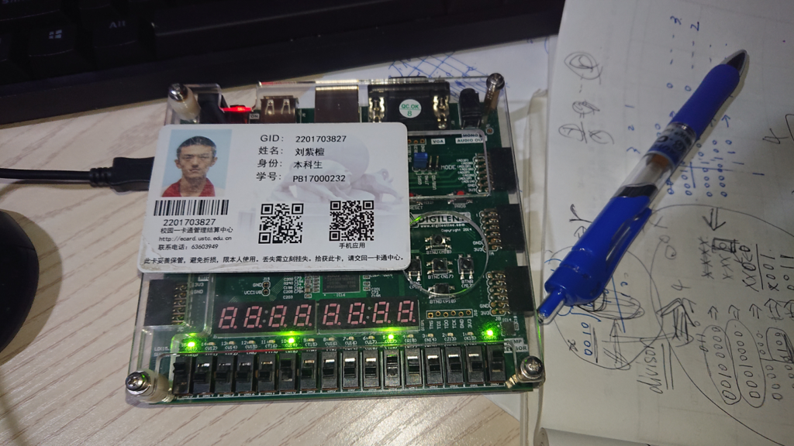

# 计算机组成原理 Lab2 实验报告

刘紫檀 PB17000232

-----

## 逻辑设计与核心代码

### 排序

排序采用经典的冒泡排序算法，对四个数字进行排序。冒泡排序的优点是节省片上资源。

排序共划分为个状态，分别以`i`和`j`的变量值来表征。类比冒泡排序，排序过程的状态如下：

```
i = 0; j = 1;
i = 0; j = 2;
i = 0; j = 3;
i = 1; j = 2;
i = 1; j = 3;
i = 2; j = 3;
```

每次比较都将`s[i]`和`s[j]`（这里为了说明的方便打了下标符号，其实代码里没有）进行比较，把大的交换到前面。

完成比较之后设置`i = 3; j = 3`从而标志完成。

#### 思考题：如何优化？

增加比较器的数目，可以减少等待时间（*时间换空间*）。

增加一个比较器，可以在三轮比较中完成。（易证）

增加到**6**个比较器，则可以一次得到所有大小信息（参考**赛图**）；再进行加法加起来所有的比较结果，就可以在几个周期内得到最后的比较结果（最短一个周期，纯组合电路）。

#### 数据通路


#### 核心代码

```verilog
module cmpr(
    input [3:0] x0,
    input [3:0] x1,
    input [3:0] x2,
    input [3:0] x3,
    input rst,
    input clk,
    output reg [3:0] s0,
    output reg [3:0] s1,
    output reg [3:0] s2,
    output reg [3:0] s3,
    output reg done
    );
    
    reg [2:0] in_cmpr_i;
    reg [2:0] in_cmpr_j;
    
    reg [3:0] cmpr_left;
    reg [3:0] cmpr_right;
    reg RightIsBigger;
    
    always @ (cmpr_left or cmpr_right) begin
        if (cmpr_left < cmpr_right)
            RightIsBigger = 1;
        else
            RightIsBigger = 0;
    end
    
    
    always @ (posedge clk) begin
        if (rst) begin
            in_cmpr_i <= 0;
            in_cmpr_j <= 1;
            s0 <= x0;
            s1 <= x1;
            s2 <= x2;
            s3 <= x3;
            
            cmpr_left <= x0;
            cmpr_right <= x1;
        end else begin
            case (in_cmpr_i)
                2'd0: begin
                    case (in_cmpr_j)
                        2'd0: begin
                            //This shall never happen
                        end
                        2'd1: begin
                                if (RightIsBigger) begin
                                    s0 <= s1;
                                    s1 <= s0;
                                end
                                in_cmpr_j <= 2;
                                cmpr_left <= s0;
                                cmpr_right <= s2;
                        end
                        
                        2'd2: begin
                                if (RightIsBigger) begin
                                    s0 <= s2;
                                    s2 <= s0;
                                end
                                in_cmpr_j <= 3;
                                cmpr_left <= s0;
                                cmpr_right <= s3;
                        end
                        2'd3: begin
                                if (RightIsBigger) begin
                                    s0 <= s3;
                                    s3 <= s0;
                                end
                                in_cmpr_j <= 2;
                                in_cmpr_i <= 1;
                                cmpr_left <= s1;
                                cmpr_right <= s2;
                        end
                    endcase
                end
                2'd1: begin
                    case (in_cmpr_j)
                        2'd0: begin
                            //This shall never happen
                        end
                        2'd1: begin
                            //This shall never happen
                        end
                        2'd2: begin
                                if (RightIsBigger) begin
                                    s1 <= s2;
                                    s2 <= s1;
                                end
                                in_cmpr_j <= 3;
                                cmpr_left <= s1;
                                cmpr_right <= s3;
                        end
                        2'd3: begin
                                if (RightIsBigger) begin
                                    s1 <= s3;
                                    s3 <= s1;
                                end
                                in_cmpr_j <= 3;
                                in_cmpr_i <= 2;
                                cmpr_left <= s2;
                                cmpr_right <= s3;
                        end
                    endcase
                end
                2'd2: begin
                    case (in_cmpr_j)
                        2'd0: begin
                            //This shall never happen
                        end
                        2'd1: begin
                            //This shall never happen
                        end
                        2'd2: begin
                            //This shall never happen
                        end
                        2'd3: begin
                                if (RightIsBigger) begin
                                    s2 <= s3;
                                    s3 <= s2;
                                end
                                in_cmpr_j <= 3;
                                in_cmpr_i <= 3;
                                cmpr_left <= s2;
                                cmpr_right <= s3;
                                done <= 1;
                        end
                    endcase
                end
                2'd3: begin
                    //This means the finish
                    
                end
            endcase
        end
    end

endmodule
```


### 除法器

除法器采用基本的移位相减设计，逻辑如下（**用`C`伪代码写作**）：

```c
// divisor = (x << (WIDTH - 1)); r = y; q = 0;
// divisor is [ WIDTH * 2 - 1: 0 ].

for (cycle = WIDTH; cycle >= 0; cycle--) {
    if (r > divisor) {
        r = r - divisor;
        q = (q << 1) + 1;
    } else {
        q = q << 1;
    }
    divisor = divisor >> 1;
}
```

实现采用三段式状态机，所有要更新的寄存器都有如`next_r`的`next`字样的值。

`cur_state`设计的取值为：

- `DIVIDER_WIDTH`（入口，检查是否被0除）
- `DIVIDER_WIDTH+1`（`done=1`）
- `DIVIDER_WIDTH+2`（`done=1 && error=1`）
- `DIVIDER_WIDTH-1`到`0`（真正进行除法的状态）

两个参数`DIVIDER_WIDTH`和`DIVIDER_SHIFT_REG_SIZE`分别是除法器数字的位宽和状态寄存器的宽度。

因为状态寄存器需要可以存下`DIVIDER_WIDTH+2`到0的所有值，而`Verilog`求对数又很麻烦，所以单独写出来。

#### 数据通路


#### 核心代码

```verilog
module divider
#( parameter DIVIDER_WIDTH = 4,
   parameter DIVIDER_SHIFT_REG_SIZE = 6 // Large enough to contain DIVIDER_WIDTH + 1
) (
    input [DIVIDER_WIDTH - 1: 0] x,
    input [DIVIDER_WIDTH - 1: 0] y, // y / x == q ... r
    input rst,
    input clk,
    output reg [DIVIDER_WIDTH - 1: 0] q, //quotient
    output reg [DIVIDER_WIDTH - 1: 0] r,
    output reg error,
    output reg done
    );
    
    reg [DIVIDER_WIDTH * 2 - 1: 0] divisor;
    reg [DIVIDER_WIDTH * 2 - 1: 0] divisor_shifted_right;
    reg [DIVIDER_WIDTH - 1: 0] q_shifted_left;
    reg [DIVIDER_WIDTH * 2 - 1: 0] y_sub_divisor;
    reg y_less_than_divisor;
    
    always @ (divisor or r) begin
        divisor_shifted_right = divisor >> 1;
        if (r < divisor)
            y_less_than_divisor = 1;
        else
            y_less_than_divisor = 0;
        y_sub_divisor = r - divisor;
    end
    
    always @ (q) begin
        q_shifted_left = q << 1;
    end
    
    reg [DIVIDER_SHIFT_REG_SIZE - 1: 0] cur_state;
    reg [DIVIDER_SHIFT_REG_SIZE - 1: 0] next_state;
    
    reg [DIVIDER_WIDTH * 2 - 1: 0] next_divisor;
    reg [DIVIDER_WIDTH - 1: 0] next_q;
    reg [DIVIDER_WIDTH - 1: 0] next_r;
    //cur_state = DIVIDER_WIDTH : check if divisor == 0
    //cur_state = DIVIDER_WIDTH - 1 to 0: do division
    
    always @ (posedge clk) begin
        if (rst) begin
            cur_state <= DIVIDER_WIDTH;
            divisor <= (x << (DIVIDER_WIDTH - 1));
            r <= y;
            q <= 0;
        end else begin
            cur_state <= next_state;
            q <= next_q;
            r <= next_r;
            divisor <= next_divisor;
        end
    end
    
    always @ (*) begin
        done = 0;
        error = 0;
        next_divisor = divisor;
        next_q = q;
        next_r = r;
        next_state = DIVIDER_WIDTH + 1;
        
        if (cur_state == DIVIDER_WIDTH) begin
            if (divisor == 0) begin
                next_state = DIVIDER_WIDTH + 2;
            end else begin
                next_state = DIVIDER_WIDTH - 1;
            end
        end else if (cur_state == DIVIDER_WIDTH + 1) begin
            done = 1;
        end else if (cur_state == DIVIDER_WIDTH + 2) begin //stable error situation
            done = 1;
            error = 1;
            next_state = DIVIDER_WIDTH + 1;
        end else begin //should be less than DIVIDER_WIDTH
            if (y_less_than_divisor) begin
                next_q = q_shifted_left;
            end else begin
                next_q = q_shifted_left + 1;
                next_r = y_sub_divisor;
            end
                    
            next_divisor = divisor_shifted_right;
            if (cur_state == 0) begin
                next_state = DIVIDER_WIDTH + 1;
            end else begin
                next_state = cur_state - 1;
            end
        end
    end
    
endmodule
```


## 仿真结果

### 排序


### 除法器


分别测试了`5/2 6/2 5/3 2/3 2/0`。结果如上图所示。

## 资源占用

### 排序


### 除法器


## 下载结果

### 排序




如图，将`8-4-2-1`排序为`1-2-4-8`。`BTNU`为`rst`，`BTNC`为`clk`，开关和灯均为四个一组，`MSB`在左。`done`为绿色灯（`RGB灯`的绿色）

### 除法器


如图，进行`6/4`的测试。

`led[0]`到`led[3]`为商，`led[4]`到`led[7]`为余数，均采用`MSB`在左。`BTNC`为`clk`，`BTNU`为`rst`。`led[15]`为`done`。上图为计算好的结果。

## 实验总结

本次实验我学习了排序和除法器的状态机实现。除法器的优化还不是很理想，但是受限于实现和下面这个智障仿真器却不会提示的错误：

```verilog
always @ (cur_state) begin
    next_divisor = divisor_shifted_right;
    //Skip some code
end
```

这里，没有把`divisor_shifted_right`变量加入敏感列表，导致调试的时候`next_divisor`的值总不会变化，浪费了两个小时。

另外，**Vivado Simulator 似乎不会对有 parameter 的 module 在 Testbench 的时候，通过鼠标悬浮提示变量的值。**

## 全部代码

### cmpr.v

```verilog
`timescale 1ns / 1ps

module cmpr(
    input [3:0] x0,
    input [3:0] x1,
    input [3:0] x2,
    input [3:0] x3,
    input rst,
    input clk,
    output reg [3:0] s0,
    output reg [3:0] s1,
    output reg [3:0] s2,
    output reg [3:0] s3,
    output reg done
    );
    
    reg [2:0] in_cmpr_i;
    reg [2:0] in_cmpr_j;
    
    reg [3:0] cmpr_left;
    reg [3:0] cmpr_right;
    reg RightIsBigger;
    
    always @ (cmpr_left or cmpr_right) begin
        if (cmpr_left < cmpr_right)
            RightIsBigger = 1;
        else
            RightIsBigger = 0;
    end
    
    
    always @ (posedge clk) begin
        if (rst) begin
            in_cmpr_i <= 0;
            in_cmpr_j <= 1;
            s0 <= x0;
            s1 <= x1;
            s2 <= x2;
            s3 <= x3;
            
            cmpr_left <= x0;
            cmpr_right <= x1;
        end else begin
            case (in_cmpr_i)
                2'd0: begin
                    case (in_cmpr_j)
                        2'd0: begin
                            //This shall never happen
                        end
                        2'd1: begin
                                if (RightIsBigger) begin
                                    s0 <= s1;
                                    s1 <= s0;
                                end
                                in_cmpr_j <= 2;
                                cmpr_left <= s0;
                                cmpr_right <= s2;
                        end
                        
                        2'd2: begin
                                if (RightIsBigger) begin
                                    s0 <= s2;
                                    s2 <= s0;
                                end
                                in_cmpr_j <= 3;
                                cmpr_left <= s0;
                                cmpr_right <= s3;
                        end
                        2'd3: begin
                                if (RightIsBigger) begin
                                    s0 <= s3;
                                    s3 <= s0;
                                end
                                in_cmpr_j <= 2;
                                in_cmpr_i <= 1;
                                cmpr_left <= s1;
                                cmpr_right <= s2;
                        end
                    endcase
                end
                2'd1: begin
                    case (in_cmpr_j)
                        2'd0: begin
                            //This shall never happen
                        end
                        2'd1: begin
                            //This shall never happen
                        end
                        2'd2: begin
                                if (RightIsBigger) begin
                                    s1 <= s2;
                                    s2 <= s1;
                                end
                                in_cmpr_j <= 3;
                                cmpr_left <= s1;
                                cmpr_right <= s3;
                        end
                        2'd3: begin
                                if (RightIsBigger) begin
                                    s1 <= s3;
                                    s3 <= s1;
                                end
                                in_cmpr_j <= 3;
                                in_cmpr_i <= 2;
                                cmpr_left <= s2;
                                cmpr_right <= s3;
                        end
                    endcase
                end
                2'd2: begin
                    case (in_cmpr_j)
                        2'd0: begin
                            //This shall never happen
                        end
                        2'd1: begin
                            //This shall never happen
                        end
                        2'd2: begin
                            //This shall never happen
                        end
                        2'd3: begin
                                if (RightIsBigger) begin
                                    s2 <= s3;
                                    s3 <= s2;
                                end
                                in_cmpr_j <= 3;
                                in_cmpr_i <= 3;
                                cmpr_left <= s2;
                                cmpr_right <= s3;
                                done <= 1;
                        end
                    endcase
                end
                2'd3: begin
                    //This means the finish
                    
                end
            endcase
        end
    end

endmodule
```


### cmpr_tb.v

```verilog
`timescale 1ns / 1ps

module cmpr_tb();

    reg clk;
    reg rst;
    reg [3:0] x0;
    reg [3:0] x1;
    reg [3:0] x2;
    reg [3:0] x3;
    wire [3:0] s0;
    wire [3:0] s1;
    wire [3:0] s2;
    wire [3:0] s3;
    wire done;
    cmpr my_cmpr (x0,x1,x2,x3,rst,clk,s0,s1,s2,s3,done);
    
    initial begin
        clk = 1;
        forever #5 clk=~clk;
    end

    initial begin
        rst = 1;
        x0 = 1; x1 = 2; x2 = 3; x3 = 4;
        #5; rst = 0;
        #20;
    end
endmodule

```

### divider.v

```verilog
`timescale 1ns / 1ps

module divider
#( parameter DIVIDER_WIDTH = 4,
   parameter DIVIDER_SHIFT_REG_SIZE = 6 // Large enough to contain DIVIDER_WIDTH + 1
) (
    input [DIVIDER_WIDTH - 1: 0] x,
    input [DIVIDER_WIDTH - 1: 0] y, // y / x == q ... r
    input rst,
    input clk,
    output reg [DIVIDER_WIDTH - 1: 0] q, //quotient
    output reg [DIVIDER_WIDTH - 1: 0] r,
    output reg error,
    output reg done
    );
    
    reg [DIVIDER_WIDTH * 2 - 1: 0] divisor;
    reg [DIVIDER_WIDTH * 2 - 1: 0] divisor_shifted_right;
    reg [DIVIDER_WIDTH - 1: 0] q_shifted_left;
    reg [DIVIDER_WIDTH * 2 - 1: 0] y_sub_divisor;
    reg y_less_than_divisor;
    
    always @ (divisor or r) begin
        divisor_shifted_right = divisor >> 1;
        if (r < divisor)
            y_less_than_divisor = 1;
        else
            y_less_than_divisor = 0;
        y_sub_divisor = r - divisor;
    end
    
    always @ (q) begin
        q_shifted_left = q << 1;
    end
    
    reg [DIVIDER_SHIFT_REG_SIZE - 1: 0] cur_state;
    reg [DIVIDER_SHIFT_REG_SIZE - 1: 0] next_state;
    
    reg [DIVIDER_WIDTH * 2 - 1: 0] next_divisor;
    reg [DIVIDER_WIDTH - 1: 0] next_q;
    reg [DIVIDER_WIDTH - 1: 0] next_r;
    //cur_state = DIVIDER_WIDTH : check if divisor == 0
    //cur_state = DIVIDER_WIDTH - 1 to 0: do division
    
    always @ (posedge clk) begin
        if (rst) begin
            cur_state <= DIVIDER_WIDTH;
            divisor <= (x << (DIVIDER_WIDTH - 1));
            r <= y;
            q <= 0;
        end else begin
            cur_state <= next_state;
            q <= next_q;
            r <= next_r;
            divisor <= next_divisor;
        end
    end
    
    always @ (*) begin
        done = 0;
        error = 0;
        next_divisor = divisor;
        next_q = q;
        next_r = r;
        next_state = DIVIDER_WIDTH + 1;
        
        if (cur_state == DIVIDER_WIDTH) begin
            if (divisor == 0) begin
                next_state = DIVIDER_WIDTH + 2;
            end else begin
                next_state = DIVIDER_WIDTH - 1;
            end
        end else if (cur_state == DIVIDER_WIDTH + 1) begin
            done = 1;
        end else if (cur_state == DIVIDER_WIDTH + 2) begin //stable error situation
            done = 1;
            error = 1;
            next_state = DIVIDER_WIDTH + 2;
        end else begin //should be less than DIVIDER_WIDTH
            if (y_less_than_divisor) begin
                next_q = q_shifted_left;
            end else begin
                next_q = q_shifted_left + 1;
                next_r = y_sub_divisor;
            end
                    
            next_divisor = divisor_shifted_right;
            if (cur_state == 0) begin
                next_state = DIVIDER_WIDTH + 1;
            end else begin
                next_state = cur_state - 1;
            end
        end
    end
    
endmodule
```


### divider_tb.v

```verilog
`timescale 1ns / 1ps

module divider_tb();
    reg clk;
    reg rst;
    reg [3:0] x;
    reg [3:0] y;
    wire [3:0] q;
    wire [3:0] r;
    wire error;
    wire done; 
    divider #(.DIVIDER_WIDTH (4)) my_div (x, y, rst, clk, q, r, error, done);
    
    initial begin
        clk = 1;
        forever #5 clk=~clk;
    end

    initial begin
        rst = 1;
        x = 2; y = 5;
        #20;
        rst = 0;
        #100;
        
        rst = 1;
        x = 2; y = 6;
        #20;
        rst = 0;
        #100;
        
        rst = 1;
        x = 3; y = 5;
        #20;
        rst = 0;
        #100;
        
        rst = 1;
        x = 3; y = 2;
        #20;
        rst = 0;
        #100;
        
        rst = 1;
        x = 0; y = 2;
        #20;
        rst = 0;
        #100;
    end
endmodule

```

