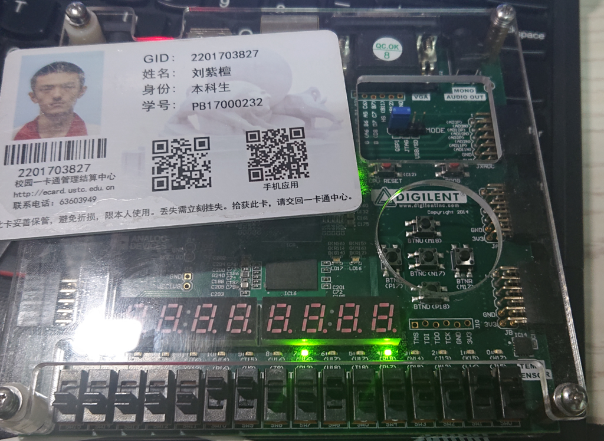
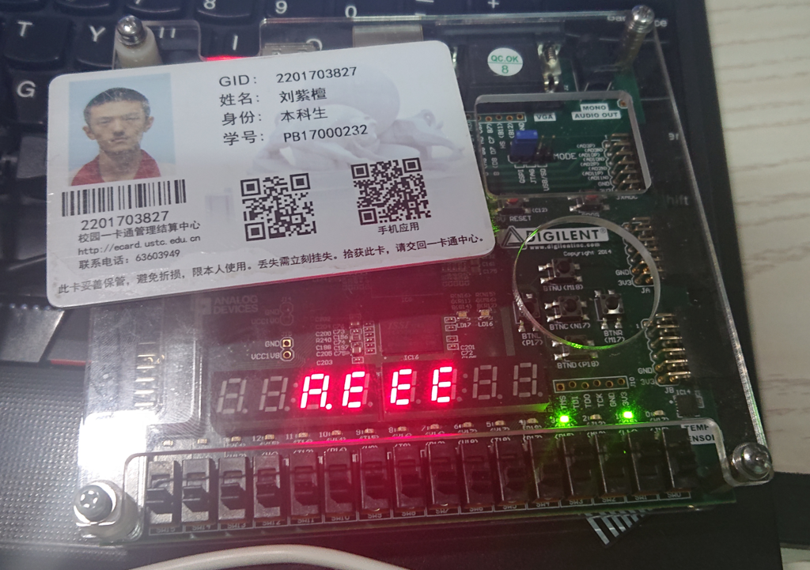

# 计算机组成原理 Lab3 实验报告

刘紫檀 PB17000232

-----

## 逻辑设计与核心代码

### 寄存器堆

采用数组`registers`来方便的生成`REG_COUNT`个寄存器。

采用`generate`方便的进行`always`块的生成，达到参数化的目的。

#### 数据通路


#### 核心代码

```verilog
module reg_file
#( parameter REG_DATA_WIDTH = 5,
   parameter REG_ADDR_WIDTH = 3,
   parameter REG_COUNT = 8
   )(
    input [REG_ADDR_WIDTH - 1: 0] ra0,
    input [REG_ADDR_WIDTH - 1: 0] ra1,
    input [REG_ADDR_WIDTH - 1: 0] wa,
    output reg [REG_DATA_WIDTH - 1: 0] rd0,
    output reg [REG_DATA_WIDTH - 1: 0] rd1,
    input [REG_DATA_WIDTH - 1: 0] wd,
    input we,
    input rst,
    input clk
    );
        
    reg [REG_DATA_WIDTH - 1: 0] registers [REG_COUNT - 1 : 0];

    generate
    genvar gv_rst;
        for (gv_rst = 0; gv_rst < REG_COUNT; gv_rst = gv_rst + 1) begin
            always @ (posedge clk) begin
                if (rst) begin
                    registers[gv_rst] <= 0; 
                end else begin
                    if (we) begin
                        if (wa == gv_rst) begin
                            registers[gv_rst] <= wd;
                        end
                    end
                end 
            end
        end
    endgenerate
    
    always @ (*) begin
        rd0 = registers[ra0];
        rd1 = registers[ra1];
    end
    
endmodule
```


### FIFO

先入先出队列利用了八个寄存器组成的*寄存器堆*。将寄存器堆的两个端口一个用于数码管扫频的显示输出（`rd0`，再交给译码后生成`seg`信息），另一个直接扫频输出就可以了。

用`queue_top`，`queue_bottom`和`queue_count`维护队列状态。初始状态下`queue_top`和`queue_bottom`为0。判断空/满代码如下：

```verilog
always @ (*) begin
    if (queue_count == 0) begin
        empty = 1;
        full = 0;
    end else if (queue_count == 8) begin 
        full = 1;
        empty = 0;
    end else begin
        full = 0;
        empty = 0;
    end
end
```
处理入队、出队的状态机如下：

```verilog
    reg [2:0] fsm_state;
    reg [2:0] next_state;
    reg [2:0] next_queue_top;
    reg [2:0] next_queue_bottom;
    reg [3:0] next_queue_count;
	reg [3:0] next_out;
    reg next_we;
    
    always @ (posedge clk_sweep) begin
        if (rst) begin
            fsm_state <= 0;
            queue_top <= 0;
            queue_bottom <= 0;
            queue_count <= 0;
            out <= 0;
            we <= 0;
        end else begin
            fsm_state <= next_state;
            queue_top <= next_queue_top;
            queue_bottom <= next_queue_bottom;
            queue_count <= next_queue_count;
            out <= next_out;
            we <= next_we;
        end
    end
    
    always @ (*) begin
        next_state = 0;
        next_queue_top = queue_top;
        next_queue_bottom = queue_bottom;
        next_queue_count = queue_count;
		next_out = out;
        next_we = 0;
    
        case (fsm_state)
            2'd0: begin
                if (en_in_real && (!full)) begin
                    next_state = 1;
                    next_we = 1;
                end else if (en_out_real && (!empty)) begin
                    next_state = 2;
					next_out = bottom_val;
                    next_queue_count = queue_count - 1;
                    next_queue_bottom = queue_bottom + 1;
                end
            end
            2'd1: begin
                next_we = 0;
                next_state = 3;
                next_queue_count = queue_count + 1;
                next_queue_top = queue_top + 1;
            end
            2'd2:
                next_state = 0;
            2'd3:
                next_state = 0;
        endcase
    end
```

Verilog 这点其实很麻烦，为了避免混乱只能写成三段了。

处理消抖的模块如下：

```verilog
module input_pulse_gen (input clk, input input_sig, output reg input_pulse);

    reg i_prev;
    always @ (negedge clk) begin //注意这里是 negedge ，这样虽然 clk 和主模块的 clk 是一个，但是还是可以保证主模块可以检测到处理后的输入
        if (input_sig == 1 && i_prev == 0)
            input_pulse <= 1;
            
        i_prev <= input_sig;
            
        if (i_prev == input_sig)
            input_pulse <= 0;
    end
endmodule
```

#### 数据通路

p.s. 手工绘制不是不可能完成的任务，但是此处逻辑复杂，浪费篇幅并无多大必要；队列数据和状态机/输出耦合比较严重。

若需要数据通路，直接根据三段式翻译即可，意义不大。

所以此处贴上 RTL Schematic。


**输入消抖动**：


其余过于复杂..放上来太费笔墨篇幅，故略。

#### 核心代码

```verilog
module fifo(
    input en_out,
    input [3:0] in,
    input en_in,
    input rst,
    input clk,
    output reg full,
    output reg empty,
    output reg [7:0] an,
    output reg [6:0] seg,
    output seg_dot,
    output reg [3:0] out
    );
    
    reg [2:0] queue_top; // Put and Inc by 1
    reg [2:0] queue_bottom; // Inc by 1 when dequeue
    reg [3:0] queue_count; // [0, 8]
	wire clk_sweep;
	assign clk_sweep = clk;
    
    always @ (*) begin
        if (queue_count == 0) begin
            empty = 1;
            full = 0;
        end else if (queue_count == 8) begin 
            full = 1;
            empty = 0;
        end else begin
            full = 0;
            empty = 0;
        end
    end
    
    wire [3:0] rd0;
    reg we;

    // Enqueue: Write to position
    // Dequeue: Just adjust pointers
    // ra(cur_num) is used for display purpose solely
    
    reg dot;
	wire [3:0] bottom_val;
    reg [2:0] cur_sweep;
    reg_file #(.REG_COUNT(8), .REG_ADDR_WIDTH(3), .REG_DATA_WIDTH(4))
         rf (cur_sweep, queue_bottom, queue_top, rd0, bottom_val, in, we, rst, clk_sweep);
    
    wire [6:0] seg_decoded;
    bcd_decoder bcd(rd0, dot, seg_decoded, seg_dot);
    
    reg disp_digit; // determine if it's in the queue to be displayed
    
    always @ (*) begin
        if (disp_digit)
            seg = seg_decoded;
        else
            seg = 7'b1111111;
    end
    
    always @ (*) begin
        if (cur_sweep == queue_bottom)
            dot = 1;
        else
            dot = 0;
    end
    
    // Manage ra and display
    always @ (posedge clk_sweep) begin
        if (rst) begin
            cur_sweep <= 0;
        end else begin
            cur_sweep <= cur_sweep + 1;
        end
    end
    
    always @ (*) begin
        an = ~(255 & ( 1 << cur_sweep));
    end
    

    always @ (*) begin
        disp_digit = 0;
        if (queue_bottom < queue_top) begin
            if (cur_sweep < queue_top && cur_sweep >= queue_bottom)
                 disp_digit = 1;
        end else begin
            if (queue_bottom > queue_top) begin
                if (cur_sweep >= queue_bottom || (cur_sweep < queue_top))
                     disp_digit = 1;
            end
        end 
        
        if (queue_count == 8)
            disp_digit = 1;
        
    end
    
    wire en_in_real;
    wire en_out_real;
    input_pulse_gen en_in_gen(clk_sweep, en_in, en_in_real);
    input_pulse_gen en_out_gen(clk_sweep, en_out, en_out_real);

    //Manage Input and {En,De}Queue
    //Phase 0: Nothing happens, if {en} && !full goto 1, if {de} & !empty goto 2
    //Phase 1: we = 1, goto 3
    //Phase 2: queue_count -= 1, queue_bottom += 1 out <= bottom_val,goto 0
    //Phase 3: queue_count = queue_count + 1, queue_top = queue_top + 1  goto 0
        
    reg [2:0] fsm_state;
    reg [2:0] next_state;
    reg [2:0] next_queue_top;
    reg [2:0] next_queue_bottom;
    reg [3:0] next_queue_count;
	reg [3:0] next_out;
    reg next_we;
    
    always @ (posedge clk_sweep) begin
        if (rst) begin
            fsm_state <= 0;
            queue_top <= 0;
            queue_bottom <= 0;
            queue_count <= 0;
            out <= 0;
            we <= 0;
        end else begin
            fsm_state <= next_state;
            queue_top <= next_queue_top;
            queue_bottom <= next_queue_bottom;
            queue_count <= next_queue_count;
            out <= next_out;
            we <= next_we;
        end
    end
    
    always @ (*) begin
        next_state = 0;
        next_queue_top = queue_top;
        next_queue_bottom = queue_bottom;
        next_queue_count = queue_count;
		next_out = out;
        next_we = 0;
    
        case (fsm_state)
            2'd0: begin
                if (en_in_real && (!full)) begin
                    next_state = 1;
                    next_we = 1;
                end else if (en_out_real && (!empty)) begin
                    next_state = 2;
					next_out = bottom_val;
                    next_queue_count = queue_count - 1;
                    next_queue_bottom = queue_bottom + 1;
                end
            end
            2'd1: begin
                next_we = 0;
                next_state = 3;
                next_queue_count = queue_count + 1;
                next_queue_top = queue_top + 1;
            end
            2'd2:
                next_state = 0;
            2'd3:
                next_state = 0;
        endcase
    end

endmodule
```


## 仿真结果

### 寄存器堆


### FIFO


## 资源占用

### 寄存器堆


### FIFO


## 下载结果

### 寄存器堆



### FIFO



## 实验总结

本次实验，我了解了寄存器堆、FIFO的设计，同时认识到了按键消抖动的重要之处。

## 全部代码

### FIFO

#### fifo_main.v

```verilog
`timescale 1ns / 1ps
//////////////////////////////////////////////////////////////////////////////////
// Company: 
// Engineer: 
// 
// Create Date: 2019/04/11 21:16:53
// Design Name: 
// Module Name: fifo_main
// Project Name: 
// Target Devices: 
// Tool Versions: 
// Description: 
// 
// Dependencies: 
// 
// Revision:
// Revision 0.01 - File Created
// Additional Comments:
// 
//////////////////////////////////////////////////////////////////////////////////


module fifo_main(
    input en_out,
    input [3:0] in,
    input en_in,
    input rst,
    input clk_in1,
    output full,
    output empty,
    output [7:0] an,
    output [6:0] seg,
    output seg_dot,
    output [3:0] out
);
    wire clk;
    wire clk_out1;
    fifo dut(en_out, in, en_in, rst, clk, full, empty, an, seg, seg_dot, out);
    pulse_gen p_gen (clk_out1, 1, clk);
  clk_wiz_0 c_wiz
     (
      // Clock out ports
      .clk_out1(clk_out1),     // output clk_out1
      // Status and control signals
      .reset(0), // input reset
     // Clock in ports
      .clk_in1(clk_in1));

endmodule

```

#### fifo.v

```verilog
`timescale 1ns / 1ps
//////////////////////////////////////////////////////////////////////////////////
// Company: 
// Engineer: 
// 
// Create Date: 2019/04/11 17:55:18
// Design Name: 
// Module Name: fifo
// Project Name: 
// Target Devices: 
// Tool Versions: 
// Description: 
// 
// Dependencies: 
// 
// Revision:
// Revision 0.01 - File Created
// Additional Comments:
// 
//////////////////////////////////////////////////////////////////////////////////

//Sweep Generator
module pulse_gen(
    input clk_fast,
    input rst_n,
    output reg sig
    );
    reg [31:0] count;
    
    always @ (posedge clk_fast)
    begin
        if (!rst_n) begin
            sig <= 1'b0;
            count <= 32'd50000;
        end
        else begin
            if (count == 0) begin
                sig <= ~sig;
                count <= 32'd5000;
            end else count <= count - 1;
        end
    end
endmodule

//��������
module input_pulse_gen (input clk, input input_sig, output reg input_pulse);

    reg i_prev;
    always @ (negedge clk) begin
        if (input_sig == 1 && i_prev == 0)
            input_pulse <= 1;
            
        i_prev <= input_sig;
            
        if (i_prev == input_sig)
            input_pulse <= 0;
    end
endmodule


// BCD
module bcd_decoder(
    input [3:0] x,
    input dot,
    output reg [6:0] seg,
    output reg seg_dot
);
    always @ (*) begin
        case (x)
            4'd0: seg = 7'b1000000;
            4'd1: seg = 7'b1111001;
            4'd2: seg = 7'b0100100;
            4'd3: seg = 7'b0110000;
            4'd4: seg = 7'b0011001;
            4'd5: seg = 7'b0010010;
            4'd6: seg = 7'b0000010;
            4'd7: seg = 7'b1111000;
            4'd8: seg = 7'b0000000;
            4'd9: seg = 7'b0010000;
            4'd10: seg = 7'b0001000;
            4'd11: seg = 7'b0000011;
            4'd12: seg = 7'b1000110;
            4'd13: seg = 7'b0100001;
            4'd14: seg = 7'b0000110;
            4'd15: seg = 7'b0001110;
        endcase
        seg_dot = ~dot;
    end
endmodule

module fifo(
    input en_out,
    input [3:0] in,
    input en_in,
    input rst,
    input clk,
    output reg full,
    output reg empty,
    output reg [7:0] an,
    output reg [6:0] seg,
    output seg_dot,
    output reg [3:0] out
    );
    
    reg [2:0] queue_top; // Put and Inc by 1
    reg [2:0] queue_bottom; // Inc by 1 when dequeue
    reg [3:0] queue_count; // [0, 8]
	wire clk_sweep;
	assign clk_sweep = clk;
    
    always @ (*) begin
        if (queue_count == 0) begin
            empty = 1;
            full = 0;
        end else if (queue_count == 8) begin 
            full = 1;
            empty = 0;
        end else begin
            full = 0;
            empty = 0;
        end
    end
    
    wire [3:0] rd0;
    reg we;

    // Enqueue: Write to position
    // Dequeue: Just adjust pointers
    // ra(cur_num) is used for display purpose solely
    
    reg dot;
	wire [3:0] bottom_val;
    reg [2:0] cur_sweep;
    reg_file #(.REG_COUNT(8), .REG_ADDR_WIDTH(3), .REG_DATA_WIDTH(4))
         rf (cur_sweep, queue_bottom, queue_top, rd0, bottom_val, in, we, rst, clk_sweep);
    
    wire [6:0] seg_decoded;
    bcd_decoder bcd(rd0, dot, seg_decoded, seg_dot);
    
    reg disp_digit; // determine if it's in the queue to be displayed
    
    always @ (*) begin
        if (disp_digit)
            seg = seg_decoded;
        else
            seg = 7'b1111111;
    end
    
    always @ (*) begin
        if (cur_sweep == queue_bottom)
            dot = 1;
        else
            dot = 0;
    end
    
    // Manage ra and display
    always @ (posedge clk_sweep) begin
        if (rst) begin
            cur_sweep <= 0;
        end else begin
            cur_sweep <= cur_sweep + 1;
        end
    end
    
    always @ (*) begin
        an = ~(255 & ( 1 << cur_sweep));
    end
    

    always @ (*) begin
        disp_digit = 0;
        if (queue_bottom < queue_top) begin
            if (cur_sweep < queue_top && cur_sweep >= queue_bottom)
                 disp_digit = 1;
        end else begin
            if (queue_bottom > queue_top) begin
                if (cur_sweep >= queue_bottom || (cur_sweep < queue_top))
                     disp_digit = 1;
            end
        end 
        
        if (queue_count == 8)
            disp_digit = 1;
        
    end
    
    wire en_in_real;
    wire en_out_real;
    input_pulse_gen en_in_gen(clk_sweep, en_in, en_in_real);
    input_pulse_gen en_out_gen(clk_sweep, en_out, en_out_real);

    //Manage Input and {En,De}Queue
    //Phase 0: Nothing happens, if {en} && !full goto 1, if {de} & !empty goto 2
    //Phase 1: we = 1, goto 3
    //Phase 2: queue_count -= 1, queue_bottom += 1 out <= bottom_val,goto 0
    //Phase 3: queue_count = queue_count + 1, queue_top = queue_top + 1  goto 0
        
    reg [2:0] fsm_state;
    reg [2:0] next_state;
    reg [2:0] next_queue_top;
    reg [2:0] next_queue_bottom;
    reg [3:0] next_queue_count;
	reg [3:0] next_out;
    reg next_we;
    
    always @ (posedge clk_sweep) begin
        if (rst) begin
            fsm_state <= 0;
            queue_top <= 0;
            queue_bottom <= 0;
            queue_count <= 0;
            out <= 0;
            we <= 0;
        end else begin
            fsm_state <= next_state;
            queue_top <= next_queue_top;
            queue_bottom <= next_queue_bottom;
            queue_count <= next_queue_count;
            out <= next_out;
            we <= next_we;
        end
    end
    
    always @ (*) begin
        next_state = 0;
        next_queue_top = queue_top;
        next_queue_bottom = queue_bottom;
        next_queue_count = queue_count;
		next_out = out;
        next_we = 0;
    
        case (fsm_state)
            2'd0: begin
                if (en_in_real && (!full)) begin
                    next_state = 1;
                    next_we = 1;
                end else if (en_out_real && (!empty)) begin
                    next_state = 2;
					next_out = bottom_val;
                    next_queue_count = queue_count - 1;
                    next_queue_bottom = queue_bottom + 1;
                end
            end
            2'd1: begin
                next_we = 0;
                next_state = 3;
                next_queue_count = queue_count + 1;
                next_queue_top = queue_top + 1;
            end
            2'd2:
                next_state = 0;
            2'd3:
                next_state = 0;
        endcase
    end

endmodule

```

#### fifo_tb.v

```verilog
`timescale 1ns / 1ps
//////////////////////////////////////////////////////////////////////////////////
// Company: 
// Engineer: 
// 
// Create Date: 2019/04/11 20:18:45
// Design Name: 
// Module Name: fifo_tb
// Project Name: 
// Target Devices: 
// Tool Versions: 
// Description: 
// 
// Dependencies: 
// 
// Revision:
// Revision 0.01 - File Created
// Additional Comments:
// 
//////////////////////////////////////////////////////////////////////////////////


module fifo_tb();

    wire full;
    wire empty;
    wire [7:0] an;
    wire [6:0] seg;
    wire seg_dot;
    wire [3:0] out;
    
    reg en_out;
    reg en_in;
    reg [3:0] in;
    reg rst;
    reg clk;

    fifo dut(en_out, in, en_in, rst, clk, full, empty, an, seg, seg_dot, out);

    initial begin
        clk = 1;
        forever #5 clk=~clk;
    end

    initial begin
        rst = 0; en_out = 0; en_in = 0; in = 10;
        #5;
        rst = 1; en_out = 1;
        #20;
        rst = 0;
        #20;
        en_out = 0; en_in = 1;
        #20;
        en_in = 0;
        #20;
        en_in = 1;
        #20;
        en_in = 0;
        #20;
        en_out = 1;
        #20;
        en_out = 0;
    end

endmodule

```


### 寄存器堆

#### main.v

```verilog
`timescale 1ns / 1ps
//////////////////////////////////////////////////////////////////////////////////
// Company: 
// Engineer: 
// 
// Create Date: 2019/04/11 16:31:30
// Design Name: 
// Module Name: main
// Project Name: 
// Target Devices: 
// Tool Versions: 
// Description: 
// 
// Dependencies: 
// 
// Revision:
// Revision 0.01 - File Created
// Additional Comments:
// 
//////////////////////////////////////////////////////////////////////////////////


module main(
    input [1: 0] ra0,
    input [1: 0] ra1,
    input [1: 0] wa,
    output [3: 0] rd0,
    output [3: 0] rd1,
    input [3: 0] wd,
    input we,
    input rst,
    input clk
    );
    
    reg_file #(.REG_DATA_WIDTH(4), .REG_ADDR_WIDTH(2), .REG_COUNT(4))
         my_reg_file (ra0, ra1, wa, rd0, rd1, wd, we, rst, clk);
    
endmodule

```

#### reg_file.v

```verilog
`timescale 1ns / 1ps
//////////////////////////////////////////////////////////////////////////////////
// Company: 
// Engineer: 
// 
// Create Date: 2019/04/11 15:14:14
// Design Name: 
// Module Name: reg_file
// Project Name: 
// Target Devices: 
// Tool Versions: 
// Description: 
// 
// Dependencies: 
// 
// Revision:
// Revision 0.01 - File Created
// Additional Comments:
// 
//////////////////////////////////////////////////////////////////////////////////

module reg_file
#( parameter REG_DATA_WIDTH = 5,
   parameter REG_ADDR_WIDTH = 3,
   parameter REG_COUNT = 8
   )(
    input [REG_ADDR_WIDTH - 1: 0] ra0,
    input [REG_ADDR_WIDTH - 1: 0] ra1,
    input [REG_ADDR_WIDTH - 1: 0] wa,
    output reg [REG_DATA_WIDTH - 1: 0] rd0,
    output reg [REG_DATA_WIDTH - 1: 0] rd1,
    input [REG_DATA_WIDTH - 1: 0] wd,
    input we,
    input rst,
    input clk
    );
        
    reg [REG_DATA_WIDTH - 1: 0] registers [REG_COUNT - 1 : 0];

    generate
    genvar gv_rst;
        for (gv_rst = 0; gv_rst < REG_COUNT; gv_rst = gv_rst + 1) begin
            always @ (posedge clk) begin
                if (rst) begin
                    registers[gv_rst] <= 0; 
                end else begin
                    if (we) begin
                        if (wa == gv_rst) begin
                            registers[gv_rst] <= wd;
                        end
                    end
                end 
            end
        end
    endgenerate
    
    always @ (*) begin
        rd0 = registers[ra0];
        rd1 = registers[ra1];
    end
    
endmodule

```

#### reg_file_tb.v

```verilog
`timescale 1ns / 1ps
//////////////////////////////////////////////////////////////////////////////////
// Company: 
// Engineer: 
// 
// Create Date: 2019/04/11 15:53:32
// Design Name: 
// Module Name: reg_file_tb
// Project Name: 
// Target Devices: 
// Tool Versions: 
// Description: 
// 
// Dependencies: 
// 
// Revision:
// Revision 0.01 - File Created
// Additional Comments:
// 
//////////////////////////////////////////////////////////////////////////////////


module reg_file_tb();
    reg clk;
    reg rst;
    reg [1:0] wa;
    reg [1:0] ra0;
    reg [1:0] ra1;
    reg [3:0] wd;
    reg we;
    wire [3:0] rd0;
    wire [3:0] rd1;
    reg_file #(.REG_DATA_WIDTH(4), .REG_ADDR_WIDTH(2), .REG_COUNT(4))
         my_reg_file (ra0, ra1, wa, rd0, rd1, wd, we, rst, clk);
    initial begin
        clk = 1;
        forever #5 clk=~clk;
    end
    initial begin
        rst = 1;
        ra0 = 2; ra1 = 3; we = 0;  wa = 2; wd = 10;
        #20;
        rst = 0;
        #10;
        wa = 2; wd = 10; we = 1;
        #15;
        we = 0; wa = 2; wd = 5;
        #15;
        ra0 = 1; ra1 = 2;
    end

endmodule

```

