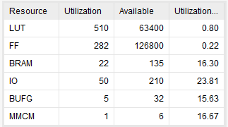
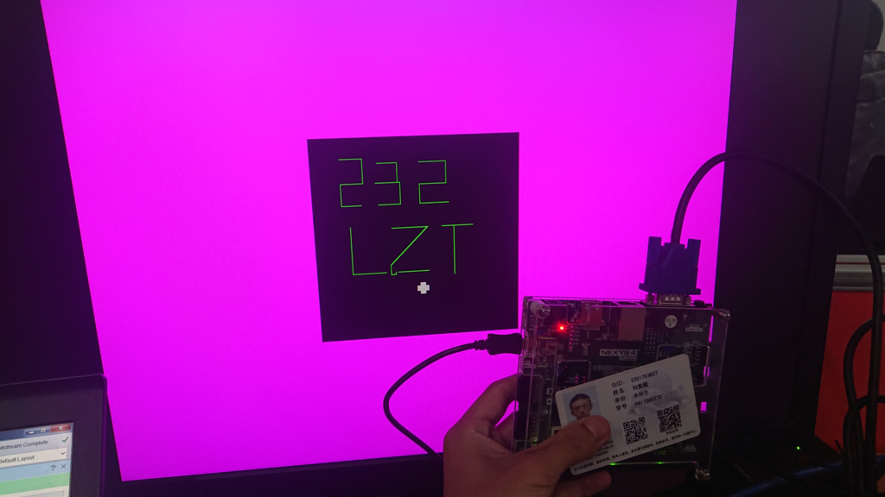

# 计算机组成原理 Lab4 实验报告

刘紫檀 PB17000232

-----

## 逻辑设计与核心代码

由于这些代码的重要性相当，所以合并*核心代码*和*全部代码*两节。

### DCU

DCU 分 `dcu` 和 `dcu_wrapped`。前者专门用于操作 VGA，被设计为一个比较通用的模块；而后者则进行 800\*600 -> 256\*256 的映射，并且提供访存的地址。

`dcu_wrapped` 还负责绘制十字准星。十字准星的关键代码如下：

```verilog
assign in_cursor_position = (row >= 172 - 1 + y - 7) && (row <= 172 - 1 + y + 7) && (col >= 272 - 1 + x - 7) && (col <= 272 - 1 + x + 7) && in_paint_region;

assign in_cursor_vert = (col >= 272 - 1 + x - 3) && (col <= 272 - 1 + x + 3) && in_cursor_position;
assign in_cursor_hori = (row >= 172 - 1 + y - 3) && (row <= 172 - 1 + y + 3) && in_cursor_position;

assign in_cursor = in_cursor_vert | in_cursor_hori;
```


#### DCU 代码

```verilog
`timescale 1ns / 1ps
//////////////////////////////////////////////////////////////////////////////////
// Company: 
// Engineer: 
// 
// Create Date: 2019/04/19 23:48:49
// Design Name: 
// Module Name: vga_hypercube
// Project Name: 
// Target Devices: 
// Tool Versions: 
// Description: 
// 
// Dependencies: 
// 
// Revision:
// Revision 0.01 - File Created
// Additional Comments:
// 
//////////////////////////////////////////////////////////////////////////////////

/* Parameter for 640x480 60Hz, pclk = 25MHz */
//# (parameter ROW_WIDTH = 32,
//   parameter COL_WIDTH = 32,
//   parameter WIDTH = 640,
//   parameter HEIGHT = 480,
//   parameter H_BP = 48,
//   parameter H_FP = 16,
//   parameter H_SPW = 96,
//   parameter V_BP = 29,   //Vertical Back Porch
//   parameter V_FP = 10,   //Vertical Front Porch
//   parameter V_SPW = 2    //Vertical Sync Pulse Width
//)(

module dcu_wrapped(
    input pclk,
    input rst,
    output [15:0] vaddr,       // 256*256 = 65536
    input [11:0] vdata, // BBBB GGGG RRRR
    output [3:0] r,
    output [3:0] g,
    output [3:0] b,
    output hsync,
    output vsync,
    input [7:0] x,
    input [7:0] y
);
    wire [31:0] col;
    wire [31:0] row;
    wire ready;
    wire [11:0] color;
    
    dcu my_dcu (pclk, rst, row, col, ready, color, r, g, b, hsync, vsync);
    
    wire in_paint_region;
    assign in_paint_region = (row >= 172 - 1) && (row <= 428 - 1) && (col <= 528 - 1) && (col >= 272 - 1) && ready;
    
    wire in_cursor_position;
    assign in_cursor_position = (row >= 172 - 1 + y - 5) && (row <= 172 - 1 + y + 5) && (col >= 272 - 1 + x - 5) && (col <= 272 - 1 + x + 5) && in_paint_region;
    assign vaddr = (row - 172 - 1) * 256 + col - 10;
    assign color = in_paint_region ? (in_cursor_position ? 12'b101010101010 : vdata) : 12'b111100001111;

endmodule

module dcu
# (parameter ROW_WIDTH = 32, // 800*600*12(4:4:4) bpp
   parameter COL_WIDTH = 32,
   parameter WIDTH = 800,
   parameter HEIGHT = 600,
   parameter H_BP = 64,
   parameter H_FP = 56,
   parameter H_SPW = 120,
   parameter V_BP = 23,   //Vertical Back Porch
   parameter V_FP = 37,   //Vertical Front Porch
   parameter V_SPW = 6    //Vertical Sync Pulse Width
)(
    input pclk,
    input rst,
    output [ROW_WIDTH - 1: 0] row,
    output [ROW_WIDTH - 1: 0] col,
    output ready,      // if ready, row and col info are valid.
    input [11:0] color, // BBBB GGGG RRRR
    output [3:0] r,
    output [3:0] g,
    output [3:0] b,
    output hsync,
    output vsync
    );
// [V_SPW -> V_BP -> [H_SPW -> H_BP -> WIDTH -> H_FP] * HEIGHT -> V_FP] per frame

    reg [31:0] h_tick;  //could be smaller, but for convenience
    reg [31:0] v_tick;  //as well
    
    always @ (posedge pclk) begin
        if (rst) begin
            h_tick <= 0;
            v_tick <= 0;
        end else begin
            if (h_tick >= H_SPW + H_BP + WIDTH + H_FP - 1) begin   //h_tick [0, H_SPW + H_BP + WIDTH + H_FP - 1]
                h_tick <= 0;
                if (v_tick >= V_SPW + HEIGHT + V_BP + V_FP - 1)    //v_tick [0, V_SPW + HEIGHT + V_BP + V_FP - 1]
                    v_tick <= 0;
                else
                    v_tick <= v_tick + 1;
            end else
                h_tick <= h_tick + 1;
        end
    end
    
    assign ready = (h_tick >= H_SPW + H_BP) && (h_tick <= H_SPW + H_BP + WIDTH)
                     && (v_tick >= V_SPW + V_BP) && (v_tick <= V_SPW + V_BP + HEIGHT);
    
    assign r = ready ? color[3:0] : 0;  //During FP/BP it's okay to send garbage data, but *don't generate extra latches*
    assign g = ready ? color[7:4] : 0;
    assign b = ready ? color[11:8] : 0;
    
    // Pixel Control
    assign col = h_tick - H_SPW - H_BP;
    assign row = v_tick - V_SPW - V_BP;
    
    //Sync Control
    assign hsync = h_tick < H_SPW ? 0 : 1;
    assign vsync = v_tick < V_SPW ? 0 : 1;
    
endmodule
```


### PCU

PCU 用来负责控制画笔和绘制，以及写显存/清空显存。


#### 核心代码

```verilog
`timescale 1ns / 1ps
//////////////////////////////////////////////////////////////////////////////////
// Company: 
// Engineer: 
// 
// Create Date: 2019/04/24 23:52:26
// Design Name: 
// Module Name: pcu
// Project Name: 
// Target Devices: 
// Tool Versions: 
// Description: 
// 
// Dependencies: 
// 
// Revision:
// Revision 0.01 - File Created
// Additional Comments:
// 
//////////////////////////////////////////////////////////////////////////////////

// 0 ... THRES -> 0 ...
module counter32(
    input clk,
    input rst,
    input [31:0] thres,
    output reg [31:0] count
);
    always @ (posedge clk) begin
        if (rst)
            count <= 0;
        else begin
            if (count == thres)
                count <= 0;
            else
                count <= count + 1;
        end
    end
endmodule

module clkdiv32(
    input clk,
    input rst,
    input [31:0] thres,
    output reg clk_div
);
    reg [31:0] count;
    always @ (posedge clk) begin
        if (rst) begin
            count <= 0;
            clk_div <= 1;
        end else begin
            if (count == thres) begin
                count <= 0;
                clk_div = ~clk_div;
            end else
                count <= count + 1;
        end
    end
endmodule

module pcu(
    input clk,     // 50 MHz
    input rst,
    input [3:0] r,
    input [3:0] g,
    input [3:0] b,
    input dir_u,
    input dir_d,
    input dir_l,
    input dir_r,
    input draw,
    input flush,
    output reg [15:0] vaddr,
    output reg [11:0] vdata,
    output reg we,
    output [7:0] x,
    output [7:0] y,
    output wclk
    );
    
    wire step_clk;   // 50 Hz, for button intensity measurement
    clkdiv32 (clk, 0, 32'd19999, step_clk);

    clkdiv32 (clk, 0, 32'd1999, wclk);

    reg [9:0] u_intensity;  // Larger, to avoid signed/unsigned problem
    reg [9:0] d_intensity;
    reg [9:0] l_intensity;
    reg [9:0] r_intensity;
    
    reg [7:0] x_abs_intensity;
    reg go_right;
    always @ (*) begin
        if (r_intensity >= l_intensity) begin
            x_abs_intensity = r_intensity - l_intensity;
            go_right = 1;
        end else begin
            x_abs_intensity = l_intensity - r_intensity;
            go_right = 0;
        end
    end

    reg [7:0] y_abs_intensity;
    reg go_down;
    always @ (*) begin
        if (d_intensity >= u_intensity) begin
            y_abs_intensity = d_intensity - u_intensity;
            go_down = 1;
        end else begin
            y_abs_intensity = u_intensity - d_intensity;
            go_down = 0;
        end
    end

    reg [10:0] real_x;
    reg [10:0] real_y;
    
    assign x = real_x[10:3];
    assign y = real_y[10:3];
    
    always @ (posedge step_clk) begin
        if (rst) begin
            u_intensity <= 0;
            d_intensity <= 0;
            l_intensity <= 0;
            r_intensity <= 0;
        end else begin
            if (dir_u && u_intensity < 254)
                u_intensity <= u_intensity + 1;
            if (dir_d && d_intensity < 254)
                d_intensity <= d_intensity + 1;
            if (dir_l && l_intensity < 254)
                l_intensity <= l_intensity + 1;       
            if (dir_r && r_intensity < 254)
                r_intensity <= r_intensity + 1;
            
            if (!dir_u && u_intensity != 0)
                u_intensity <= u_intensity - 1;
            if (!dir_d && d_intensity != 0)
                d_intensity <= d_intensity - 1;
            if (!dir_l && l_intensity != 0)
                l_intensity <= l_intensity - 1;
            if (!dir_r && r_intensity != 0)
                r_intensity <= r_intensity - 1;
        end
    end
    
    // always @ (posedge step_clk) begin
    //     if (rst) begin
    //         real_x <= 0;
    //         real_y <= 0;
    //     end else begin
    //         real_x <= real_x + r_intensity - l_intensity;
    //         real_y <= real_y + d_intensity - u_intensity;
    //     end
    // end

    // Make it continous
    reg [7:0] wait_x;
    always @ (posedge step_clk) begin
        if (rst) begin
            real_x <= 0;
            wait_x <= 0;
        end else begin
            if (x_abs_intensity != 0 && wait_x == 0)
                wait_x <= x_abs_intensity;
            else if (wait_x != 0) begin
                if (go_right) begin
                    wait_x <= wait_x + 1;
                    real_x <= real_x + 1;
                end else begin
                    wait_x <= wait_x + 1;
                    real_x <= real_x - 1;
                end
            end
        end
    end

    reg [7:0] wait_y;
    always @ (posedge step_clk) begin
        if (rst) begin
            real_y <= 0;
            wait_y <= 0;
        end else begin
            if (y_abs_intensity != 0 && wait_y == 0)
                wait_y <= y_abs_intensity;
            else if (wait_y != 0) begin
                if (go_down) begin
                    wait_y <= wait_y + 1;
                    real_y <= real_y + 1;
                end else begin
                    wait_y <= wait_y + 1;
                    real_y <= real_y - 1;
                end
            end
        end
    end

    // Pixel Write & Flush
    reg [15:0] flush_addr;
    always @ (posedge wclk) begin
        if (rst)
            flush_addr <= 0;
        else 
            flush_addr <= flush_addr + 1;
    end

    always @ (posedge wclk) begin
        if (draw) begin
            we <= 1;
            vaddr <= y * 256 + x;
            vdata <= {b[3], b[2], b[1], b[0], g[3], g[2], g[1], g[0], r[3], r[2], r[1], r[0]};
        end else begin
            if (flush) begin
                we <= 1;
                vaddr <= flush_addr;
                vdata <= 12'b111111111111;
            end else
                we <= 0;
        end
    end
    
endmodule

```


### Block RAM IP Core

采用了 `Block RAM Generator` 这个 `IP` 核，配置为 `Simple Dual Port RAM`。

详情见下图：


实例化如下：

```verilog
blk_mem_gen_0 my_blk_mem (
    .clka(wclk),    // input wire clka
    .wea(we),      // input wire [0 : 0] wea
    .addra(vwaddr),  // input wire [15 : 0] addra
    .dina(vwdata),    // input wire [11 : 0] dina
    .clkb(clk_in1),    // input wire clkb
    .addrb(vraddr),  // input wire [15 : 0] addrb
    .doutb(vrdata)  // output wire [11 : 0] doutb
);
```


#### 核心代码

```verilog
module fifo(
    input en_out,
    input [3:0] in,
    input en_in,
    input rst,
    input clk,
    output reg full,
    output reg empty,
    output reg [7:0] an,
    output reg [6:0] seg,
    output seg_dot,
    output reg [3:0] out
    );
    
    reg [2:0] queue_top; // Put and Inc by 1
    reg [2:0] queue_bottom; // Inc by 1 when dequeue
    reg [3:0] queue_count; // [0, 8]
	wire clk_sweep;
	assign clk_sweep = clk;
    
    always @ (*) begin
        if (queue_count == 0) begin
            empty = 1;
            full = 0;
        end else if (queue_count == 8) begin 
            full = 1;
            empty = 0;
        end else begin
            full = 0;
            empty = 0;
        end
    end
    
    wire [3:0] rd0;
    reg we;

    // Enqueue: Write to position
    // Dequeue: Just adjust pointers
    // ra(cur_num) is used for display purpose solely
    
    reg dot;
	wire [3:0] bottom_val;
    reg [2:0] cur_sweep;
    reg_file #(.REG_COUNT(8), .REG_ADDR_WIDTH(3), .REG_DATA_WIDTH(4))
         rf (cur_sweep, queue_bottom, queue_top, rd0, bottom_val, in, we, rst, clk_sweep);
    
    wire [6:0] seg_decoded;
    bcd_decoder bcd(rd0, dot, seg_decoded, seg_dot);
    
    reg disp_digit; // determine if it's in the queue to be displayed
    
    always @ (*) begin
        if (disp_digit)
            seg = seg_decoded;
        else
            seg = 7'b1111111;
    end
    
    always @ (*) begin
        if (cur_sweep == queue_bottom)
            dot = 1;
        else
            dot = 0;
    end
    
    // Manage ra and display
    always @ (posedge clk_sweep) begin
        if (rst) begin
            cur_sweep <= 0;
        end else begin
            cur_sweep <= cur_sweep + 1;
        end
    end
    
    always @ (*) begin
        an = ~(255 & ( 1 << cur_sweep));
    end
    

    always @ (*) begin
        disp_digit = 0;
        if (queue_bottom < queue_top) begin
            if (cur_sweep < queue_top && cur_sweep >= queue_bottom)
                 disp_digit = 1;
        end else begin
            if (queue_bottom > queue_top) begin
                if (cur_sweep >= queue_bottom || (cur_sweep < queue_top))
                     disp_digit = 1;
            end
        end 
        
        if (queue_count == 8)
            disp_digit = 1;
        
    end
    
    wire en_in_real;
    wire en_out_real;
    input_pulse_gen en_in_gen(clk_sweep, en_in, en_in_real);
    input_pulse_gen en_out_gen(clk_sweep, en_out, en_out_real);

    //Manage Input and {En,De}Queue
    //Phase 0: Nothing happens, if {en} && !full goto 1, if {de} & !empty goto 2
    //Phase 1: we = 1, goto 3
    //Phase 2: queue_count -= 1, queue_bottom += 1 out <= bottom_val,goto 0
    //Phase 3: queue_count = queue_count + 1, queue_top = queue_top + 1  goto 0
        
    reg [2:0] fsm_state;
    reg [2:0] next_state;
    reg [2:0] next_queue_top;
    reg [2:0] next_queue_bottom;
    reg [3:0] next_queue_count;
	reg [3:0] next_out;
    reg next_we;
    
    always @ (posedge clk_sweep) begin
        if (rst) begin
            fsm_state <= 0;
            queue_top <= 0;
            queue_bottom <= 0;
            queue_count <= 0;
            out <= 0;
            we <= 0;
        end else begin
            fsm_state <= next_state;
            queue_top <= next_queue_top;
            queue_bottom <= next_queue_bottom;
            queue_count <= next_queue_count;
            out <= next_out;
            we <= next_we;
        end
    end
    
    always @ (*) begin
        next_state = 0;
        next_queue_top = queue_top;
        next_queue_bottom = queue_bottom;
        next_queue_count = queue_count;
		next_out = out;
        next_we = 0;
    
        case (fsm_state)
            2'd0: begin
                if (en_in_real && (!full)) begin
                    next_state = 1;
                    next_we = 1;
                end else if (en_out_real && (!empty)) begin
                    next_state = 2;
					next_out = bottom_val;
                    next_queue_count = queue_count - 1;
                    next_queue_bottom = queue_bottom + 1;
                end
            end
            2'd1: begin
                next_we = 0;
                next_state = 3;
                next_queue_count = queue_count + 1;
                next_queue_top = queue_top + 1;
            end
            2'd2:
                next_state = 0;
            2'd3:
                next_state = 0;
        endcase
    end

endmodule
```

## 资源占用



## 下载结果



## 实验总结

### 注意事项

- 液晶显示器（至少是我的 `SAMSUNG SyncMaster SA300`）要求 `RGB` 在行消隐、列消隐期间为0
- Vivado Synthesis 的 Warning 有的时候很无厘头，但是基本是对的
  - 但是有的时候也会自相矛盾，不要死磕这一处——bug一般在别的地方