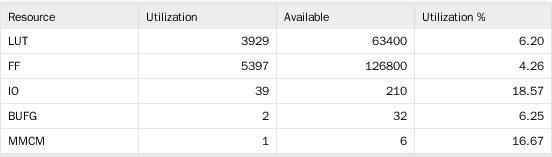
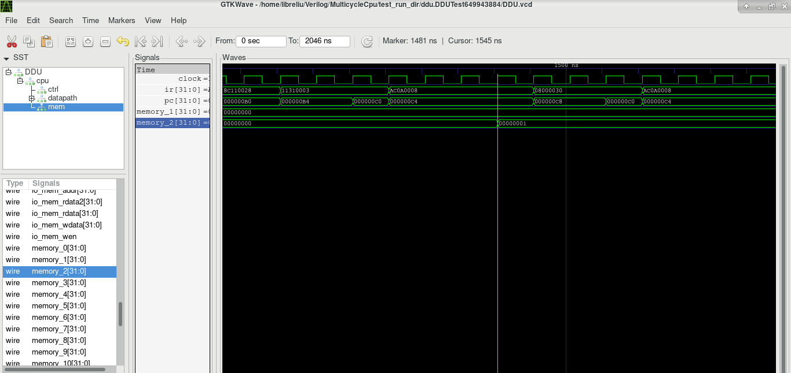
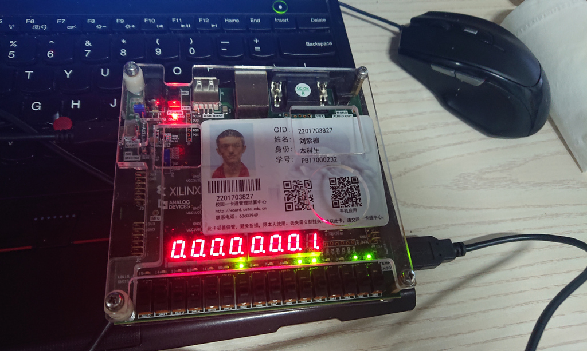

# 计算机组成原理 Lab4 实验报告

刘紫檀 PB17000232

-----

## 工具链 - Chisel + GTKWave

本次 CPU 实验中我采用了 UC Berkeley 的 Chisel3 作为硬件描述的工具。

Chisel 相比 Verilog，有如下优势：

1. Verilog 在设计之初只是*硬件模拟语言*，其中很多语法不适合硬件综合；Chisel 对此有仔细区分
2. Verilog 的一些语法概念在如何映射到硬件实现方面是非常不直观的，或一不小心就会导致非常低效的电路结构（比如锁存器）
3. Verilog 缺少现代编程语言的机制，诸如 OOP/FP，类型推导和反射
4. Verilog 缺乏规模化构建的机制，比如「成批链接」I/O 端口的语法和好用的 function 机制
5. Verilog 的可扩展性大大弱于 Scala

Chisel 是基于 Scala 语言设计构建的。 Scala 是一个以 Java 为基础的「Scalable Language」，在执行前会被翻译为 Class 文件，最终在 JVM 中运行。

Chisel 经过 Firrtl 中间层后，会被翻译为 Verilog 代码，然后再用 Vivado 导入综合/实现/烧写。

### 配置工具链

主要参考 https://github.com/ucb-bar/chisel-tutorial.git。

在 ArchLinux 下只需要 `pacman -Sy sbt scala` 安装 `sbt` 构建工具和 `scala`； Chisel 的相关代码会在第一次使用引用 Chisel 的 `sbt` 项目时由 `sbt` 经由 `Maven` 构建系统下载。下载可能需要网络加速服务，或切换镜像（比较困难，因为硬写在了 `sbt` 的 `jar` 包中了），因为 `Maven` 主镜像非常缓慢。

### 从模板开始

为了方便大家熟悉 Chisel，Chisel 项目准备了 [chisel-template](https://github.com/freechipsproject/chisel-template) 项目。用 `git clone https://github.com/freechipsproject/chisel-template` 即可 clone 到本地。

目录结构大致如下所示：

```
.
├── build.sbt                              # sbt 构建文件
├── project                                # sbt 生成的文件，无需关心
│   ├── build.properties 
│   └── plugins.sbt 
├── README.md                              # template 的介绍
├── scalastyle-config.xml
├── scalastyle-test-config.xml
└── src                                    # 源码目录
    ├── main                               # 一般用来放 Design Sources
    │   └── scala
    │       └── gcd
    │           └── GCD.scala
    └── test                               # 一般用来放 Testbench
        └── scala
            └── gcd
                ├── GCDMain.scala
                └── GCDUnitTest.scala

8 directories, 9 files

```

这个目录结构和 `sbt` 的构建有关系，更详细的介绍请参见 `sbt` 的手册，大概是 `src` 下面每一个目录都是一个子的 `sbt` 构建单位（项目），可以写独立的  `build.sbt` 的那种。

### 从哪里获得帮助

我主要用到了四个方面的帮助

1. 关于 Scala 的：参考 Spec，谷歌和 Scala 自己的 doc
2. 关于 Chisel 的：
   1. 一般的用法直接参见 https://github.com/freechipsproject/chisel3.wiki 和 https://github.com/ucb-bar/chisel-tutorial
   2. 特别的用法要去看源码（在 https://github.com/freechipsproject/chisel3/）和 API 文档（在 https://chisel.eecs.berkeley.edu/api/3.0.0/chisel3/ ）
      1. 比如说 ListLookup/BitPad 和某些 deprecated 的用法（比如支持 BitPad 的类似 MuxCase 的调用 MuxLookup）
3. 关于 sbt 的：参考 sbt 的文档即可
4. 代码风格和复用的设计思路：RISCV Mini 项目（ `freechipsproject` @ Github)

### 调试

一般采用 Chisel 的 PeekPokeTester 的 `poke`（置数）和 `step`（前进 n 个时钟周期），在运行的时候加上`--generate-vcd-output on` 选项，然后用 GTKWave 打开生成的 vcd 文件。此法调试和 Vivado 体验近似。

### 我的源码结构

```
.
├── build.sbt
├── DDU.anno.json
├── DDU.fir                       # 生成的 DDU Firrtl 文件
├── DDU.v                         # 生成的 DDU Verilog 文件
├── project
├── scalastyle-config.xml
├── scalastyle-test-config.xml
├── src
│   ├── main
│   │   └── scala
│   │       ├── alu
│   │       │   └── ALU.scala  # ALU
│   │       ├── Control.scala   # 控制单元
│   │       ├── CPU.scala       # Control + Mem + Datapath
│   │       ├── Datapath.scala  # 数据通路
│   │       ├── DDU.scala       # CPU + DDU(Display & Debug Unit)
│   │       ├── Instr.scala     # 所有用到的指令定义（BitPad）
│   │       ├── Mem.scala       # 内存（采用实例 128 个 32 位 Reg 实现）
│   │       ├── RegFile.scala   # 寄存器堆
│   │       └── TestField.scala # 测试场地，用来测试一些代码能不能过编译
│   └── test
│       ├── resources            # 资源文件，和 Maven 习惯一致
│       │   ├── inst_rom.coe    # 助教给的 COE 去掉前两行（不过我在引用的时候还是直接写死了绝对路径emmm）
│       │   └── inst_rom.S
│       └── scala                # 一些 Testbench
│           ├── alu
│           │   └── ALU.scala
│           ├── CPU.scala
│           ├── DDU.scala
│           ├── RegFile.scala
│           └── TestField.scala
└── test_run_dir


304 directories, 440 files

```

### 构建命令

例：在与 `build.sbt` 同层的目录下运行 `sbt`后：

- `test:runMain ddu.DDUGen` 用于生成 DDU 的 Verilog 代码
- `test:runMain ddu.DDUTest --generate-vcd-output on`  用于运行 DDU + CPU Testbench 并生成 VCD 波形文件，可以用 GTKWave 打开
- `test:runMain multicpu.CPUTest --generate-vcd-output on` 运行 CPU Testbench
- `test:run` 可以查看所有可以运行的 main classes

下面为 `test:run` 的示例：
```
sbt:MultiCycleCpu> test:run
[warn] Multiple main classes detected.  Run 'show discoveredMainClasses' to see the list

Multiple main classes detected, select one to run:

 [1] ddu.DDUGen
 [2] ddu.DDUTest
 [3] gcd.GCDMain
 [4] gcd.GCDRepl
 [5] multicpu.ALUGen
 [6] multicpu.ALUTest
 [7] multicpu.CPUGen
 [8] multicpu.CPUTest
 [9] multicpu.RegFileGen
 [10] multicpu.RegFileTest
 [11] testfield.TestFieldGen
 [12] testfield.TestFieldTest

Enter number: 
```

构建生成的内容一般在 `test_run_dir`，`ALUGen/DDUGen` 等生成的一般在项目主目录下。

### Chisel 的问题

1. 不支持内存初值
   - 因为 Chisel 的硬件描述完全面向综合，而可以赋初值的内存本质上是个高级功能
2. 对 IP 核只能用 Verilog Blackbox 封装起来，到 Vivado Simulator 仿真
   - 不是个大问题，但是还是诸多不便（如果必须用 IP 核的话）
3. Chisel 的 `poke`（置数）操作总是慢半个时钟周期，以及 `iotester` 执行效率和 Vivado Simulator 一样感人
   - 没找到解决方法，并且 RISCV-Mini 项目为了解决内存模拟的问题用的 Verilator C++ 写的模拟插件

### Vivado 项目和 `top.v`

DDU 缺乏时钟分频，所以在 Vivado 中写一个 top.v 用来实例化 Clocking Wizard IP 核，同时把 xdc 处理好。

## 逻辑设计

下面仅列出与实验 PPT 所给有所改动的部分：

- 数据通路：修改 ALU A 端口输入，使得可以从 PC/RegA/RegB 选择；修改 ALU B 端口输入，新增从 `SignExt((ir(15,0) << 2), 32)`、 `ir(15,0)` 和 `ir(10,6)` 选择的机制
- 控制单元：增加 I 型指令执行的若干状态；增加单步执行时的 `rest` 状态

其它略。

## src 代码

此处合并*核心代码*和*全部代码*两节。

### Control

代码中已包含比较详细的注释。

```scala
// Control.scala
package multicpu

import chisel3._
import chisel3.util._

class CtrlDbg extends Bundle {
    val cur_state = Input(UInt(4.W))
    val isRType   = Input(Bool())
    val isIType   = Input(Bool())
    val isJType   = Input(Bool())
    val isLW      = Input(Bool())
    val isSW      = Input(Bool())
    val isBEQ     = Input(Bool())
    val isBNE     = Input(Bool())
}

//-- Datapath perspective --
class CtrlSigBase extends Bundle {
    val Inst = Output(UInt(32.W))
    val IRWrite = Input(Bool())
    // RegDst = 1: Write to rd (add, etc)
    //          0: Write to rt (addi, lw, etc)
    val RegDst = Input(Bool())
    val RegWrite = Input(Bool())
    val ALUSrcA = Input(UInt(2.W))
    val ALUSrcB = Input(UInt(3.W))
    val ALUOp   = Input(UInt(4.W))
    val PCSource = Input(UInt(2.W))
    val PCWriteBEQ = Input(Bool())
    val PCWriteBNE = Input(Bool())
    val PCWrite = Input(Bool())
    // IorD = 1: Address = aluout
    val IorD = Input(Bool())
    val MemRead = Input(Bool())
    val MemWrite = Input(Bool())
    val MemtoReg = Input(Bool())
}

//-- Datapath perspective --
class CtrlSigIO extends Bundle {
    val base = (new CtrlSigBase)

    // Single Step
    val SingleStep = Output(Bool())
    // Displayed sigs
    val ctrl_dbg = (new CtrlDbg)
}

object CtrlSigALUB {   // ALUSrcB
    val RegB    = 0.U(3.W) // So called "rt"
    val Const4  = 1.U(3.W)
    val EImm   = 2.U(3.W)  // Sign-extended immediate
    val EImm2  = 3.U(3.W)  // EAddr << 2
    val ZImm   = 4.U(3.W)  // Zero-extended immediate
    val shamt  = 5.U(3.W)  // use ir(10,6) (shamt).zeroext as ALUSrcB
}

object CtrlSigALUA {   // ALUSrcA
    val PC       = 0.U(2.W) // from pc
    val RegA     = 1.U(2.W) // ir(25,21) (rs)
    val RegB     = 2.U(2.W) // ir(20,16) rt  
}

object CtrlSigPC {     // PCSource
    // Directly comes from ALU
    val ALU  = 0.U(2.W)

    // J, 26bit addr
    // PC := Cat(PC(31,28),instr_index, 0.U(2.W))                
    val J  = 2.U(2.W)
    
    // BNE && BEQ, which needs jump on ALU_Flags,
    // and previous calculated ALU result
    //     (PC + 4) + sign_extend(offset << 2)
    //     Therefore PC comes from ALUOut
    val ALUOut = 1.U(2.W) // Previous ALU Result(1 cyc. earlier)
}
//------------------------

/** Creates a cascade of n Muxs to search for a key value.
  *
  * @example {{{
  * MuxLookupB(idx, default,
  *     Array(BitPat("b001") -> a, BitPat("b0??") -> b))
  * }}}
  */

object MuxLookupB {
  /** @param key a key to search for
    * @param default a default value if nothing is found
    * @param mapping a sequence to search of keys and values
    * @return the value found or the default if not
    */
  def apply[S <: UInt, T <: Data, D <: BitPat] (key: S, default: T, mapping: Seq[(BitPat, T)]): T = {
    var res = default
    for ((k, v) <- mapping.reverse)
      res = Mux(k === key, v, res)
    res
  }
}

import Instr._

class Control extends Module {
    val io = IO(Flipped(new CtrlSigIO))

/*     val isIType = ((io.Inst === ADDI) || 
                   (io.Inst === ANDI) ||
                   (io.Inst === ORI ) ||
                   (io.Inst === XORI) ||
                   (io.Inst === SLTI))
Have to be separated. Why?
*/ 

    val isRType = Wire(Bool())
    val isIType = Wire(Bool())
    val isJType = Wire(Bool())
    val isLW    = Wire(Bool())
    val isSW    = Wire(Bool())
    val isBEQ   = Wire(Bool())
    val isBNE   = Wire(Bool())
    val isSLL   = Wire(Bool())

    // isRType := Lookup(io.Inst, false.B, Seq(
    //     ADD -> true.B,
    //     AND -> true.B,
    //     SUB -> true.B,
    //     OR  -> true.B,
    //     NOR -> true.B,
    //     XOR -> true.B,
    //     SLT -> true.B
    //     ))

    
    isRType := (   (io.base.Inst === ADD) || 
                   (io.base.Inst === AND) ||
                   (io.base.Inst === SUB) ||
                   (io.base.Inst === OR ) ||
                   (io.base.Inst === NOR) ||
                   (io.base.Inst === XOR) ||
                   (io.base.Inst === SLT))
    isIType := ((io.base.Inst === ADDI) || 
                   (io.base.Inst === ANDI) ||
                   (io.base.Inst === ORI ) ||
                   (io.base.Inst === XORI) ||
                   (io.base.Inst === SLTI))
    isJType := (io.base.Inst === J)
    isLW    := (io.base.Inst === LW)
    isSW    := (io.base.Inst === SW)
    isBEQ   := (io.base.Inst === BEQ)
    isBNE   := (io.base.Inst === BNE)
    isSLL   := (io.base.Inst === SLL)

    def make_default () {
        io.base.IRWrite      := false.B
        io.base.RegDst       := false.B
        io.base.RegWrite     := false.B
        io.base.ALUSrcA      := CtrlSigALUA.PC
        io.base.ALUSrcB      := 0.U
        io.base.ALUOp        := 0.U
        io.base.PCSource     := false.B
        io.base.PCWriteBEQ   := false.B 
        io.base.PCWriteBNE   := false.B
        io.base.PCWrite      := false.B
        io.base.IorD         := false.B
        io.base.MemRead      := false.B
        io.base.MemWrite     := false.B
        io.base.MemtoReg     := false.B    
    }

    val inst_fetch :: inst_decode :: lwsw_mem_addr_comp :: lw_mem_access :: sw_mem_access :: lw_writeback :: r_exec :: r_writeback :: i_exec :: i_writeback :: b_exec :: j_exec :: s_exec :: illegal :: delay_start :: rest :: Nil = Enum(16)

    val cur_state = RegInit(delay_start)
    make_default()  // **Important, else you'll suffer errors on unconnected wires
                    // act like the "default" clause in Verilog "case"
    switch (cur_state) {

        is (inst_fetch) {     // IR <= mem[pc]; PC <= PC + 4

            io.base.MemRead   := true.B
            io.base.ALUSrcA   := CtrlSigALUA.PC // ALU_A <= PC
            io.base.IorD      := false.B // mem_addr <= PC
            io.base.IRWrite   := true.B
            io.base.ALUSrcB   := CtrlSigALUB.Const4 // ALU_B <= 4
            io.base.ALUOp     := ALUSel.ALU_ADD
            io.base.PCWrite   := Mux(io.SingleStep, false.B, true.B)   // Enable PC Unconditional Writing
            io.base.PCSource  := CtrlSigPC.ALU

            //cur_state := inst_decode
            cur_state    := Mux(io.SingleStep, rest, inst_decode)
        }
        is (inst_decode) {    // ALUOut <= PC + Sign-Ext(Imm << 2)

            io.base.ALUSrcA   := CtrlSigALUA.PC  // ALU_A <= regFile Port A
            io.base.ALUSrcB   := CtrlSigALUB.EImm2
            io.base.ALUOp     := ALUSel.ALU_ADD

            cur_state := MuxCase(illegal, Seq(
                isRType -> r_exec,
                isIType -> i_exec,
                isJType -> j_exec,
                isLW    -> lwsw_mem_addr_comp,
                isSW    -> lwsw_mem_addr_comp,
                isBEQ   -> b_exec,
                isBNE   -> b_exec,
                isSLL   -> s_exec
            ))
        }
        is (lwsw_mem_addr_comp) {

            io.base.ALUSrcA   := CtrlSigALUA.RegA  // ALU_A <= regFile Port A (rs)
            io.base.ALUSrcB   := CtrlSigALUB.EImm
            io.base.ALUOp     := ALUSel.ALU_ADD
            
            cur_state := MuxCase(illegal, Array(
                isLW    -> lw_mem_access,
                isSW    -> sw_mem_access
            ))
        }
        is (lw_mem_access) {

            io.base.MemRead   := true.B
            io.base.IorD      := true.B  // (gather address from aluout)

            cur_state := lw_writeback
        }
        is (sw_mem_access) {

            io.base.MemWrite  := true.B
            io.base.IorD      := true.B

            cur_state := inst_fetch
        }
        is (lw_writeback) {

            io.base.RegDst    := false.B // regFile Write addr <= ir(20,16) (rt)
            io.base.RegWrite  := true.B
            io.base.MemtoReg  := true.B  // use mdr(delayed mem_rdata)

            cur_state := inst_fetch
        }
        is (r_exec) {

            io.base.ALUSrcA   := CtrlSigALUA.RegA
            io.base.ALUSrcB   := CtrlSigALUB.RegB
            io.base.ALUOp     := MuxLookupB(io.base.Inst, ALUSel.ALU_XXX, Seq(
                ADD     -> ALUSel.ALU_ADD,
                AND     -> ALUSel.ALU_AND,
                SUB     -> ALUSel.ALU_SUB,
                OR      -> ALUSel.ALU_OR ,
                NOR     -> ALUSel.ALU_NOR,
                XOR     -> ALUSel.ALU_XOR,
                SLT     -> ALUSel.ALU_SLT
            ))

            cur_state := r_writeback
        }
        is (r_writeback) {

            io.base.RegDst    := true.B
            io.base.RegWrite  := true.B
            io.base.MemtoReg  := false.B // use alu_out

            cur_state := inst_fetch
        }

        is (s_exec) {
            io.base.ALUSrcA   := CtrlSigALUA.RegB
            io.base.ALUSrcB   := CtrlSigALUB.shamt
            io.base.ALUOp     := MuxLookupB(io.base.Inst, ALUSel.ALU_XXX, Seq(
                SLL     -> ALUSel.ALU_SLL
            ))

            cur_state := r_writeback // write back are the common one
        }

        is (i_exec) {

            io.base.ALUSrcA   := CtrlSigALUA.RegA  // ALU_A <= regFile Port A (rs)
            io.base.ALUSrcB   := MuxLookupB(io.base.Inst, CtrlSigALUB.EImm, Seq(
                ADDI     -> CtrlSigALUB.EImm,
                ANDI     -> CtrlSigALUB.ZImm,
                ORI      -> CtrlSigALUB.ZImm,
                XORI     -> CtrlSigALUB.ZImm,
                SLTI     -> CtrlSigALUB.EImm
            ))
            io.base.ALUOp     := MuxLookupB(io.base.Inst, ALUSel.ALU_XXX, Seq(
                ADDI     -> ALUSel.ALU_ADD,
                ANDI     -> ALUSel.ALU_AND,
                ORI      -> ALUSel.ALU_OR,
                XORI     -> ALUSel.ALU_XOR,
                SLTI     -> ALUSel.ALU_SLT
            ))

            cur_state := i_writeback
        }
        is (i_writeback) {

            io.base.RegDst   := false.B // regFile Write addr <= ir(20,16) (rt)
            io.base.RegWrite  := true.B
            io.base.MemtoReg  := false.B // use alu_out

            cur_state := inst_fetch
        }
        is (b_exec) {

            io.base.ALUSrcA    := CtrlSigALUA.RegA // (rs)
            io.base.ALUSrcB    := CtrlSigALUB.RegB
            io.base.ALUOp      := ALUSel.ALU_SUB
            io.base.PCWriteBEQ := isBEQ
            io.base.PCWriteBNE := isBNE
            io.base.PCSource   := CtrlSigPC.ALUOut

            cur_state := inst_fetch
        }
        is (j_exec) {

            io.base.PCWrite   := true.B
            io.base.PCSource  := CtrlSigPC.J

            cur_state := inst_fetch
        }

        is (illegal) {

            cur_state := illegal
        }

        is (delay_start) {
            cur_state := inst_fetch
        }
        
        // halting the processor, return to inst_decode if single=0
        // to make this happen, keep pc + 4 available at any time
        // without actually changing pc
        is (rest) {
            io.base.MemRead   := true.B
            io.base.ALUSrcA   := CtrlSigALUA.PC // ALU_A <= PC
            io.base.IorD      := false.B // mem_addr <= PC
            io.base.IRWrite   := true.B
            io.base.ALUSrcB   := CtrlSigALUB.Const4 // ALU_B <= 4
            io.base.ALUOp     := ALUSel.ALU_ADD
            // Enable PC Unconditional Writing if we're leaving SingleStep mode
            io.base.PCWrite   := Mux(io.SingleStep, false.B, true.B) 
            io.base.PCSource  := CtrlSigPC.ALU

            cur_state := Mux(io.SingleStep, rest, inst_decode)
        }


    }

    //Debug
    io.ctrl_dbg.cur_state := cur_state
    io.ctrl_dbg.isRType   := isRType
    io.ctrl_dbg.isIType   := isIType
    io.ctrl_dbg.isJType   := isJType
    io.ctrl_dbg.isLW      := isLW   
    io.ctrl_dbg.isSW      := isSW   
    io.ctrl_dbg.isBEQ     := isBEQ  
    io.ctrl_dbg.isBNE     := isBNE  

}
```


### Datapath

```scala
package multicpu

import chisel3._
import chisel3.util._

class DebugPort extends Bundle {
    val ir = Output(UInt(32.W))
    val mdr = Output(UInt(32.W))
    val aluout = Output(UInt(32.W))
    val pc = Output(UInt(32.W))
    val ra_c = Input(UInt(5.W))
    val rd_c = Output(UInt(32.W))

    val mr_a = Input(UInt(32.W))
    val mr_d = Output(UInt(32.W))
}

class DatapathIO extends Bundle {
    val ctrl = new CtrlSigBase
    val mem = new MemPort
    val debug = new DebugPort
}

class Datapath extends Module {
    val io = IO(new DatapathIO)
    val alu = Module(new ALU(32))
    val regFile = Module(new RegFile)
    // moving mem out of Datapath for simu & synthesizing
    // val mem = Module(new Mem)

    // IR
    val ir = RegInit(Instr.Pseudo_NOP)
    when (io.ctrl.IRWrite) {
        ir := io.mem.mem_rdata
    }
    io.ctrl.Inst := ir

    // MDR
    val mdr = RegNext(io.mem.mem_rdata)

    // ALUOut
    val aluout = RegNext(alu.io.out)

    // PC
    val pc = RegInit(0.U(32.W))
    when ( (io.ctrl.PCWriteBEQ && alu.io.flagZero)    ||
           (io.ctrl.PCWriteBNE && (!alu.io.flagZero)) ||
            io.ctrl.PCWrite ) {
        pc := MuxLookup(io.ctrl.PCSource, 0.U(32.W), Seq(
            CtrlSigPC.ALU    -> alu.io.out,
            CtrlSigPC.ALUOut -> aluout,
            CtrlSigPC.J      -> Cat(pc(31,28), (ir(25,0) << 2))
        ))
    }

    // regFile
    regFile.io.ra_a := ir(25,21)
    regFile.io.ra_b := ir(20,16)
    regFile.io.wa   := Mux(io.ctrl.RegDst, ir(15,11), ir(20,16))
    regFile.io.wd   := Mux(io.ctrl.MemtoReg, mdr, aluout)  // **use aluout(delayed alu.io)**
    //regFile.io.rd_a := 
    //regFile.io.rd_b := 
    regFile.io.RegWrite := io.ctrl.RegWrite

    def SignExt(n: UInt, m: Int) = {
        val p = Wire(SInt(m.W))
        p := n.asSInt
        p.asUInt
    }
    // ALU
    // alu.io.A := Mux(io.ctrl.ALUSrcA, regFile.io.rd_a, pc) // deprecated 
    alu.io.A := MuxLookup(io.ctrl.ALUSrcA, 0.U, Seq(
            CtrlSigALUA.PC   -> pc,
            CtrlSigALUA.RegA -> regFile.io.rd_a,
            CtrlSigALUA.RegB -> regFile.io.rd_b
    ))
    alu.io.B := MuxLookup(io.ctrl.ALUSrcB, 0.U, Seq(
        CtrlSigALUB.RegB   -> regFile.io.rd_b,
        CtrlSigALUB.Const4 -> 4.U(32.W),
        CtrlSigALUB.EImm  -> SignExt(ir(15,0), 32),  // it works?
        CtrlSigALUB.EImm2 -> SignExt((ir(15,0) << 2), 32),
        CtrlSigALUB.ZImm  -> ir(15,0),
        CtrlSigALUB.shamt -> ir(10,6)
    ))
    alu.io.opcode := io.ctrl.ALUOp
    // alu.io.out
    // alu.io.flagZero

    // Mem
    io.mem.mem_addr  := Mux(io.ctrl.IorD, aluout, pc)
    io.mem.mem_wdata := regFile.io.rd_b
    io.mem.mem_wen   := io.ctrl.MemWrite

    // Debug
    io.debug.ir      := ir
    io.debug.mdr     := mdr
    io.debug.aluout  := aluout
    io.debug.pc      := pc
    regFile.io.ra_c  := io.debug.ra_c
    io.debug.rd_c    := regFile.io.rd_c
    io.mem.mem_addr2 := io.debug.mr_a 
    io.debug.mr_d    := io.mem.mem_rdata2
}
```


### Instr

一个单例，用来写所有的指令的定义。

```scala
package multicpu

import chisel3.UInt
import chisel3.util.BitPat


// error] (run-main-19) chisel3.core.Binding$ExpectedHardwareException: bits operated on 'chisel3.core.UInt@368' must be hardware, not a bare Chisel type. Perhaps you forgot to wrap it in Wire(_) or IO(_)?
// [error] chisel3.core.Binding$ExpectedHardwareException: bits operated on 'chisel3.core.UInt@368' must be hardware, not a bare Chisel type. Perhaps you forgot to wrap it in Wire(_) or IO(_)?
// when using val instead of def, why?
object Instr {
    val ADD  = BitPat("b000000???????????????00000100000")
    val AND  = BitPat("b000000???????????????00000100100")

    val SUB  = BitPat("b000000???????????????00000100010")

    val OR   = BitPat("b000000???????????????00000100101")
    val NOR  = BitPat("b000000???????????????00000100111")
    val XOR  = BitPat("b000000???????????????00000100110")
    val SLT  = BitPat("b000000???????????????00000101010")

    val SLL  = BitPat("b00000000000???????????????000000")

    val ADDI = BitPat("b001000??????????????????????????")
    val ANDI = BitPat("b001100??????????????????????????")
    val ORI  = BitPat("b001101??????????????????????????")
    val XORI = BitPat("b001110??????????????????????????")
    val SLTI = BitPat("b001010??????????????????????????")

    val BEQ  = BitPat("b000100??????????????????????????")
    val BNE  = BitPat("b000101??????????????????????????")
    val J    = BitPat("b000010??????????????????????????")

    val LW   = BitPat("b100011??????????????????????????")
    val SW   = BitPat("b101011??????????????????????????")

    // Used for Init vars; addi $0, $0, 0
    val Pseudo_NOP = BitPat.bitPatToUInt(BitPat("b00100000000000000000000000000000")) 
}

```

### RegFile

```scala

package multicpu

import chisel3._
import chisel3.util._

class RegFile extends Module {
    val io = IO(new Bundle {
        val ra_a = Input(UInt(5.W))
        val ra_b = Input(UInt(5.W))
        val wa = Input(UInt(5.W))
        val wd = Input(UInt(32.W))
        val rd_a = Output(UInt(32.W))
        val rd_b = Output(UInt(32.W))
        val RegWrite = Input(Bool())

        // Port for debugging
        val ra_c = Input(UInt(5.W))
        val rd_c = Output(UInt(32.W))
    })
    val regs = RegInit( VecInit( Seq.fill(32)(0.U(32.W)) ) )
    for (i <- 0 until 32) {
        when (io.wa === i.U(5.W) && io.RegWrite) {
            regs(i) := io.wd
        }
        // when (io.ra_a === i.U(5.W)) {  // Will produce error!
        //     io.rd_a := regs(i) 
        // }
        // when (io.ra_b === i.U(5.W)) {
        //     io.rd_b := regs(i)
        // }
    }
    val raZero = (io.ra_a === 0.U)
    val rbZero = (io.ra_b === 0.U)
    val rcZero = (io.ra_c === 0.U)
    io.rd_a := Mux(raZero, 0.U, regs(io.ra_a))
    io.rd_b := Mux(rbZero, 0.U, regs(io.ra_b))
    io.rd_c := Mux(rcZero, 0.U, regs(io.ra_c))
}
```

### CPU

```scala
package multicpu

import chisel3._
import chisel3.util._

// // CPU without mem
// class CPU extends Module {
//     val io = IO(new Bundle {
//         val mem = new MemPort
//         val debug = new DebugPort
//         val ctrl_dbg = Flipped(new CtrlDbg)
//     })

//     val datapath = Module(new Datapath)
//     io.mem <> datapath.io.mem
//     io.debug <> datapath.io.debug

//     val ctrl = Module(new Control)
//     ctrl.io <> datapath.io.ctrl
//     io.ctrl_dbg <> ctrl.io.ctrl_dbg
// }

// CPU with mem
class CPU extends Module {
    val io = IO(new Bundle {
        val debug = new DebugPort
        val ctrl_dbg = Flipped(new CtrlDbg)
        val single = Input(Bool())
    })

    val datapath = Module(new Datapath)
    io.debug <> datapath.io.debug

    val ctrl = Module(new Control)
    ctrl.io.base <> datapath.io.ctrl
    io.ctrl_dbg <> ctrl.io.ctrl_dbg
    ctrl.io.SingleStep := io.single

    val mem = Module(new Mem(128))
    mem.io <> datapath.io.mem
}
```

### DDU

```scala
package ddu

import multicpu._

import chisel3._
import chisel3.util._

object Config {
    val delay_1ms = 5000  // 1ms under 5MHz freq
    val delay_1us = 5     // 1us under 5MHz freq
}

class SegDisp extends Bundle {
    val seg = Output(UInt(7.W))
    val dp  = Output(Bool())
    val an  = Output(UInt(8.W))
}

/*
module bcd_decoder(
    input [3:0] x,
    input dot,
    output reg [6:0] seg,
    output reg seg_dot
);
    always @ (*) begin
        case (x)
            4'd0: seg = 7'b1000000;
            4'd1: seg = 7'b1111001;
            4'd2: seg = 7'b0100100;
            4'd3: seg = 7'b0110000;
            4'd4: seg = 7'b0011001;
            4'd5: seg = 7'b0010010;
            4'd6: seg = 7'b0000010;
            4'd7: seg = 7'b1111000;
            4'd8: seg = 7'b0000000;
            4'd9: seg = 7'b0010000;
            4'd10: seg = 7'b0001000;
            4'd11: seg = 7'b0000011;
            4'd12: seg = 7'b1000110;
            4'd13: seg = 7'b0100001;
            4'd14: seg = 7'b0000110;
            4'd15: seg = 7'b0001110;
        endcase
        seg_dot = ~dot;
    end
endmodule
*/

class DDU extends Module {
    val io = IO(new Bundle {
        val cont = Input(Bool())
        val step = Input(Bool())
        val mem  = Input(Bool())
        val inc  = Input(Bool())
        val dec  = Input(Bool())
        val disp = new SegDisp
        val led  = Output(UInt(16.W))
    })

    val cpu = Module(new CPU())

    def toBin(b: BitPat): UInt = BitPat.bitPatToUInt(b)
    def Decode(n: UInt) = MuxLookup(n, toBin(BitPat("b1000000")), Seq(
        0.U -> toBin(BitPat("b1000000")),
        1.U -> toBin(BitPat("b1111001")),
        2.U -> toBin(BitPat("b0100100")),
        3.U -> toBin(BitPat("b0110000")),
        4.U -> toBin(BitPat("b0011001")),
        5.U -> toBin(BitPat("b0010010")),
        6.U -> toBin(BitPat("b0000010")),
        7.U -> toBin(BitPat("b1111000")),
        8.U -> toBin(BitPat("b0000000")),
        9.U -> toBin(BitPat("b0010000")),
        10.U -> toBin(BitPat("b0001000")),
        11.U -> toBin(BitPat("b0000011")),
        12.U -> toBin(BitPat("b1000110")),
        13.U -> toBin(BitPat("b0100001")),
        14.U -> toBin(BitPat("b0000110")),
        15.U -> toBin(BitPat("b0001110"))
    ))

    def counter(max: UInt) = {
        val x = RegInit(0.U(max.getWidth.W))
        x := Mux(x === max, 0.U, x + 1.U)
        x
    }

    def counter(max: UInt, carry: Bool) = {
        val x = RegInit(0.U(max.getWidth.W))
        x := Mux(carry, Mux(x === max, 0.U, x + 1.U), x)
        x
    }

    def anti_jitter(sig: Bool, n: Int) : Bool = {
        val x = RegNext(sig)
        val rising_edge = sig && !x 
        val cnt = RegInit(0.U(n.U.getWidth.W))

        val idle :: count :: Nil = Enum(2)
        val cur_state = RegInit(idle)
        val res = RegInit(false.B)
        when (cur_state === idle) {
            when ( rising_edge ) {
                cur_state := count
                cnt       := n.U
                res       := true.B
            }
        } 
        .elsewhen (cur_state === count) {
            res := false.B
            when (cnt === 0.U) {
                cur_state := idle
            } .otherwise {
                cnt       := cnt - 1.U
            }
        } .otherwise {
            res := false.B
            cur_state     := idle
        }
        res
    }
    //---- Display -----
    // Sweep Generator
    val step  = counter(7.U, counter((Config.delay_1ms * 1).U) === 0.U)  // 0 ~ 7, with freq divider
    io.disp.an := ~(1.U(7.W) << step)

    // data to be displayed
    val disp_data = Wire(UInt(32.W))
    io.disp.seg := Decode(MuxLookup(step, 0.U, Seq(
        0.U -> disp_data(3,0),
        1.U -> disp_data(7,4),
        2.U -> disp_data(11,8),
        3.U -> disp_data(15,12),
        4.U -> disp_data(19,16),
        5.U -> disp_data(23,20),
        6.U -> disp_data(27,24),
        7.U -> disp_data(31,28)
    )))
    // Dot
    io.disp.dp := false.B
    //----- data ------
    disp_data := Mux(io.mem, cpu.io.debug.mr_d, cpu.io.debug.rd_c)
    val disp_addr = RegInit(0.U(32.W))
    when (anti_jitter(io.inc, (Config.delay_1ms * 500)))  {
        disp_addr := disp_addr + 1.U
    } .elsewhen (anti_jitter(io.dec, (Config.delay_1ms * 500))) {
        disp_addr := disp_addr - 1.U
    }

    cpu.io.debug.mr_a := disp_addr
    cpu.io.debug.ra_c := disp_addr(4,0)
    //---- single step control ---
    val pressed = anti_jitter(io.step, (Config.delay_1ms * 500))  // will lasts for 1 cycle while pressed
    // io.cont = 1 => single = 0
    // io.cont = 0 => when pressed, single = 0, else single = 1
    cpu.io.single := !(pressed || io.cont)

    //--- led ---
    // upper 8 bits for RF/(MEM ADDR >> 2)
    // lower 8 bits for PC addr >> 2

    io.led := Cat(  Mux(io.mem, disp_addr(9,0) >> 2, disp_addr(4,0))  , (cpu.io.debug.pc(9,0) >> 2)(7,0) )
}
```

### Mem

```scala
package multicpu

import chisel3._
import chisel3.util._

// Datapath perspective
class MemPort extends Bundle {
    val mem_rdata = Input(UInt(32.W))
    val mem_addr = Output(UInt(32.W))
    val mem_wdata = Output(UInt(32.W))
    val mem_wen   = Output(Bool())

    // Extra reading port for debugging
    val mem_addr2 = Output(UInt(32.W))
    val mem_rdata2 = Input(UInt(32.W))
}

object COEReader {
    def read(s: String) : Array[UInt] = {
        val lines = scala.io.Source.fromFile("/home/libreliu/Verilog/MulticycleCpu/src/test/resources/inst_rom.coe").getLines()
        
        var arr = Array[UInt]()

        for (l <- lines) {
            // TODO: Strip leading blank chars
            val num = java.lang.Long.parseLong(l, 16)
            println("COEReader: got " + num.toString)
            arr = scala.Array.concat(arr, Array(num.U(32.W)))
        }
        arr
    }
}

    // // a synchronous-read, synchronous-write memory (like in FPGAs).
    // val mem = SyncReadMem(1024, UInt(32.W))
    // // Create one write port and one read port.
    // mem.write(io.mem_addr, wdata)
    // dataOut := mem.read(addr, enable)

class Mem(n: Int) extends Module {
    val io = IO(Flipped(new MemPort))

    // val data_init = Array(
    //     0x20010001.U(32.W),
    //     0x20210001.U(32.W),
    //     0x00210820.U(32.W),
    //     0x08000002.U(32.W),
    //     0x08000003.U(32.W),
    //     0x08000003.U(32.W),
    //     0x08000003.U(32.W),
    //     0x08000003.U(32.W)
    // ).toSeq
    val data_init = COEReader.read("inst_rom.coe")
    if (n < data_init.length) {
        throw new IllegalArgumentException
    }

    val memory = RegInit( VecInit( Seq.concat(data_init, Seq.fill(n - data_init.length)(0.U(32.W)) ) ) )
    for (p <- 0 until n) {
        when (io.mem_wen && (io.mem_addr >> 2) === p.U) {
            memory(p) := io.mem_wdata
        }
        // Mem here must be async, or buggy
        io.mem_rdata := memory(io.mem_addr >> 2)
        //io.mem_rdata := RegNext(memory((io.mem_addr >> 2)))

        // For debugging
        io.mem_rdata2 := memory(io.mem_addr2 >> 2)

    }
}
```

## test 代码

### ALU

```scala
// See LICENSE.txt for license details.
package multicpu

import java.io.File

import chisel3.iotesters.{PeekPokeTester, Driver, ChiselFlatSpec}
import chisel3._

import scala.util.Random
import Math.{pow, abs}

//github.com/freechipsproject/chisel-tester
class ALUUnitTester(c: ALU) extends PeekPokeTester(c) {
  val RandGen = new Random()

  for (n <- 0 until 64) {
    val a      = BigInt(abs(RandGen.nextLong() % (pow(2, 32).toLong - 1) ))
    val b      = BigInt(abs(RandGen.nextLong() % (pow(2, 32).toLong - 1) ))
    val opcode = BigInt(abs(RandGen.nextLong() % 16))
  // for (a <- 0 until 16) {
    // for (b <- 0 until 16) {
      // for (opcode <- 0 until 4) {
        var output = BigInt(0)
        if (opcode == ALUSel.ALU_ADD.toInt) {
          output = (a+b) & BigInt((Math.pow(2,32) - 1).toLong)
        } else if (opcode == ALUSel.ALU_SUB.toInt) {
          output = (a-b) & BigInt((Math.pow(2,32) - 1).toLong)
        } else if (opcode == ALUSel.ALU_SLT.toInt) {
          output = a.toInt < b.toInt
        } else if (opcode == ALUSel.ALU_SLTU.toInt) {
          output = a < b
        } else if (opcode == ALUSel.ALU_AND.toInt) {
          output = a & b
        } else if (opcode == ALUSel.ALU_OR.toInt) {
          output = a | b
        } else if (opcode == ALUSel.ALU_XOR.toInt) {
          output = a ^ b
        } else if (opcode == ALUSel.ALU_COPY_A.toInt) {
          output = a
        } else if (opcode == ALUSel.ALU_NOR.toInt) {
          output = (~(a.toInt | b.toInt))  // Problem ! TBC
        } else {
          output = b
        }
        poke(c.io.A, a)
        poke(c.io.B, b)
        poke(c.io.opcode, opcode)
        step(1)
        println("A = "+ a.toString + "; B = "+ b.toString + "; opcode = " + opcode.toString)
        expect(c.io.out, output)
  }
      // }}}
}

class ALUTester extends ChiselFlatSpec {
  behavior of "ALU"
  backends foreach {backend =>
    it should s"perform correct math operation on dynamic operand in $backend" in {
      Driver(() => new ALU(32), backend)((c) => new ALUUnitTester(c)) should be (true)
    }
  }

    /**
    * By default verilator backend produces vcd file, and firrtl and treadle backends do not.
    * Following examples show you how to turn on vcd for firrtl and treadle and how to turn it off for verilator
    */

  // "running with --generate-vcd-output on" should "create a vcd file from your test" in {
  //   iotesters.Driver.execute(
  //     Array("--generate-vcd-output", "on", "--target-dir", "test_run_dir/vcd", "--top-name", "alu"),
  //     () => new ALU(32)
  //   ) {

  //     c => new ALUUnitTester(c)
  //   } should be(true)

  //   new File("test_run_dir/vcd/alu.vcd").exists should be (true)
  // }

}

object ALUGen extends App {
  chisel3.Driver.execute(args, () => new ALU(32))
}

object ALUTest extends App {
  iotesters.Driver.execute(args, () => new ALU(32)) {
    c => new ALUUnitTester(c)
  }
}
```


### CPU

```scala
package multicpu

import java.io.File

import chisel3.iotesters.{PeekPokeTester, Driver, ChiselFlatSpec}
import chisel3._


import scala.util.Random
import Math.{pow, abs}


// class CPUUnitTester(c: CPU) extends PeekPokeTester(c) {
//     val RandGen = new Random()
//     var mem = new Array[Int](128)
//     var mem_data_prev = 0;

//     def printStatus() {
//         println("====== Registers ======")
//         for (n <- 0 until 5) {
//             poke(c.io.debug.ra_c, n)
//             println("$" + n.toString + "=" + peek(c.io.debug.rd_c).toInt )
//         }
//         println("======= States ========")
//         println("ir mdr aluout pc state " + peek(c.io.debug.ir).toInt + " "
//                 + peek(c.io.debug.mdr).toInt + " "+ peek(c.io.debug.aluout).toInt + " "
//                 + peek(c.io.debug.pc).toInt + " " + peek(c.io.ctrl_dbg.cur_state).toInt )
//         println("R I J L S EQ NE "+ peek(c.io.ctrl_dbg.isRType).toInt + " "
//                                   + peek(c.io.ctrl_dbg.isIType).toInt + " "
//                                   + peek(c.io.ctrl_dbg.isJType).toInt + " "
//                                   + peek(c.io.ctrl_dbg.isLW).toInt    + " "
//                                   + peek(c.io.ctrl_dbg.isSW).toInt    + " "
//                                   + peek(c.io.ctrl_dbg.isBEQ).toInt   + " "
//                                   + peek(c.io.ctrl_dbg.isBNE).toInt   + " "  )
//     }

//     def processMemory() {   // NOTICE: Memory is a little behind..
//         var mem_addr  = peek(c.io.mem.mem_addr).toInt
//         //var mem_rdata = peek(c.io.mem.mem_rdata)
//         var mem_wdata = peek(c.io.mem.mem_wdata).toInt
//         var mem_wen   = peek(c.io.mem.mem_wen).toInt
//         if (mem_wen == 1) {
//             mem(mem_addr >> 2) = mem_wdata.toInt;
//         }
//         println("Maddr: " + mem_addr.toString + " En: " + mem_wen + "rdata: " + mem_data_prev)

//         poke(c.io.mem.mem_rdata, mem_data_prev)
//         mem_data_prev = mem(mem_addr >> 2)
//     }

//     def initMemory() {
//         mem(0) = 0x20010001; // addi $1, $0, 1
//         mem(1) = 0x20210001; // addi $1, $1, 1
//         mem(2) = 0x00210820; // add $1, $1, $1
//         //mem(3) = 0x08000003; // J 0x12 (index = 3)
//         mem(3) = 0x08000002; // J 0x8 (index = 2)
//         mem(4) = 0x08000003; // add $1, $1, $1
//         mem(5) = 0x08000003; // add $1, $1, $1
//         mem(6) = 0x08000003; // add $1, $1, $1
//         mem(7) = 0x08000003; // add $1, $1, $1
//         mem(8) = 0x08000003; // add $1, $1, $1
//     }

//     initMemory()
//     println(mem(0).toString)
//     for (i <- 0 until 32) {
//         println("Clk " + i.toString)
//         processMemory()
//         printStatus()
//         step(1)

//     }

// }


class CPUUnitTester(c: CPU) extends PeekPokeTester(c) {
    val RandGen = new Random()

    def printStatus() {
        println("====== Registers ======")
        for (n <- 0 until 5) {
            poke(c.io.debug.ra_c, n)
            println("$" + n.toString + "=" + peek(c.io.debug.rd_c).toInt )
        }
        println("======= States ========")
        println("ir mdr aluout pc state " + peek(c.io.debug.ir).toInt + " "
                + peek(c.io.debug.mdr).toInt + " "+ peek(c.io.debug.aluout).toInt + " "
                + peek(c.io.debug.pc).toInt + " " + peek(c.io.ctrl_dbg.cur_state).toInt )
        println("R I J L S EQ NE "+ peek(c.io.ctrl_dbg.isRType).toInt + " "
                                  + peek(c.io.ctrl_dbg.isIType).toInt + " "
                                  + peek(c.io.ctrl_dbg.isJType).toInt + " "
                                  + peek(c.io.ctrl_dbg.isLW).toInt    + " "
                                  + peek(c.io.ctrl_dbg.isSW).toInt    + " "
                                  + peek(c.io.ctrl_dbg.isBEQ).toInt   + " "
                                  + peek(c.io.ctrl_dbg.isBNE).toInt   + " "  )
    }

    poke(c.io.single, 1);
    for (i <- 0 until 32) {
        println("Clk " + i.toString)
        printStatus()
        if (i == 10)
          poke(c.io.single, 0)
        step(1)
    }

}

class CPUTester extends ChiselFlatSpec {
  behavior of "CPU"
  backends foreach {backend =>
    it should s"perform correct math operation on dynamic operand in $backend" in {
      Driver(() => new CPU(), backend)((c) => new CPUUnitTester(c)) should be (true)
    }
  }
}

object CPUGen extends App {
  chisel3.Driver.execute(args, () => new CPU())
}

object CPUTest extends App {
  iotesters.Driver.execute(args, () => new CPU()) {
    c => new CPUUnitTester(c)
  }
}
```


### DDU

```scala
package ddu

import java.io.File

import chisel3.iotesters.{PeekPokeTester, Driver, ChiselFlatSpec}
import chisel3._


import scala.util.Random
import Math.{pow, abs}

object DDUGen extends App {
  chisel3.Driver.execute(args, () => new DDU())
}

class DDUUnitTester(c: DDU) extends PeekPokeTester(c) {
  // poke(c.io.cont, 1)
  // step(10)
  // poke(c.io.cont, 0)
  // step(20)
  // poke(c.io.step, 1)
  // step(2)
  // poke(c.io.cont, 1)
  // step(50)
  poke(c.io.cont, 1)
  step(200)
}

object DDUTest extends App {
  iotesters.Driver.execute(args, () => new DDU()) {
    c => new DDUUnitTester(c)
  }
}
```


### RegFile

```scala
// See LICENSE.txt for license details.
package multicpu

import java.io.File

import chisel3.iotesters.{PeekPokeTester, Driver, ChiselFlatSpec}
import chisel3._

import scala.util.Random
import Math.{pow, abs}


//github.com/freechipsproject/chisel-tester
class RegFileUnitTester(c: RegFile) extends PeekPokeTester(c) {
    val RandGen = new Random()

    def setNum(n: Int, x: BigInt) {
        poke(c.io.wa, n)
        poke(c.io.wd, x)
        poke(c.io.RegWrite, true)
        step(1)
        poke(c.io.RegWrite, false)
    }

    def checkNum(n: Int, x: BigInt, which: Int) {
        if (which == 0) {
            poke(c.io.ra_a, n)
            if (n == 0)
                expect(c.io.rd_a, 0)
            else
                expect(c.io.rd_a, x)
        } else {
            poke(c.io.ra_b, n)
            if (n == 0)
                expect(c.io.rd_b, 0)
            else
                expect(c.io.rd_b, x)
        }
    }

    for (n <- 0 until 32) {
        checkNum(n, BigInt(0), abs(RandGen.nextLong() % 2))
    }

    for (n <- 0 until 64) {
        val a      = BigInt(abs(RandGen.nextLong() % (pow(2, 32).toLong - 1) ))
        val n: Int = abs(RandGen.nextLong() % 32)
        val which  = abs(RandGen.nextLong() % 2)

        setNum(n, a)
        checkNum(n, a, which)
    }
  

}

class RegFileTester extends ChiselFlatSpec {
  behavior of "RegFile"
  backends foreach {backend =>
    it should s"perform correct math operation on dynamic operand in $backend" in {
      Driver(() => new RegFile(), backend)((c) => new RegFileUnitTester(c)) should be (true)
    }
  }
}

object RegFileGen extends App {
  chisel3.Driver.execute(args, () => new RegFile())
}

object RegFileTest extends App {
  iotesters.Driver.execute(args, () => new RegFile()) {
    c => new RegFileUnitTester(c)
  }
}
```


## 资源占用




## 仿真结果



上图为加载助教 coe 文件情况下的仿真截图（GTKWave）

## 下载结果




## 实验总结

### 注意事项

1. 一定要先把 CPU 在 Chisel 阶段调试好，再放到板子里执行；不充分调试的结果就是非常长的调试时间
   - 其实 Chisel 的优势也在于，只要 Behaviour 仿真没问题，烧写后就基本没问题； Verilog 的玄学错误大大减少